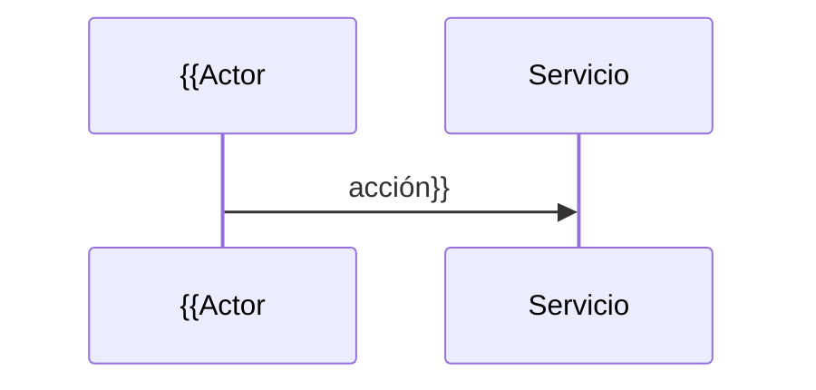

# Artefacto de Trazabilidad — {{KEY}} {{TÍTULO}}

> **Para qué:** conectar esta historia con sus decisiones de diseño, modelo de datos, código y pruebas.
> **Para quién:** equipo (durante el desarrollo) y docente (evaluación de calidad técnica).

| Campo | Valor |
| --- | --- |
| Historia | **{{KEY}}** — {{TÍTULO}} |
| Épica | {{EPICA_KEY}} — {{EPICA_NOMBRE}} |
| Requerimientos | {{RF_IDS}} (ver [[Requerimientos]] · [[Trazabilidad RF-Épicas]]) |
| Estado en Jira | {{ESTADO}} |
| Enlace | https://project-aurora-alz.atlassian.net/browse/{{KEY}} |

## 1. Historia de usuario
**Como** {{rol}} **quiero** {{objetivo}} **para** {{beneficio}}.

### Criterios de aceptación
- [ ] {{criterio_1}}
- [ ] {{criterio_2}}

## 2. Decisiones de diseño (ADR)
Decisiones técnicas que esta historia implica o de las que depende.

- {{ADR-0XX}} — {{título de la decisión}} (ver [[Arquitectura y Stack Tecnológico]])

> [!todo] Si la historia implicó una **decisión técnica nueva** sin ADR, crear `ADR-0XX` en el doc de Arquitectura y enlazarlo aquí. Si no hubo decisión nueva, indicar "Sin ADR nuevo; se apoya en {{ADR existentes}}".

## 3. Modelo de datos (DER)
Cambios en el modelo de datos producidos por esta historia.

```mermaid
erDiagram
    {{ENTIDAD_A ||--o{ ENTIDAD_B : relación}}
```

> [!todo] Si la historia **no** modifica el modelo de datos, indicar "Sin cambios en el DER". Si lo modifica, reflejar las entidades/atributos afectados.

## 4. Diagramas de modelado
Incluir solo los que apliquen (clases / secuencia / estados). Ver guía en la skill.

### 4.1 Diagrama de clases
```mermaid
classDiagram
    {{ClaseA --> ClaseB}}
```

### 4.2 Diagrama de secuencia


### 4.3 Diagrama de estados (DTE)
```mermaid
stateDiagram-v2
    {{[*] --> Estado1}}
```

> [!todo] Borrar las subsecciones que no apliquen a esta historia.

## 5. Código relacionado
Archivos, endpoints, componentes, commits y/o PRs que implementan la historia.

| Tipo | Ubicación / referencia |
| --- | --- |
| {{Backend/Frontend/IaC}} | `{{path/al/archivo}}` |
| Commit / PR | {{hash o #PR}} |

> [!todo] Completar con paths reales del repo. Si aún no hay código, dejar la fila como pendiente.

## 6. Casos de prueba
| ID | Precondición | Pasos | Resultado esperado | Resultado de ejecución |
| --- | --- | --- | --- | --- |
| CP-{{KEY}}-01 | {{precondición}} | {{1. … 2. … 3. …}} | {{resultado esperado}} | {{Pasó / Falló / Pendiente}} |

> [!todo] Cada criterio de aceptación debería tener al menos un caso de prueba. **No** registrar "Pasó/Falló" sin ejecución real; usar "Pendiente" hasta ejecutar.

## 7. Matriz de trazabilidad de la historia
| Historia | RF | ADR | DER | Diagramas | Código | Casos de prueba |
| --- | --- | --- | --- | --- | --- | --- |
| {{KEY}} | {{RF_IDS}} | {{ADR-0XX / —}} | {{sí/—}} | {{clases/secuencia/estados}} | {{paths}} | {{CP-…}} |

## Checklist de completitud (cátedra)
- [ ] Historia y criterios de aceptación
- [ ] ADR correspondiente (si hubo decisión técnica nueva)
- [ ] DER actualizado (si modificó el modelo de datos)
- [ ] Diagramas de modelado relevantes (clases/secuencia/estados, según aplique)
- [ ] Casos de prueba con precondición, pasos y resultado esperado
- [ ] Resultados de ejecución de las pruebas
- [ ] Referencias a código (paths/commits/PRs)
