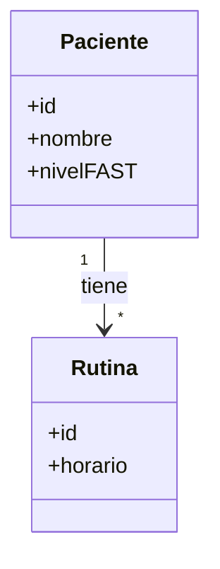
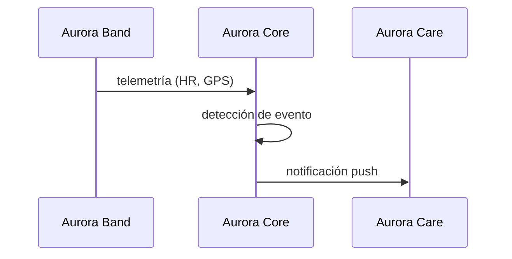
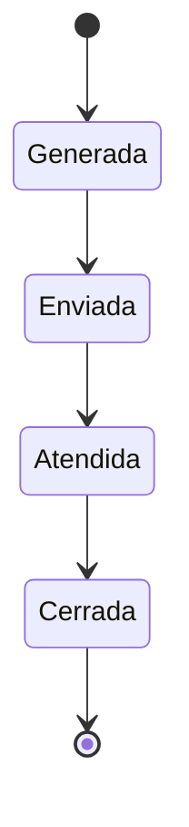
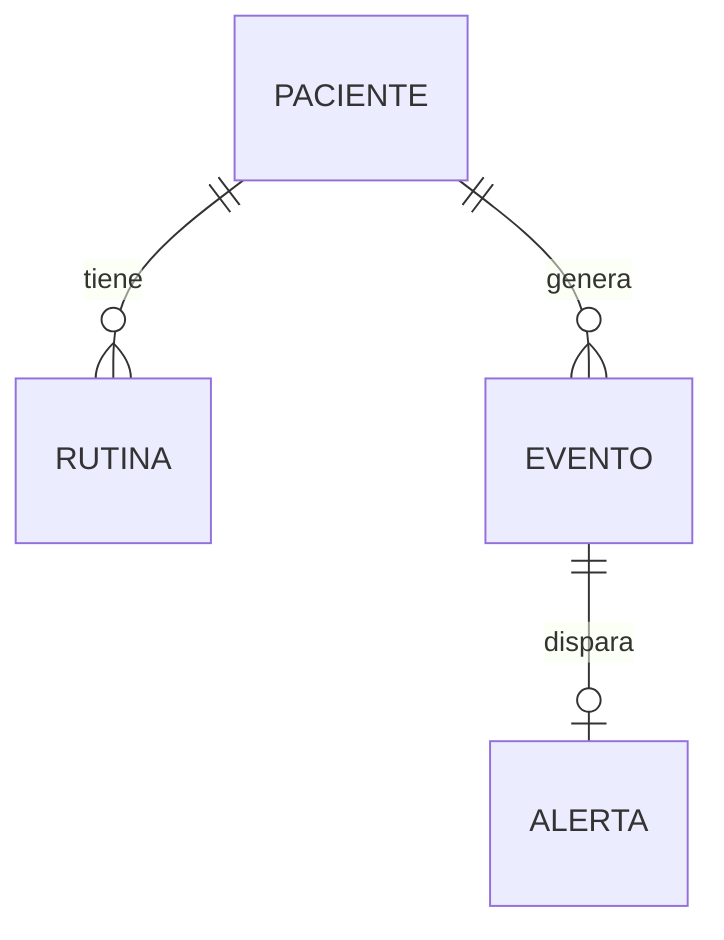

# Guía de la cátedra — Artefactos de Trazabilidad

## Definición (textual de la cátedra)

**ARTEFACTOS DE TRAZABILIDAD**
- **Para qué:** conectan cada historia del backlog con las decisiones de diseño, el código y las pruebas.
- **Para quién:** equipo, durante el desarrollo · docente, para evaluar la calidad técnica.

Contenido exigido por historia:
- Diagramas de modelado relevantes: clases, secuencia, estados (DTE), etc., según aplique.
- **ADR** correspondiente si la historia implicó una decisión técnica nueva.
- **DER** actualizado si la historia modificó el modelo de datos.
- **Casos de prueba** con precondición, pasos y resultado esperado; resultados de ejecución.

## Guía por sección

### Decisiones de diseño (ADR)
- Los ADR del proyecto viven en `Document Hub/Arquitectura y Stack Tecnológico.md` (ADR-001 a ADR-009 a la fecha).
- Incluir solo ADRs que la historia **usa** o **introduce**. Si introduce una decisión nueva, crear el ADR (siguiente número libre) con: Contexto, Drivers, Decisión y Consecuencias (formato ya usado en ese doc). No inventar la decisión: si no está tomada, marcarla como pendiente.

### Modelo de datos (DER)
- Solo si la historia crea/modifica entidades, atributos o relaciones.
- Representar con `erDiagram` de Mermaid. Si no hay cambios, escribir explícitamente "Sin cambios en el DER".

### Diagramas de modelado — cuándo aplica cada uno
- **Clases (`classDiagram`)**: la historia introduce o cambia entidades de dominio, servicios o sus relaciones.
- **Secuencia (`sequenceDiagram`)**: hay una interacción entre componentes/actores que conviene mostrar paso a paso (ej. flujo de una alerta Home→Core→Care).
- **Estados / DTE (`stateDiagram-v2`)**: una entidad tiene ciclo de vida con estados (ej. una Alerta: generada → enviada → atendida → cerrada; una toma de medicación: pendiente → confirmada/omitida).
- Incluir solo los que aporten; borrar las subsecciones que no apliquen.

### Casos de prueba
- Formato por caso: **ID · Precondición · Pasos · Resultado esperado · Resultado de ejecución**.
- Vincular cada **criterio de aceptación** con al menos un caso de prueba.
- "Resultado de ejecución": `Pasó` / `Falló` / `Pendiente`. **No** marcar Pasó/Falló sin ejecución real.
- Convención de ID: `CP-<KEY>-NN` (ej. `CP-AURA-60-01`).
- Alinear con el Plan de Testing del proyecto (ver `Document Hub/`).

## Cheatsheet Mermaid

### Diagrama de clases

### Diagrama de secuencia

### Diagrama de estados (DTE)

### DER (entidad-relación)

## Convenciones de salida
- Idioma español (es-AR).
- Frontmatter YAML con `base: "[[Document Hub.base]]"` para que el artefacto aparezca en la base/grafo de Obsidian.
- Enlazar con `[[wikilinks]]` a [[Requerimientos]], [[Arquitectura y Stack Tecnológico]] y [[Trazabilidad RF-Épicas]].
- Ubicación: `Document Hub/Trazabilidad/<KEY> - <slug>.md`.
