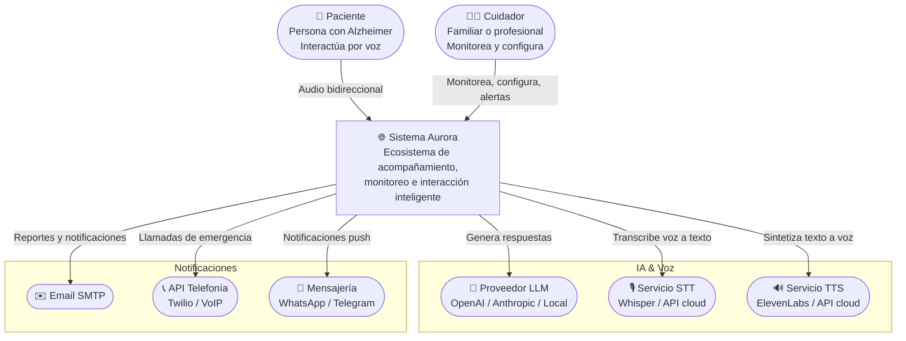
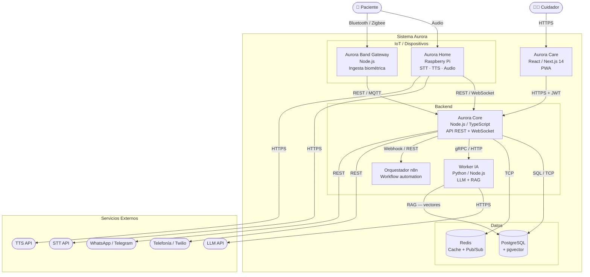
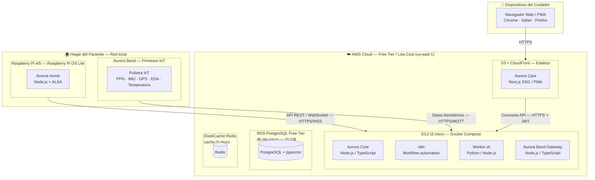

## 1. Introducción y Propósito

### 1.1 Objetivo del documento

Este documento registra las decisiones técnicas fundacionales del sistema Aurora, su arquitectura de solución y las pautas de desarrollo que guiarán la construcción del sistema. Su propósito es servir como referencia compartida para el equipo durante el desarrollo y para futuros mantenedores del sistema.

### 1.2 Audiencia

- Equipo de desarrollo (ingenieros de software, integradores IoT)
- Director del proyecto
- Futuros mantenedores y contribuyentes

### 1.3 Sistema en alcance

Aurora es un ecosistema de acompañamiento y monitoreo para personas con Alzheimer u otros trastornos de memoria que residen en su hogar. Se compone de cuatro subsistemas principales:

| Componente | Descripción |
|---|---|
| **Aurora Home** | Asistente de voz que interactúa proactivamente con el paciente |
| **Aurora Band** | Pulsera IoT para monitoreo biométrico continuo |
| **Aurora Care** | Aplicación para cuidadores (monitoreo, alertas, configuración) |
| **Aurora Core** | Núcleo de orquestación, automatización, análisis e IA |

### 1.4 Convenciones del documento

- Los diagramas utilizan la notación **C4 Model** (Contexto, Contenedores, Despliegue) con sintaxis **Mermaid**
- Las decisiones arquitectónicas significativas se registran como **Architecture Decision Records (ADRs)** en la sección 3
- Cada ADR incluye: contexto, alternativas consideradas, criterios de comparación, decisión tomada y consecuencias (incluyendo trade-offs negativos)

---

## 2. Arquitectura de Solución — Modelo C4

### 2.1 Contexto (Nivel 1)

El diagrama de contexto muestra a Aurora como un sistema que interactúa con el paciente (por voz), el cuidador (a través de Aurora Care) y diversos sistemas externos para brindar sus funcionalidades.



#### Actores del sistema

| Actor        | Descripción                                                                                                                                   |
| ------------ | --------------------------------------------------------------------------------------------------------------------------------------------- |
| **Paciente** | Persona con Alzheimer o pérdida de memoria. Interactúa exclusivamente por voz con Aurora Home. No requiere habilidades técnicas.              |
| **Cuidador** | Familiar o profesional que supervisa al paciente. Utiliza Aurora Care (app web/mobile) para monitorear, configurar rutinas y recibir alertas. |

#### Sistemas externos

| Sistema | Propósito |
|---|---|
| **Proveedor LLM** | Generación de respuestas conversacionales, inferencia emocional, adaptación de contenido |
| **STT** | Transcripción de voz del paciente a texto (p.ej., Whisper, Google STT) |
| **TTS** | Síntesis de voz natural para respuestas del asistente (p.ej., ElevenLabs, AWS Polly) |
| **WhatsApp / Telegram API** | Canales de notificación alternativos al cuidador |
| **API de Telefonía** | Llamada automática de emergencia cuando la alerta escala |
| **Email SMTP** | Notificaciones por correo electrónico (reportes diarios/semanales) |

---

### 2.2 Contenedores (Nivel 2)

El diagrama de contenedores descompone el sistema en sus unidades desplegables y muestra las relaciones entre ellas.




#### Descripción de contenedores

| Contenedor              | Tecnología propuesta                    | Responsabilidad                                                                                               |
| ----------------------- | --------------------------------------- | ------------------------------------------------------------------------------------------------------------- |
| **Aurora Home**         | Raspberry Pi OS + Node.js + ALSA        | Captura de audio, reproducción de respuestas, comunicación con Aurora Core, ejecución local de STT/TTS ligero |
| **Aurora Core**         | Node.js / TypeScript — NestJS o Fastify | API REST/WebSocket, lógica de dominio, orquestación de módulos, autenticación, gestión de eventos             |
| **Worker IA**           | Python (FastAPI) o Node.js              | Inferencia con LLM, pipeline RAG, clasificación de eventos, detección de estados                              |
| **Base de Datos**       | PostgreSQL 16 + pgvector                | Datos relacionales (pacientes, cuidadores, eventos, rutinas) + vectores de embeddings para RAG                |
| **Redis**               | Redis 7                                 | Caché de consultas frecuentes, sesiones WebSocket, cola de mensajería/pub-sub                                 |
| **n8n**                 | n8n (self-hosted)                       | Automatización de flujos: recordatorios por horario, escalado de alertas, reglas condicionales                |
| **Aurora Care**         | React + Next.js 14 (PWA)                | Panel del cuidador responsive, notificaciones push, modo offline parcial                                      |
| **Aurora Band Gateway** | Node.js / TypeScript                    | API de ingesta de datos biométricos, gestión de estado de conexión, buffer de datos offline                   |

---

### 2.3 Despliegue (Nivel 3)

El diagrama de despliegue muestra cómo se distribuyen físicamente los contenedores en la infraestructura.




#### Estrategia de despliegue

| Ambiente | Infraestructura | Propósito |
|---|---|---|
| **Desarrollo** | Local (Docker Compose) o AWS Free Tier | Desarrollo activo, pruebas unitarias |
| **Staging** | AWS Free Tier (recursos mínimos) | Integración, pruebas E2E, validación con stakeholders |
| **Producción** | AWS (escalable) u on-premise (servidor local) | Uso real con pacientes |

**Nota sobre costos:** La configuración inicial en AWS Free Tier permite operar con:

- 1 instancia EC2 t2.micro (750 h/mes gratis)
- 1 RDS db.t4g.micro (750 h/mes gratis)
- 1 ElastiCache cache.t3.micro (costo mínimo ~$15/mes)
- S3 + CloudFront (Free Tier 1TB/mes)
- Alternativa on-premise: servidor local en el hogar del paciente con port forwarding/DuckDNS

---

## 3. Architecture Decision Records (ADRs)

---

### ADR-001: Lenguaje y Framework Backend

| Campo | Valor |
|---|---|
| **ID** | ADR-001 |
| **Fecha** | Mayo 2026 |
| **Estado** | Propuesto |
| **Decisores** | Equipo Aurora |

#### Contexto

El backend de Aurora (Aurora Core) debe manejar múltiples responsabilidades: API REST para Aurora Care y Aurora Home, WebSocket para comunicación bidireccional en tiempo real, procesamiento de eventos, integración con n8n, y gestión de datos. El equipo no tiene una preferencia definida previamente.

#### Drivers de decisión

1. **Baja latencia** para interacciones conversacionales en tiempo real
2. **Ecosistema maduro** para integración con n8n (construido en Node.js)
3. **Facilidad de despliegue** en AWS Free Tier (Lambda, ECS, EC2)
4. **Curva de aprendizaje razonable** para el equipo
5. **Tipado estático** para reducir errores en un sistema crítico (alertas de emergencia)
6. **Rendimiento** para concurrencia moderada (~decenas de pacientes simultáneos)

#### Opciones consideradas

| Opción | Versión | Fundamentos |
|---|---|---|
| **Node.js / TypeScript** — NestJS o Fastify | Node 22 LTS, TS 5.x | Ecosistema maduro, tipado estático, async/await nativo, mismo lenguaje que n8n |
| **Python** — FastAPI o Django | Python 3.12, FastAPI 0.110+ | Ideal para IA/ML, tipado con Pydantic, buena performance asíncrona |
| **Java** — Spring Boot 3 | Java 21 LTS, Spring Boot 3.x | Madurez enterprise, rendimiento superior, ecosistema vasto |

#### Criterios de evaluación

| Criterio | Node.js/TS | Python | Java |
|---|---|---|---|
| Latencia (p50/p99) | ★★★★ Bajo | ★★★ Medio | ★★★★★ Muy bajo |
| Ecosistema IA/ML | ★★★ Medio | ★★★★★ Excelente | ★★ Bajo |
| Integración con n8n | ★★★★★ Nativo | ★★★ Webhook | ★★★ Webhook |
| Despliegue AWS (Lambda) | ★★★★★ Excelente | ★★★★ Bueno | ★★★ Medio |
| Curva de aprendizaje | ★★★★★ Fácil | ★★★★ Fácil | ★★★ Media |
| Tipado estático | ★★★★ TS fuerte | ★★★ Pydantic | ★★★★★ Nativo |
| Costo operativo (Free Tier) | ★★★★★ Bajo | ★★★★ Bajo | ★★★ Medio |

#### Decisión


**Fundamento:**


#### Consecuencias

**Positivas:**


**Negativas (trade-offs):**


---

### ADR-002: Framework Frontend para Aurora Care

| Campo | Valor |
|---|---|
| **ID** | ADR-002 |
| **Fecha** | Mayo 2026 |
| **Estado** | Propuesto |

#### Contexto

Aurora Care es la aplicación que utiliza el cuidador para monitorear al paciente, configurar rutinas, recibir alertas y gestionar el sistema. Debe funcionar tanto en dispositivos móviles (notificaciones push, acceso rápido) como en computadoras de escritorio (gestión detallada).

#### Drivers de decisión

1. **Soporte mobile y desktop** con una sola base de código
2. **Notificaciones push** en tiempo real para alertas críticas
3. **Modo offline parcial** para visualizar datos sin conexión
4. **Rapidez de desarrollo** con el equipo actual
5. **SEO** no es relevante (app protegida por autenticación)
6. **Compartir tipos** con el backend TypeScript

#### Opciones consideradas

| Opción | Descripción |
|---|---|
| **React + Next.js (PWA)** | SPA con service workers, responsive, despliegue estático |
| **Vue.js + Nuxt** | Similar a Next.js, ecosistema Vue |
| **Flutter** | Compilado nativo, UI consistente, una sola base de código |
| **React Native** | App móvil nativa con lógica compartida |

#### Criterios de evaluación

| Criterio | Next.js (PWA) | Nuxt (PWA) | Flutter | React Native |
|---|---|---|---|---|
| Mobile + Desktop | ★★★★★ PWA | ★★★★★ PWA | ★★★★★ Nativo | ★★★★★ Nativo |
| Notificaciones push | ★★★★ Service Worker | ★★★★ Service Worker | ★★★★★ Firebase | ★★★★★ Firebase |
| Offline partial | ★★★★ Cache API | ★★★★ Cache API | ★★★ Local DB | ★★★ Local DB |
| Velocidad de desarrollo | ★★★★★ Excelente | ★★★★ Bueno | ★★★ Medio | ★★★ Medio |
| Compartir tipos con backend | ★★★★★ TypeScript | ★★★★ TypeScript | ★ Bajo | ★★★ TypeScript |
| Despliegue (Free Tier) | ★★★★★ S3+CloudFront | ★★★★★ S3+CloudFront | ★★★ Google Play | ★★★ App Store |

#### Decisión


**Fundamento:**

#### Consecuencias

**Positivas:**

**Negativas:**

---

### ADR-003: Base de Datos (Relacional y Vectorial)

| Campo | Valor |
|---|---|
| **ID** | ADR-003 |
| **Fecha** | Mayo 2026 |
| **Estado** | Propuesto |

#### Contexto

Aurora requiere persistencia para datos relacionales (pacientes, cuidadores, eventos, rutinas, alertas, configuraciones) y datos vectoriales (embeddings para RAG — Retrieval-Augmented Generation — en el motor de IA). Se evaluaron opciones de base de datos única vs. especializadas.

#### Drivers de decisión

1. **Consistencia y confiabilidad** para datos de salud (eventos, alertas, medicación)
2. **Búsqueda vectorial** eficiente para RAG (memoria del paciente, contexto conversacional)
3. **Costo** en Free Tier / bajos recursos
4. **Simplicidad operativa** (preferible una sola base de datos)
5. **Respaldo y recuperación** ante fallas

#### Opciones consideradas

| Opción | Relacional | Vectorial | Esquema |
|---|---|---|---|
| **PostgreSQL + pgvector** | PostgreSQL 16 | pgvector (extensión) | Una sola base de datos |
| **PostgreSQL + Qdrant separado** | PostgreSQL 16 | Qdrant (servicio aparte) | Dos bases de datos |
| **MongoDB + Atlas Vector Search** | MongoDB 7 | Atlas Vector Search (integrado) | Una sola base de datos |
| **PostgreSQL + Pinecone** | PostgreSQL 16 | Pinecone (SaaS) | Dos servicios |

#### Criterios de evaluación

| Criterio | PostgreSQL + pgvector | PostgreSQL + Qdrant | MongoDB + Atlas | PostgreSQL + Pinecone |
|---|---|---|---|---|
| Costo Free Tier | ★★★★★ Gratis (RDS + pgvector) | ★★★★ Gratis RDS + Qdrant self-host | ★★★ Free tier limitado (512MB) | ★★★ Gratis RDS + Pinecone free tier limitado |
| Simplicidad operativa | ★★★★★ Un solo motor | ★★★★ Dos servicios | ★★★★★ Una sola DB | ★★★ Dos servicios SaaS |
| Madurez relacional | ★★★★★ Excelente | ★★★★★ Excelente | ★★★★ Bueno | ★★★★★ Excelente |
| Búsqueda vectorial | ★★★★ Buena (HNSW) | ★★★★★ Excelente (HNSW, filtros) | ★★★★ Buena | ★★★★★ Excelente (gestionado) |
| Flexibilidad de esquema | ★★★ Esquema fijo | ★★★ Esquema fijo | ★★★★★ Sin esquema | ★★★ Esquema fijo |
| Comunidad / Soporte | ★★★★★ Masiva | ★★★ Creciente | ★★★★★ Masiva | ★★★★ Creciente |

#### Decisión


**Fundamento:**

#### Consecuencias

**Positivas:**

**Negativas:**


---

### ADR-004: Patrón Arquitectónico

| Campo | Valor |
|---|---|
| **ID** | ADR-004 |
| **Fecha** | Mayo 2026 |
| **Estado** | Propuesto |

#### Contexto

Aurora integra múltiples subsistemas (voz, IoT, IA, automatización, notificaciones, panel web) que deben coordinarse de manera confiable. El patrón arquitectónico define cómo se estructuran y comunican estos componentes.

#### Drivers de decisión

1. **Tolerancia a fallos parciales**: una caída en la IA no debe impedir recordatorios básicos
2. **Escalabilidad selectiva**: los componentes críticos (alertas, monitoreo IoT) pueden necesitar escalar independientemente
3. **Complejidad controlada**: el equipo es pequeño y el presupuesto acotado
4. **Integración con n8n**: el orquestador de flujos existente en el diseño
5. **Evolución**: poder partir de una arquitectura simple y evolucionar hacia microservicios si es necesario

#### Opciones consideradas

| Opción | Descripción |
|---|---|
| **Monolito Modular** | Un solo proceso Node.js con módulos bien definidos (carpetas/dominios) y APIs internas claras |
| **Microservicios** | Cada módulo como servicio independiente desplegado separadamente |
| **Arquitectura Orientada a Eventos (EDA)** | Componentes se comunican mediante eventos asíncronos (broker de mensajes) |
| **Híbrido: Monolito Modular + n8n para flujos** | Core como monolito modular, flujos de automatización delegados a n8n |

#### Criterios de evaluación

| Criterio | Monolito Modular | Microservicios | EDA puro | Híbrido (propuesto) |
|---|---|---|---|---|
| Complejidad inicial | ★★★★★ Baja | ★★ Alta | ★★★ Media | ★★★★ Baja-Media |
| Tolerancia a fallos | ★★ Baja (todo en uno) | ★★★★ Alta | ★★★★★ Muy alta | ★★★★ Alta |
| Escalabilidad | ★★★ Vertical | ★★★★★ Horizontal | ★★★★★ Horizontal | ★★★★ Parcial |
| Velocidad de desarrollo | ★★★★★ Rápida | ★★★ Lenta | ★★★ Lenta | ★★★★ Rápida |
| Integración n8n | ★★★ Webhook | ★★★★ Webhook nativo | ★★★★★ Nativo | ★★★★★ Nativo |
| Costo operativo | ★★★★★ Bajo | ★★★ Alto | ★★★ Medio | ★★★★ Medio-bajo |
| Curva de aprendizaje | ★★★★★ Baja | ★★ Alta | ★★★ Media | ★★★★ Baja |

#### Decisión

**Estructura:**


#### Consecuencias

**Positivas:**


**Negativas:**

---

### ADR-005: Autenticación y Autorización

| Campo | Valor |
|---|---|
| **ID** | ADR-005 |
| **Fecha** | Mayo 2026 |
| **Estado** | Propuesto |

#### Contexto

Aurora maneja datos sensibles de salud (biométricos, ubicación, medicación, historial médico). El acceso debe estar estrictamente controlado: cada cuidador solo debe ver los datos del paciente a su cargo, y debe existir trazabilidad de quién accedió o modificó información.

#### Drivers de decisión

1. **Cumplimiento de privacidad**: los datos de salud requieren autenticación fuerte y cifrado
2. **Multi-tenant**: cada cuidador asociado a uno o más pacientes, con datos estrictamente separados
3. **Múltiples canales**: acceso desde Aurora Care (web), API para Aurora Home, y potencialmente app mobile
4. **Costo**: preferencia por solución gratuita o de bajo costo en etapa inicial
5. **Bajo mantenimiento**: el equipo no debe administrar infraestructura de autenticación compleja

#### Opciones consideradas

| Opción | Tipo | Costo |
|---|---|---|
| **AWS Cognito** | Servicio administrado (AWS) | Free Tier: 50k MAU |
| **Auth0** | SaaS | Free Tier: 7k MAU |
| **Firebase Authentication** | SaaS (Google) | Free Tier: 10k MAU |
| **Keycloak** | Self-hosted (open source) | Costo de infraestructura (EC2) |
| **JWT Custom (bcrypt + JWT)** | Implementación propia | Solo tiempo de desarrollo |

#### Criterios de evaluación

| Criterio | AWS Cognito | Auth0 | Firebase Auth | Keycloak | JWT Custom |
|---|---|---|---|---|---|
| Costo Free Tier | ★★★★★ 50k MAU | ★★★★ 7k MAU | ★★★★ 10k MAU | ★★★ Infra EC2 | ★★★★★ Sin costo directo |
| Multi-tenant | ★★★★ Grupos | ★★★★★ Organizaciones | ★★★ Custom claims | ★★★★★ Realms | ★★★ Custom |
| MFA / 2FA | ★★★★★ Sí | ★★★★★ Sí | ★★★★ SMS/App | ★★★★★ Sí | ★★ Manual |
| Social login | ★★★★ Google, Apple, FB | ★★★★★ Muchos | ★★★★★ Google, Apple | ★★★★ SAML/OIDC | ★ Manual |
| Integración Node.js | ★★★★ AWS SDK | ★★★★★ SDK Auth0 | ★★★★ Firebase Admin | ★★★★ Adaptadores | ★ Sólo JWT |
| Mantenimiento | ★★★★★ Zero | ★★★★★ Zero | ★★★★★ Zero | ★★★ Medio | ★★ Alto |
| Residencia de datos | ★★★★ Regiones AWS | ★★★ Regiones limitadas | ★★★ Regiones Google | ★★★★★ Control total | ★★★★★ Control total |

#### Decisión


**Fundamento:**

#### Consecuencias

**Positivas:**


**Negativas:**


---

### ADR-006: Diseño de API

| Campo | Valor |
|---|---|
| **ID** | ADR-006 |
| **Fecha** | Mayo 2026 |
| **Estado** | Propuesto |

#### Contexto

Aurora Core debe exponer APIs para múltiples clientes: Aurora Home (voice assistant), Aurora Care (web PWA), Aurora Band Gateway (data ingestion), y n8n (webhooks). La API debe soportar tanto operaciones CRUD tradicionales como comunicación en tiempo real.

#### Drivers de decisión

1. **Múltiples clientes** con necesidades diferentes (web, IoT, voz, automatización)
2. **Tiempo real** para interacciones de voz, alertas y actualización de estado
3. **Simplicidad** para que n8n y servicios externos consuman la API sin lógica compleja
4. **Tipado** compartido entre backend y frontend
5. **Documentación** generada automáticamente

#### Opciones consideradas

| Opción | Descripción |
|---|---|
| **REST + WebSocket** | REST para CRUD, WebSocket para tiempo real y streaming de audio |
| **GraphQL** | API flexible con tipado, suscripciones para tiempo real |
| **gRPC** | RPC tipado con streaming bidireccional, alta performance |
| **REST + SSE (Server-Sent Events)** | REST + eventos unidireccionales |

#### Criterios de evaluación

| Criterio | REST + WebSocket | GraphQL | gRPC | REST + SSE |
|---|---|---|---|---|
| Simplicidad de consumo | ★★★★★ Universal | ★★★★ Bueno (pero query complejo) | ★★★ Requiere proto | ★★★★★ Universal |
| Tiempo real bidireccional | ★★★★★ WebSocket | ★★★★ Subscriptions | ★★★★★ Streaming | ★★ SSE unidireccional |
| Streaming de audio | ★★★★★ WebSocket | ★★★ Subscriptions | ★★★★★ Streaming | ★ No soportado |
| Documentación automática | ★★★★ Swagger/OpenAPI | ★★★★★ GraphiQL/Introspection | ★★★★ Protobuf | ★★★★ Swagger/OpenAPI |
| Tipado compartido | ★★★★ OpenAPI → TS | ★★★★★ Codegen nativo | ★★★★ Proto → TS | ★★★★ OpenAPI → TS |
| Eficiencia de red | ★★★ Múltiples endpoints | ★★★★★ Una query específica | ★★★★★ Binario eficiente | ★★★ Múltiples endpoints |
| Facilidad para n8n | ★★★★★ Webhook nativo | ★★★★ Query HTTP | ★★ Bajo soporte | ★★★★★ Webhook nativo |
| Curva de aprendizaje | ★★★★★ Baja | ★★★★ Media | ★★★ Alta | ★★★★★ Baja |

#### Decisión


**Fundamento:**

#### Consecuencias

**Positivas:**


**Negativas:**


#### Presupuesto de latencia para el pipeline de voz (baseline esperado)

La cadena de procesamiento de una interacción de voz involucra componentes secuenciales con latencias estimadas en condiciones normales (p50):

| Etapa | Latencia estimada | Dependencia |
|---|---|---|
| Captura de audio + envío | <100 ms | Aurora Home → red local |
| STT (Speech-to-Text) | 300-800 ms | API cloud externa |
| LLM + RAG (generación de respuesta) | 500-2000 ms | API cloud externa + consulta a BD |
| TTS (Text-to-Speech) | 200-500 ms | API cloud externa |
| Recepción + reproducción | <100 ms | Red local → Aurora Home |
| **Total estimado (p50)** | **~1.1-3.5 segundos** | |

**Objetivo de diseño:** p95 por debajo de 4 segundos para respuestas conversacionales simples (recordatorios, confirmaciones). Para respuestas que requieren RAG completo (reminiscencia, actividades cognitivas), se acepta hasta 6 segundos.

**Implicaciones:**
- Si la latencia supera estos umbrales, se debe considerar: (a) modelos de IA más ligeros, (b) STT/TTS local en Aurora Home, (c) caché de respuestas frecuentes, (d) respuestas parciales con indicación de "estoy pensando..."
- La instancia EC2 t2.micro con CPU credits limitados puede agregar latencia de red; monitorear en staging antes de producción

---

### ADR-007: Despliegue e Infraestructura

| Campo | Valor |
|---|---|
| **ID** | ADR-007 |
| **Fecha** | Mayo 2026 |
| **Estado** | Propuesto |

#### Contexto

El sistema Aurora debe desplegarse inicialmente con costos mínimos (Free Tier AWS o alternativas gratuitas) pero con la capacidad de migrar a on-premise o a infraestructura escalable de pago según evolucione. El despliegue debe ser reproducible y automatizado.

#### Drivers de decisión

1. **Costo mínimo** en etapa de prototipo y validación
2. **Reproducibilidad** (infraestructura como código)
3. **Migración viable** a on-premise si los costos cloud superan el presupuesto
4. **Actualizaciones remotas** de Aurora Home (Raspberry Pi) sin intervención física
5. **Monitoreo** básico para detectar caídas del servicio

#### Opciones consideradas

| Opción | Descripción |
|---|---|
| **AWS Free Tier (EC2 + RDS + S3)** | Servicios cloud con capa gratuita |
| **On-premise (servidor local)** | Servidor en el hogar del paciente |
| **Auto-hosting (VPS barato)** | VPS de $5/mes (DigitalOcean, Linode, Hetzner) |
| **Híbrido: cloud + on-premise** | Aurora Core en cloud, Aurora Home local |

#### Criterios de evaluación

| Criterio | AWS Free Tier | On-premise local | VPS barato | Híbrido (propuesto) |
|---|---|---|---|---|
| Costo inicial | ★★★★★ $0 | ★★★★ $0 (si hay hardware) | ★★★ $5-10/mes | ★★★★ $0-5/mes |
| Disponibilidad | ★★★★★ 99.99% SLA | ★★ Depende de internet local | ★★★★ 99.9% | ★★★★★ Cloud + local |
| Mantenimiento | ★★★★★ Gestionado | ★★★ Manual | ★★★★ Automatizable | ★★★★ Gestión mixta |
| Actualizaciones remotas | ★★★★★ Fáciles | ★★★ Port forwarding | ★★★★ Fáciles | ★★★★★ Fáciles |
| Migración a on-premise | ★★★★ Posible | ★★★★★ Ya está on-prem | ★★★★ Posible | ★★★★ Migración parcial |
| Privacidad de datos | ★★★ AWS | ★★★★★ Control total | ★★★ VPS provider | ★★★★ Datos locales |
| Escalabilidad | ★★★★ Límites Free Tier | ★★ Limitado | ★★★ Vertical | ★★★★ Escalable cloud |

#### Decisión

Se adopta una estrategia **híbrida con prioridad AWS Free Tier**:

- **Aurora Core** (API + workers) → **EC2 t2.micro** o **ECS Fargate** (dentro del Free Tier)
- **Base de datos** → **RDS PostgreSQL Free Tier** (db.t4g.micro, 20GB)
- **Redis** → **ElastiCache** (caché, pub/sub) — costo mínimo (~$15/mes)
- **Aurora Care** (frontend) → **S3 + CloudFront** (Free Tier 1TB/mes)
- **n8n** → Misma instancia EC2 que Aurora Core o contenedor separado
- **Aurora Home** → **Raspberry Pi 4/5** en el hogar del paciente
- **Dominio** → DuckDNS (gratuito) o Route53 (costo mínimo)
- **CI/CD** → **GitHub Actions** (Free Tier: 2000 min/mes para repos privados; repos públicos tienen minutos ilimitados. Si el repo es privado, considerar build eficiente: cache de Docker layer, separar jobs de test y deploy, y evitar builds innecesarios en cada commit)

**Plan de migración a on-premise:**
- Todo el stack (excepto Aurora Home) empaquetado en Docker Compose
- n8n permite reconfigurar flujos sin cambiar código

#### Consecuencias

**Positivas:**
- Costo inicial cercano a $0 gracias al Free Tier de AWS
- Docker Compose en todo el stack permite portabilidad completa (cloud ↔ on-premise)
- GitHub Actions automatiza pruebas y despliegue sin costo adicional
- Aurora Home con actualización OTA via `git pull` o Docker pull
- La instancia EC2 única simplifica el monitoreo y la gestión inicial

**Negativas:**
- EC2 t2.micro tiene CPU limitada (CPU credits); cargas sostenidas pueden estrangular el rendimiento
- RDS Free Tier no tiene réplicas Multi-AZ (riesgo ante falla de AZ)
- ElastiCache tiene un costo aunque sea mínimo (~$15/mes); se puede usar Redis en la misma EC2 como alternativa más económica
- On-premise requiere que el cuidador tenga internet estable y conocimientos básicos para reiniciar el sistema si falla
- La migración entre cloud y on-premise requiere sincronización de datos (backup/restore de PostgreSQL)

---

### ADR-008: Modo Offline y Operación Degradada

| Campo | Valor |
|---|---|
| **ID** | ADR-008 |
| **Fecha** | Mayo 2026 |
| **Estado** | Propuesto |

#### Contexto

Aurora Home (el asistente de voz en el hogar del paciente) depende de conectividad a internet para funciones críticas: transcripción STT, generación de respuestas LLM, síntesis TTS, y comunicación con Aurora Core. Dado que no se puede garantizar conectividad continua en un entorno doméstico (cortes de ISP, reinicio de router, mantenimiento), el sistema debe definir una estrategia de operación degradada que mantenga funcionalidades esenciales.

#### Drivers de decisión

1. **Seguridad del paciente**: recordatorios de medicación y alertas de emergencia no deben depender de conectividad cloud
2. **Experiencia de usuario**: la interacción por voz no debe fallar abruptamente; debe degradarse gracefulmente
3. **Autonomía del dispositivo**: la batería y recursos de la Raspberry Pi limitan qué puede ejecutarse localmente
4. **Recuperación automática**: al restaurarse la conectividad, el sistema debe sincronizar datos sin intervención manual

#### Opciones consideradas

| Opción | Descripción |
|---|---|
| **Online-only (sin modo offline)** | Todo el procesamiento depende de cloud. Sin internet, Aurora Home queda inoperativo |
| **Cola local + reprocesamiento** | Aurora Home acumula audio y eventos localmente y los procesa cuando vuelve la conexión |
| **Degradado híbrido (propuesto)** | Funcionalidad crítica local (recordatorios programados, TTS offline básico); funcionalidad completa requiere cloud |
| **Full offline** | Todos los modelos (STT, TTS, LLM) se ejecutan localmente en la RPi |

#### Criterios de evaluación

| Criterio | Online-only | Cola local + repro | Degradado híbrido | Full offline |
|---|---|---|---|---|
| Recordatorios sin internet | ★★ No funcionan | ★★★★ Programados en RPi | ★★★★★ Sí, locales | ★★★★★ Sí, locales |
| Interacción vocal sin internet | ★★ No funciona | ★★★ Reprocesa después | ★★★★ Respuestas predefinidas | ★★★★★ Sí, con LLM local |
| Complejidad técnica | ★★★★★ Baja | ★★★ Media | ★★★ Media | ★ Alta (modelos en RPi) |
| Calidad de interacción | ★★★★★ Completa online | ★★★ Diferida | ★★★★ Básica offline | ★★★ LLM local limitado |
| Costo de hardware RPi | ★★★★★ Mínimo | ★★★★ Mínimo | ★★★ Aceptable | ★★ RPi 8GB+ o acelerador |
| Recuperación automática | ★★ Manual | ★★★★ Sincronización automática | ★★★★ Sincronización automática | ★★★★ Sincronización automática |

#### Decisión

Se adopta el modo **degradado híbrido** con la siguiente estrategia:

- **En línea (conectividad normal):** Funcionamiento completo con STT/TTS/LLM cloud. Aurora Home opera como thin client de voz.
- **Sin conectividad (degradado):**
  - **Recordatorios programados** se ejecutan localmente desde un archivo de configuración con horarios cacheados (sincronizado desde Aurora Core cuando hay conexión)
  - **Interacción por voz básica:** Se utiliza un pequeño modelo TTS offline (e.g., Piper TTS) para respuestas predefinidas ("Lo siento, no tengo conexión", "Es hora de tu medicación")
  - **El audio del paciente** se almacena localmente en un buffer circular (máximo 5 minutos) para su procesamiento posterior cuando la conexión se restablezca
  - **Alertas críticas** (caídas detectadas por la pulsera) se almacenan localmente y se reenvían al restaurar la conexión; no se pierden
- **Reconexión automática:** Al detectar conectividad, Aurora Home sincroniza eventos almacenados, descarga actualizaciones de configuración, y reanuda operación completa. Implementar con **retry exponencial** y health check periódico.

#### Consecuencias

**Positivas:**
- Recordatorios de medicación y rutinas críticas nunca se pierden, incluso sin internet
- El paciente no experimenta una falla total del sistema ante cortes de conectividad
- Los eventos críticos (caídas) tienen un buffer local que garantiza su entrega diferida
- La sincronización automática elimina la necesidad de intervención del cuidador en cortes de red

**Negativas:**
- La interacción conversacional rica (charla, reminiscencia, actividades cognitivas) no está disponible offline
- Aurora Home necesita almacenamiento persistente local para buffer de audio y eventos (SD card o SSD)
- El TTS offline tiene calidad de voz inferior a los servicios cloud
- La RPi debe ejecutar un cron local o scheduler para recordatorios offline, agregando complejidad al firmware
- La gestión del buffer circular requiere políticas de descarte cuando se llena durante cortes prolongados

---

### ADR-009: Protocolo de Comunicación IoT — Aurora Band

| Campo | Valor |
|---|---|
| **ID** | ADR-009 |
| **Fecha** | Mayo 2026 |
| **Estado** | Propuesto |

#### Contexto

Aurora Band (pulsera IoT) debe enviar datos biométricos (frecuencia cardíaca, IMU, GPS, EDA, temperatura) al Aurora Band Gateway en la nube. La comunicación debe ser confiable, de bajo consumo energético (la pulsera funciona con batería), y capaz de manejar desconexiones intermitentes. El diagrama de contenedores muestra "API REST / MQTT" como opciones tentativas sin decisión registrada.

#### Drivers de decisión

1. **Bajo consumo energético**: la transmisión de datos es el mayor consumo en dispositivos IoT con batería
2. **Confiabilidad en entrega**: los datos biométricos (especialmente eventos de caída) no deben perderse
3. **Desconexiones frecuentes**: la pulsera puede salir del alcance del gateway o perder conectividad Bluetooth
4. **Volumen de datos**: envío periódico de lecturas biométricas (cada 1-5 minutos) más eventos esporádicos
5. **Simplicidad del firmware**: el hardware de la pulsera tiene recursos limitados

#### Opciones consideradas

| Opción | Modelo | Consumo | Confiabilidad |
|---|---|---|---|
| **HTTP REST** | Request-response (pull) | Alto (conexión por cada envío) | Medio (sin QoS nativo) |
| **MQTT** | Pub-sub (push) | Bajo (conexión persistente ligera) | Alto (QoS 0, 1, 2) |
| **WebSocket** | Full-duplex | Medio (conexión persistente TCP) | Medio (sin QoS) |
| **CoAP** | Request-response sobre UDP | Muy bajo | Bajo (UDP, sin garantía) |

#### Criterios de evaluación

| Criterio | HTTP REST | MQTT | WebSocket | CoAP |
|---|---|---|---|---|
| Consumo energético | ★★ Alto (handshake + headers cada request) | ★★★★★ Bajo (conexión persistente ligera) | ★★★ Medio | ★★★★★ Muy bajo |
| Confiabilidad (QoS) | ★★★ Retry manual | ★★★★★ QoS 0/1/2 nativo | ★★★ Sin QoS nativo | ★★ No garantizado |
| Manejo de desconexión | ★★★★ Buffer + retry | ★★★★★ Sesión persistente + buffer en broker | ★★★ Reconexión manual | ★★★ Retry simple |
| Ancho de banda | ★★ Headers HTTP verbosos | ★★★★★ Binario ligero | ★★★★ Framing simple | ★★★★★ Mínimo |
| Madurez en IoT | ★★★★ Común en APIs | ★★★★★ Estándar de facto IoT | ★★★ Poco común en IoT | ★★★ Emergente |
| Complejidad firmware | ★★★★★ Simple | ★★★★ Media (cliente MQTT) | ★★★ Media | ★★★ Media |
| Facilidad de integración en Aurora Core | ★★★★★ Express/NestJS nativo | ★★★★ Broker + bridge HTTP | ★★★★★ Nativo WebSocket | ★★ Bridge necesario |

#### Decisión

Se adopta **MQTT** como protocolo primario de comunicación entre Aurora Band y el Aurora Band Gateway, con **HTTP REST** como canal secundario para comandos de configuración y sincronización inicial.

**Arquitectura MQTT:**

```
Aurora Band ──MQTT──→ [Broker MQTT (Mosquitto / AWS IoT Core)] ──→ Aurora Band Gateway ──→ Aurora Core
```

- **MQTT QoS 1** para datos biométricos periódicos (al menos una entrega, sin duplicación estricta)
- **MQTT QoS 2** para eventos críticos (caídas, alertas de emergencia) — entrega exactamente una vez
- **Tópicos**: `/aurora/band/{device_id}/biometric`, `/aurora/band/{device_id}/event`, `/aurora/band/{device_id}/status`
- **HTTP REST** para: registro inicial del dispositivo, sincronización de configuración, consulta de estado (batería, conectividad)
- **Broker**: AWS IoT Core (si se usa AWS) o Mosquitto self-hosted (si on-premise)

#### Consecuencias

**Positivas:**
- MQTT está diseñado para IoT: conexiones de baja potencia, reconexión automática con sesión persistente, y QoS granular
- El broker MQTT desacopla la pulsera del backend: la pulsera publica eventos y no necesita conocer la topología del servidor
- AWS IoT Core tiene integración nativa con el resto del stack AWS y reglas para reenviar mensajes a Lambda, SQS o Kinesis
- El payload binario ligero (CBOR o MessagePack sobre MQTT vs. JSON sobre HTTP) reduce el ancho de banda y el consumo de batería
- Los tópicos con wildcards permiten escalar a múltiples pulseras sin cambiar la infraestructura

**Negativas:**
- MQTT introduce un componente adicional (el broker) que debe ser administrado o pagado como servicio
- AWS IoT Core tiene costos (aprox. $0.08/millón de mensajes después del Free Tier de 250KB/mes)
- Si se usa Mosquitto self-hosted, es un servicio más que monitorear y mantener actualizado
- El equipo necesita familiarizarse con MQTT (tópicos, QoS, will messages, retained messages)
- La depuración de problemas de conectividad IoT es más compleja que con HTTP simple (pérdida de mensajes, QoS no entregado)
- Para migrar a on-premise, el broker MQTT debe desplegarse junto con el resto del stack

---

## 4. Pautas de Codificación

### 4.1 Convenciones de nomenclatura

| Elemento | Convención | Ejemplo |
|---|---|---|
| Archivos TypeScript/JavaScript | `kebab-case` | `patient-service.ts`, `event-handler.ts` |
| Clases / interfaces / tipos | `PascalCase` | `PatientService`, `AlertEvent` |
| Funciones / métodos / variables | `camelCase` | `getPatientById()`, `createEvent()` |
| Constantes globales | `UPPER_SNAKE_CASE` | `MAX_RETRY_COUNT`, `ALERT_CRITICAL` |
| Directorios | `kebab-case` | `src/modules/patient/`, `src/common/` |
| Archivos de componentes React | `PascalCase` | `PatientDashboard.tsx`, `AlertCard.tsx` |
| Archivos de test | `*.test.ts` / `*.spec.ts` | `patient-service.test.ts` |
| Migraciones de BD | `YYYYMMDDHHmmss_<desc>.sql` | `20260525120000_create_patients.sql` |

### 4.2 Estructura de directorios propuesta

```
backend/
  src/
    modules/
      patient/
        patient.module.ts
        patient.controller.ts
        patient.service.ts
        patient.entity.ts
        dto/
        interfaces/
      event/
      alert/
      biometric/
      auth/
      caregiver/
      routine/
      medication/
      interaction/
    common/
      guards/
      filters/
      interceptors/
      pipes/
      decorators/
      utils/
    config/
    database/
      migrations/
      seeds/
    webhooks/
      n8n/
      aurora-home/
      aurora-band/
  test/
    unit/
    integration/
    e2e/
frontend/
  src/
    app/        (Next.js App Router)
      (auth)/
      dashboard/
      patient/
      alerts/
      routines/
      settings/
    components/
      ui/
      shared/
      features/
    lib/
      api/
      hooks/
      utils/
      types/
    public/
      sw.js       (Service Worker)
infra/
  docker/
    docker-compose.yml
    Dockerfile.backend
    Dockerfile.frontend
  terraform/
    main.tf
    variables.tf
  scripts/
    deploy.sh
    backup.sh
```

### 4.3 Linting y formateo

| Herramienta | Propósito | Configuración |
|---|---|---|
| **ESLint** | Análisis estático TypeScript/JavaScript | Configuración basada en `@typescript-eslint` + `eslint-plugin-nestjs` |
| **Prettier** | Formateo automático de código | `printWidth: 100`, `semi: true`, `singleQuote: true`, `trailingComma: 'all'` |
| **Husky** | Git hooks | Pre-commit: lint-staged (ESLint + Prettier) |
| **lint-staged** | Linting solo de archivos staged | `*.ts` → eslint --fix + prettier --write |
| **Commitlint** | Validación de mensajes de commit | `conventional-changelog` (Angular convention) |

**Convención de commits:**
```
<type>(<scope>): <descripciónBreve>

<descripciónCompleta>

tipos: feat, fix, refactor, test, docs, chore, style, perf
scope: patient, alerts, auth, home, band, api, infra...
ejemplo: feat(patient): agregar CRUD de perfil de paciente
	- Create para cuidadores
	- Read para cuidadores y pacientes
	- Update para cuidadores
	- Delete desa 
```

### 4.4 Calidad y testing

- **Unit tests**: Jest para backend y Vitest para frontend. Cobertura mínima: 70%
- **Integration tests**: Supertest para endpoints de API
- **E2E**: Playwright para Aurora Care (web)
- **GitHub Actions**: Ejecutar tests automáticamente en cada push y PR

---

## 5. Proceso de Despliegue y Gestión de Ambientes

### 5.1 Ambientes

| Ambiente | Infraestructura | Propósito | Actualización |
|---|---|---|---|
| **Desarrollo (dev)** | Local (Docker Compose) o AWS Free Tier compartido | Desarrollo diario, pruebas unitarias y de integración | Automática en cada push a `develop` |
| **Staging** | AWS free tier (EC2 + RDS) | Validación de integración, pruebas con stakeholders, UAT | Automática al merge a `main` |
| **Producción (prod)** | AWS (pago por uso) u on-premise | Uso real con pacientes | Manual mediante GitHub Releases |

### 5.2 Flujo CI/CD (GitHub Actions)

```yaml
# .github/workflows/ci.yml
name: CI/CD Aurora

on:
  push:
    branches: [develop, main]
  pull_request:
    branches: [main]

jobs:
  test:
    runs-on: ubuntu-latest
    steps:
      - uses: actions/checkout@v4
      - uses: actions/setup-node@v4
      - run: npm ci
      - run: npm run lint
      - run: npm run test:coverage
  
  build-and-deploy:
    needs: test
    if: github.ref == 'refs/heads/main'
    runs-on: ubuntu-latest
    steps:
      - name: Build Docker images
        run: docker compose -f infra/docker/docker-compose.yml build
      
      - name: Push to registry
        run: docker push ... (GHCR o Docker Hub)
      
      - name: Deploy to staging
        run: ... (SSH + Docker pull + restart)
      
      - name: Deploy frontend to S3
        run: ... (aws s3 sync)
```

### 5.3 Estrategia de releases

1. **Desarrollo diario** en ramas `feature/*` → PR a `develop`
2. **Integración** en `develop` → despliegue automático a dev
3. **Pre-release** → merge a `main` → despliegue automático a staging
4. **Release** → tag semántico (`v1.0.0`) en `main` → build de producción + deploy manual a prod
5. **Hotfix** → rama `hotfix/*` desde `main` → PR directo a `main`

### 5.4 Monitoreo y logging

| Herramienta | Propósito | Costo |
|---|---|---|
| **AWS CloudWatch** | Logs de EC2/Lambda, métricas de sistema | Gratuito (5GB logs) |
| **Sentry** (opcional) | Monitoreo de errores en frontend y backend | Free Tier: 5k eventos/mes |
| **Uptime Kuma** (self-host) | Health checks de endpoints críticos | Gratuito |
| **n8n** | Monitoreo visual de flujos de automatización | Incluido en n8n |

### 5.5 Respaldo y recuperación

- **RDS**: Automated backups diarios (7 días de retención en Free Tier)
- **PostgreSQL dump**: Script semanal que sube a S3 (Gratis: 5GB)
- **Configuración n8n**: Exportada a JSON y versionada en Git (no incluye credenciales)
- **Plan de recuperación**: Documento separado en `docs/ops/disaster-recovery.md`

---

## 6. Consideraciones de Privacidad, Retención y Cumplimiento Normativo

Esta sección identifica aspectos regulatorios y de privacidad que deben ser considerados en la implementación, sin pretender constituir asesoramiento legal. El equipo debe validar estos puntos con el sponsor y, de ser necesario, con asesoría legal especializada.

### 6.1 Marco regulatorio aplicable

Dado que Aurora maneja datos sensibles de salud (biométricos, ubicación, medicación, grabaciones de voz) de pacientes con Alzheimer, los siguientes marcos podrían ser relevantes según la jurisdicción:

| Marco | Jurisdicción | Relevancia |
|---|---|---|
| **Ley de Protección de Datos Personales (Ley 25.326)** | Argentina | Aplicable si el proyecto opera en Argentina. Regula el consentimiento, finalidad, y derechos ARCO (acceso, rectificación, cancelación, oposición) |
| **GDPR** | Unión Europea | Si los datos pertenecen a residentes europeos. Requiere consentimiento explícito para datos de salud, DPO, notificación de brechas |
| **HIPAA** | Estados Unidos | Si el sistema se utiliza en el contexto del sistema de salud estadounidense. Regla de privacidad y seguridad para PHI (Protected Health Information) |
| **LGDP** | Brasil | Similar a GDPR para residentes brasileños |

### 6.2 Políticas de retención de datos propuestas

| Tipo de dato | Período sugerido | Justificación |
|---|---|---|
| Grabaciones de voz (audio crudo) | 30 días, luego anonimizar o eliminar | Necesario para mejora de modelos STT y auditoría inmediata |
| Transcripciones de interacciones | 6 meses | Trazabilidad de interacciones y mejora de respuestas LLM |
| Datos biométricos (HR, temperatura, EDA) | 90 días | Detección de tendencias y patrones de salud |
| Datos de ubicación (GPS) | 7 días | Seguridad inmediata; datos históricos agregados (sin precisión) se retienen 90 días |
| Eventos y alertas | 2 años | Trazabilidad legal y médica; base para auditoría |
| Configuración de rutinas y medicación | Vigencia de la relación + 1 año | Continuidad del servicio; respaldo post-cesación |
| Datos de cuenta de cuidador | Vigencia de la relación + 2 años | Cumplimiento contable y legal |

### 6.3 Controles de privacidad recomendados

- **Cifrado en reposo**: Todos los datos sensibles en PostgreSQL deben cifrarse a nivel de columna (pgcrypto) o usar RDS encryption-at-rest
- **Cifrado en tránsito**: TLS 1.3 obligatorio para todas las comunicaciones externas; TLS 1.2 mínimo para comunicación interna
- **Minimización de datos**: Aurora Home solo debe transmitir el audio necesario para la interacción; no debe almacenar grabaciones en la RPi más allá del buffer circular de 5 minutos
- **Consentimiento**: El sistema debe registrar el consentimiento del paciente o su tutor legal para el tratamiento de datos, incluyendo alcance, finalidad y vigencia
- **Anonimización**: Los datos usados para entrenamiento o mejora de modelos IA deben ser anonimizados (eliminar identificadores directos y cuasi-identificadores)
- **Portal de derechos ARCO**: Aurora Care debe incluir una funcionalidad que permita al cuidador/tutor solicitar acceso, rectificación, cancelación u oposición sobre los datos del paciente