# Arquitectura de Información — Aurora Care

Capítulo 7 del [[Manual de UX-UI Aurora]]. Cubre la PWA del cuidador (mobile 390 / desktop 1440). Los RF citados refieren a [[Requerimientos]].

## 1. Modelo de navegación

**Mobile: bottom tab bar de 5 ítems** (pulgar, una mano, entre tareas). **Desktop: sidebar** con los mismos ítems + atajos.

| Tab | Ícono (Lucide) | Contiene | Por qué es tab |
| --- | --- | --- | --- |
| **Inicio** | `house` | Dashboard: estado de Ana, próximas rutinas, alertas activas, dispositivos, drop-in | El vistazo de 5 segundos (J2) |
| **Rutinas** | `calendar-clock` | Agenda del día · segmentos *Rutinas* / *Medicación* · editores | Configuración más frecuente (RF-65/66, RF-82–91) |
| **Recuerdos** | `book-heart` | Biografía, recuerdos, vínculos familiares, preferencias; validaciones pendientes | El diferencial emocional; alimenta el RAG (US 1.2) |
| **Actividad** | `bell` | Segmentos *Alertas* / *Terapias* / *Historial*: alertas activas e históricas, biblioteca de actividades terapéuticas (autónomas de Aurora y sesiones guiadas por el cuidador) y timeline de eventos | Badge de no-leídas; todo lo que Aurora **hace y detecta** vive junto (RF-60–64, RF-10–13) |
| **Ajustes** | `settings` | Perfil del paciente, cuidadores y dispositivos, reglas de alerta, contactos de emergencia, cuenta del hogar, privacidad | Todo lo de baja frecuencia |

**Acción flotante persistente en Inicio**: `Hablar con Ana` (drop-in, RF-73) — el puente emocional siempre a un toque.

**Deep links de notificaciones**: toda push abre el **detalle de la alerta** correspondiente, nunca el home (el cuidador llega con apuro).

## 2. Sitemap

```mermaid
flowchart TD
    AUTH["🔐 Auth<br/>Login · Registro cuenta hogar · Recuperación"] --> ONB["🧭 Onboarding wizard<br/>1 Vincular dispositivo · 2 Perfil paciente<br/>3 Rutinas base · 4 Primer recuerdo · 5 Invitar cuidadores"]
    ONB --> HOME

    subgraph TABS["Navegación principal"]
        HOME["🏠 Inicio<br/>Estado · Próximas rutinas<br/>Alertas activas · Dispositivos"]
        RUT["📅 Rutinas<br/>Agenda del día<br/>├ Rutinas<br/>└ Medicación"]
        REC["📖 Recuerdos<br/>Biografía · Vínculos<br/>Preferencias · Validaciones"]
        ACT["🔔 Actividad<br/>Alertas · Terapias · Historial"]
        SET["⚙️ Ajustes"]
    end

    HOME --> DROP["🎙️ Drop-in<br/>(audio unidireccional)"]
    HOME --> PSTATE["Detalle estado del paciente"]
    RUT --> RUTED["Editor de rutina<br/>horario · frecuencia · prioridad<br/>margen de confirmación"]
    RUT --> MEDED["Editor de medicación<br/>dosis · horarios · tratamiento"]
    RUT --> CUMP["Historial de cumplimiento"]
    REC --> RECED["Alta/edición de recuerdo<br/>(texto · foto · audio)"]
    REC --> VALID["Cola de validación<br/>(aportes de otros cuidadores)"]
    ACT --> ALDET["Detalle de alerta<br/>contexto · acciones · trazabilidad"]
    ACT --> TLINE["Timeline de eventos<br/>filtros por tipo/fecha"]
    ACT --> TER["Biblioteca de terapias<br/>reminiscencia · trivia · lógica · música"]
    TER --> TERAUT["Detalle de actividad autónoma<br/>config · programar · resultados"]
    TER --> TERGUI["Player de sesión guiada<br/>paso a paso para el cuidador<br/>+ Aurora Home en dúo"]
    TER --> TERRES["Resultados y descubrimientos<br/>participación · ánimo · validar hallazgos"]
    SET --> PPROF["Perfil del paciente"]
    SET --> CGD["Cuidadores y dispositivos"]
    SET --> RULES["Reglas de notificación<br/>por severidad y canal"]
    SET --> EMERG["Contactos de emergencia<br/>(orden de escalado)"]
    SET --> DEV["Dispositivos<br/>Aurora Home · wearable"]
    SET --> PRIV["Privacidad y datos<br/>consentimiento · exportar · ARCO"]
```

## 3. Inventario de contenido por pantalla (MVP)

| Pantalla | Pregunta que responde | Contenido priorizado (arriba → abajo) | RF |
| --- | --- | --- | --- |
| **Inicio** | ¿Está bien Ana? | 1. Banner de alerta activa (solo si hay) · 2. Card de estado («Sin novedades desde las 8:20» + última interacción) · 3. Próximas rutinas (3) · 4. Estado de dispositivos (chips) · 5. Acceso a resumen del día | RF-60/61/71 |
| **Detalle estado** | ¿Qué pasó hoy? | Timeline del día · cumplimiento · interacciones con Aurora · (visión: biometría) | RF-60–63 |
| **Rutinas (agenda)** | ¿Qué toca hoy? | Vista día con bloques horarios; estados ✓ / pendiente / omitida; toggle pausar | RF-65, 82-84 |
| **Editor de rutina** | — | Nombre, tipo, horario(s), frecuencia, prioridad (define severidad de omisión), margen de confirmación (RN7), mensaje de voz opcional | RF-65/82-84 |
| **Medicación** | ¿Tomó los remedios? | Tratamientos activos (dosis + horarios) · historial de cumplimiento con % semanal | RF-66, 85-91 |
| **Recuerdos** | — | Lista con foto/miniatura; chips por tipo (persona, lugar, evento, música); banner de pendientes de validación (RN6) | RF-68, US 1.2 |
| **Alta de recuerdo** | — | Prompts guiados («¿Quién aparece? ¿Qué significa para Ana?») · foto/audio opcional · vínculo con personas | RF-68 |
| **Actividad — Alertas** | ¿Qué requiere mi atención? | Activas arriba (severidad + tiempo) · histórico agrupado por día · estado atendida/por quién | RF-64/72, RF-36-46 |
| **Actividad — Terapias** | ¿Cómo estimulamos hoy a Ana? | Sugerencia del día · biblioteca por tipo (reminiscencia, trivia, lógica, música, juego de memoria) con modo «La hace Aurora» / «Guiada por vos» · métricas de participación semanal | RF-10-13, RF-52 |
| **Detalle de actividad autónoma** | — | Qué hace Aurora y con qué recuerdos · dificultad (automática por desempeño) · iniciar ahora / programar como rutina · resultados recientes | RF-11/13, RF-52 |
| **Player de sesión guiada** | ¿Qué hago yo ahora? | Paso a paso para el cuidador no experto (preparación → apertura → exploración → cierre): qué decir, qué evitar, y qué hace Aurora Home en cada paso (música, fotos en display, preguntas disparadoras) | RF-09/10, US 2.2 |
| **Resultados y descubrimientos** | ¿Sirvió? ¿Qué aprendió Aurora? | Resumen (duración, participación, ánimo estimado) · «descubrimientos» de la conversación → validar/descartar (mismo circuito RN6 que los recuerdos) | RF-50, RN6 |
| **Detalle de alerta** | ¿Qué hago? | Qué + cuándo + qué hizo el sistema (reintentos, escalado) · acciones: drop-in / llamar / marcar atendida (con nota) · trazabilidad | RF-72, RN14 |
| **Timeline de eventos** | ¿Qué viene pasando? | Eventos por día, filtros (tipo, severidad); eventos nunca se borran, se marcan revisado/descartado (RN9) | RF-63 |
| **Ajustes → Cuidadores** | — | Lista de cuidadores + dispositivos asociados (modelo cuenta única) · invitar por link · revocar dispositivo | RF-76-78 |
| **Ajustes → Reglas** | — | Matriz severidad × canal (push/WhatsApp/llamada) · ventana de escalado · horarios de silencio para nivel Baja | RF-45/67 |
| **Ajustes → Contactos** | — | Orden de escalado arrastrable · teléfonos verificados | RF-69 |
| **Ajustes → Dispositivos** | — | Aurora Home: conexión, volumen, modo noche · Wearable: batería, última sync (modo reducido si no hay, RN10) | RF-20-23/71 |
| **Ajustes → Privacidad** | — | Consentimiento, exportar datos (reporte médico básico), derechos ARCO | RF-81, RNF |

> [!note] Extensión funcional — sesiones guiadas
> La **sesión guiada cuidador+Aurora** (el player paso a paso) extiende el alcance original: los RF-09–13 cubren actividades iniciadas por Aurora, pero el modo "coach del cuidador no experto" no tiene RF/US propios. Requiere sumar historias al backlog (registrado en [[Handoff y Backlog de Diseño]]). Las actividades autónomas y el registro de participación sí son MVP del User Story Map.

## 4. Estados obligatorios

Cada pantalla se diseña con sus 5 estados: **ideal · vacío** (primer uso, con CTA educativo) · **cargando** (skeleton) · **error/parcial** · **offline** (PWA: último dato sincronizado + timestamp visible — nunca datos viejos que parezcan actuales).

El estado **sin wearable** (RN10) no es un error: el dashboard reordena y muestra lo que sí sabe (interacciones de voz, rutinas), con un módulo «Conectar pulsera» discreto (visión).

## 5. Escalabilidad de la IA (nota para visión)

La jerarquía «cuenta del hogar → 1 paciente» está fijada por regla de negocio (RN1). Para B2B ([[Proto-personas|Silvina]]), el nivel superior pasa a ser «organización → N pacientes»: los 5 tabs sobreviven como vista *por paciente*; solo se antepone un selector/lista. No usar el nombre del paciente como título fijo del layout: siempre como dato ("contexto del paciente") — costo cero hoy, rediseño evitado mañana.

## Documentos relacionados
- [[User Flows]] · [[Journeys y Escenarios]] · [[Fundamentos Visuales]] (navegación, breakpoints)
