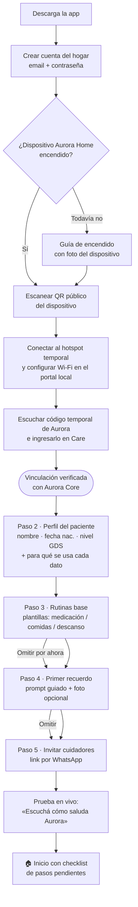
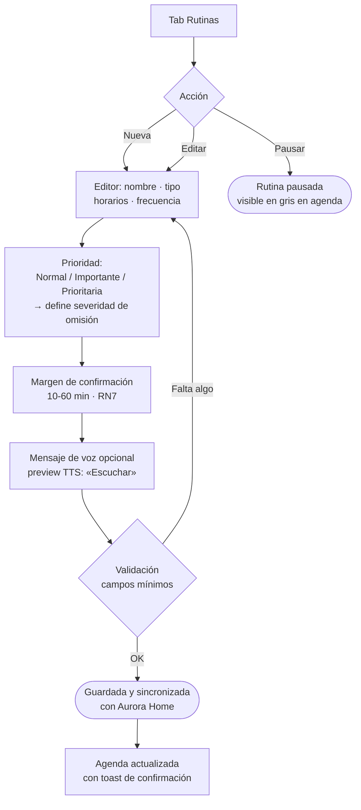
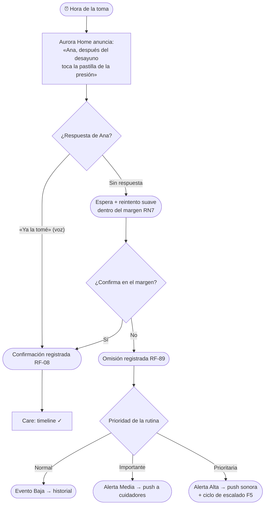
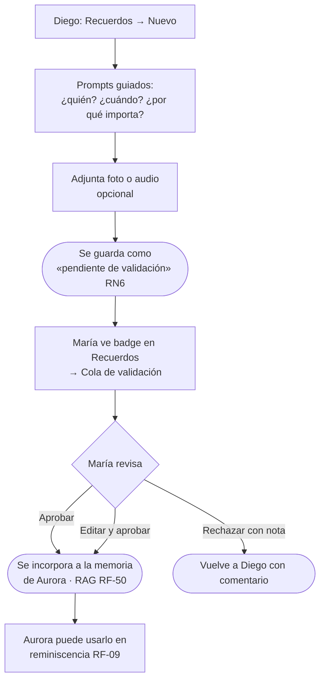
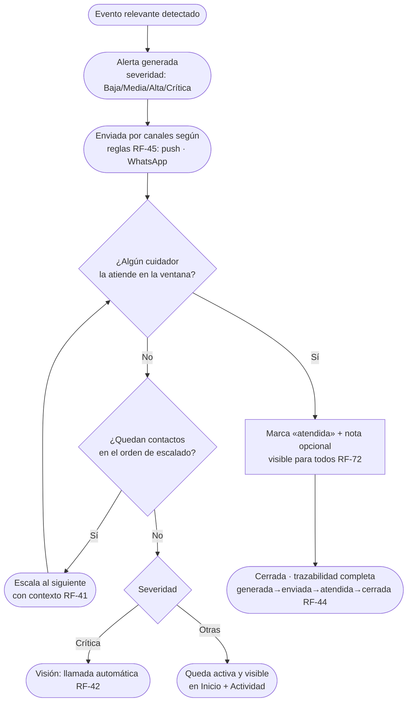
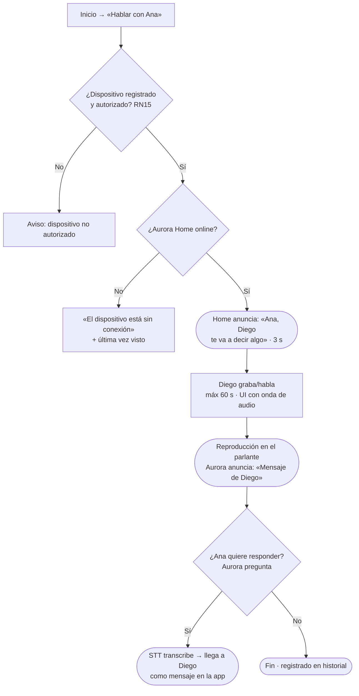
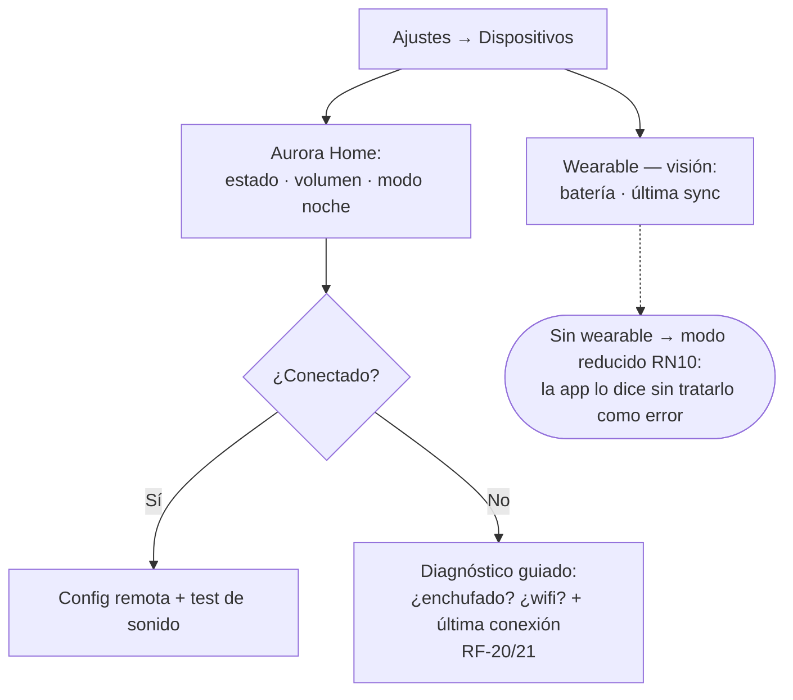
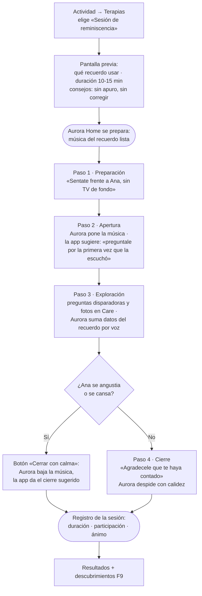
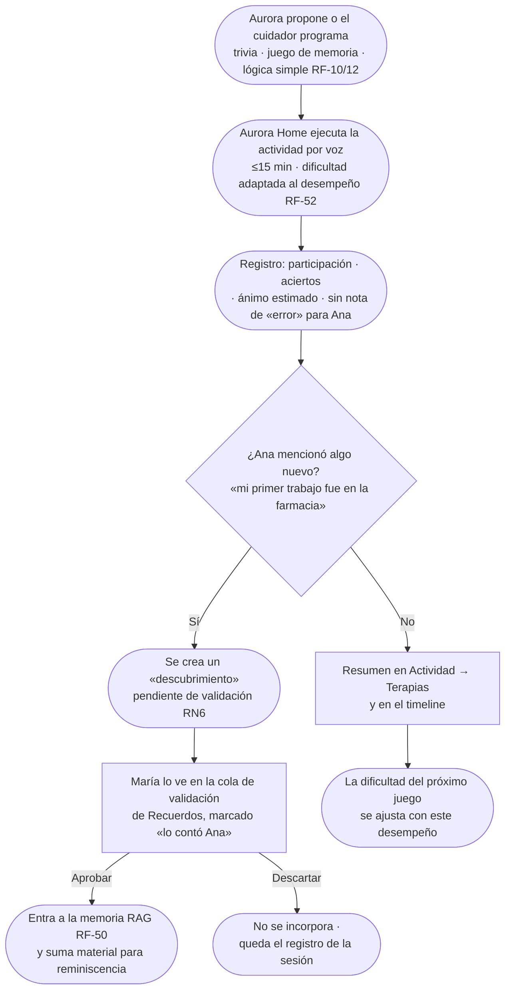

# User Flows

Capítulo 8 del [[Manual de UX-UI Aurora]]. Flujos MVP en detalle; los de visión, al final en baja fidelidad. Convención: rectángulo = pantalla/estado de UI · rombo = decisión · redondeado = acción del sistema.

## F1 · Registro y onboarding del hogar (MVP)

**Reglas**: el QR contiene sólo serial, identificador público y versión de provisioning; no lleva Wi-Fi, credenciales ni el código temporal. Aurora dicta un código de seis dígitos, de un uso, válido por dos minutos y con cinco intentos máximos; Care lo envía a Core, nunca directamente a Home. Sin el código no hay activación: una fotografía del QR no alcanza. Los pasos 3-5 son omitibles y quedan como checklist en Inicio · guardado automático por paso (si abandona, retoma donde estaba) · la cuenta es **única por hogar** (RN1); los cuidadores se asocian por **dispositivo**, sin cuentas propias.

## F2 · ABMC de rutina (MVP)

**Regla de severidad por prioridad**: Normal → omisión = evento **Baja** (solo historial) · Importante → **Media** (push estándar) · Prioritaria → **Alta** (push sonora + escalado). Mapa completo de severidades en [[Arquitectura de Información — Aurora Care]].

## F3 · Recordatorio de medicación: confirmación / omisión (MVP — flujo del sistema)

## F4 · Alta de recuerdo con validación (MVP)

## F5 · Ciclo de vida de alerta con escalado (MVP)

## F6 · Drop-in (MVP)

## F7 · Gestión de dispositivos (MVP)

## F8 · Sesión guiada de terapia — cuidador + Aurora en dúo (MVP)

La app hace de **coach del cuidador no experto** mientras Aurora Home acompaña en vivo. El protagonista es el cuidador; Aurora aporta música y preguntas disparadoras, mientras las fotos se muestran en Care cuando el cuidador las utiliza.

**Reglas**: cada paso muestra *qué decir*, *qué evitar* y *qué está haciendo Aurora* · el botón **Cerrar con calma** está siempre visible (salida airosa, principio 5 del [[VUI — Diseño Conversacional|VUI]]) · los pasos vienen de plantillas por tipo de terapia validables con especialistas (riesgo R1).

## F9 · Actividad autónoma de Aurora + descubrimientos (MVP)

**Reglas**: los descubrimientos **nunca** entran directo a la memoria — mismo circuito de validación que los aportes de cuidadores (RN6) · ante señales de angustia, Aurora cambia de actividad y lo registra para el cuidador (guion G4 del VUI).

---

## Flujos de visión (lo-fi — detalle en [[Handoff y Backlog de Diseño]])

**F10 · Zonas seguras (geofencing)**: Ajustes → Zonas seguras → mapa con radio arrastrable → nombre + horarios de vigencia → guardar (RF-70). Salida de zona → evento Alta/Crítica según configuración (RN11) → alerta con mapa y última ubicación (US 3.2).

**F11 · Biometría**: dashboard con tendencias (FC, actividad, sueño); umbrales personalizados; anomalía → evento según reglas (RF-15–19, 24–26).

**F12 · Llamada automática de emergencia**: alerta Crítica sin atención en ventana → llamada TTS al primer contacto → sin respuesta → siguiente → registro completo (RF-42).

**F13 · Reporte médico**: Actividad → Exportar → rango de fechas + secciones (cumplimiento, eventos, interacciones) → PDF para el profesional de la salud (RNF Exportación).

## Documentos relacionados
- [[Journeys y Escenarios]] · [[Arquitectura de Información — Aurora Care]] · [[VUI — Diseño Conversacional]] (la mitad de F3 y F6 ocurre por voz)
