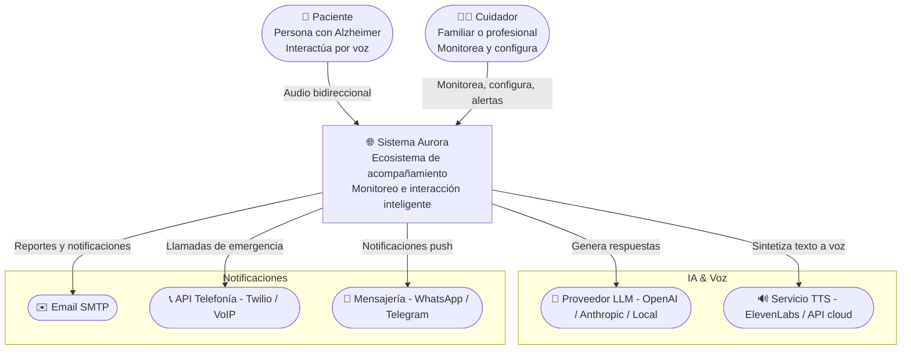
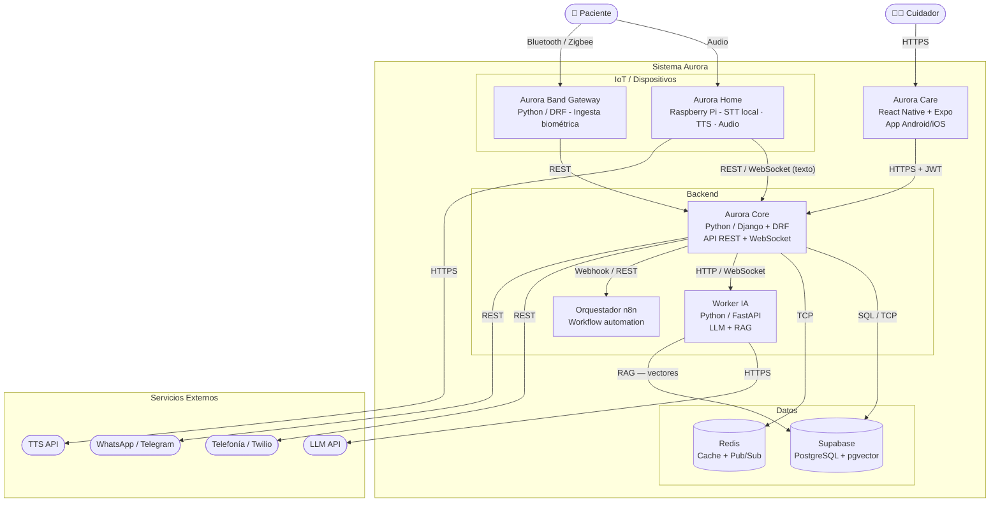
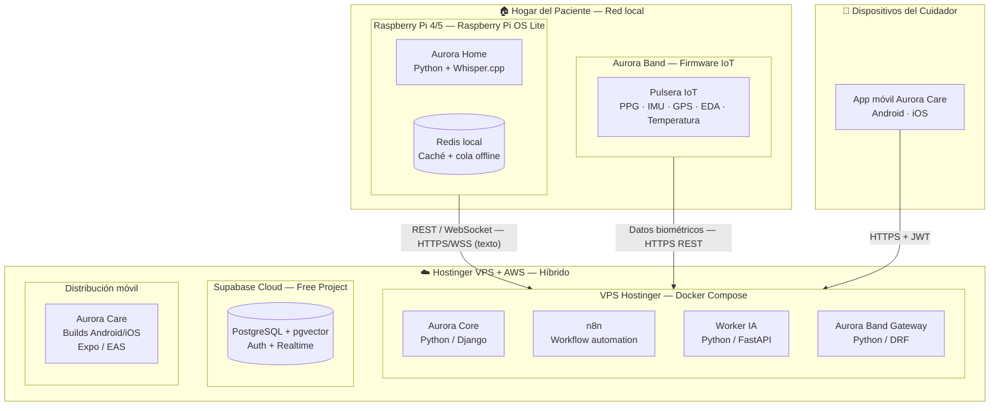

## 1. Introducción y Propósito

### 1.1 Objetivo del documento

Este documento registra las decisiones técnicas fundacionales del sistema Aurora, su arquitectura de solución y las pautas de desarrollo que guiarán la construcción del sistema. Su propósito es servir como referencia compartida para el equipo durante el desarrollo y para futuros mantenedores del sistema.

### 1.2 Audiencia

- Equipo de desarrollo (ingenieros de software, integradores IoT)
- Director del proyecto
- Futuros mantenedores y contribuyentes

### 1.3 Sistema en alcance

Aurora es un ecosistema de acompañamiento y monitoreo para personas con Alzheimer u otros trastornos de memoria que residen en su hogar. Se compone de cuatro subsistemas principales:

| Componente | Descripción |
|---|---|
| **Aurora Home** | Asistente de voz que interactúa proactivamente con el paciente |
| **Aurora Band** | Pulsera IoT para monitoreo biométrico continuo |
| **Aurora Care** | Aplicación para cuidadores (monitoreo, alertas, configuración) |
| **Aurora Core** | Núcleo de orquestación, automatización, análisis e IA |

### 1.4 Convenciones del documento

- Los diagramas utilizan la notación **C4 Model** (Contexto, Contenedores, Despliegue) con sintaxis **Mermaid**
- Las decisiones arquitectónicas significativas se registran como **Architecture Decision Records (ADRs)** en la sección 3
- Cada ADR incluye: contexto, alternativas consideradas, criterios de comparación, decisión tomada y consecuencias (incluyendo trade-offs negativos)

---

## 2. Arquitectura de Solución — Modelo C4

### 2.1 Contexto (Nivel 1)

El diagrama de contexto muestra a Aurora como un sistema que interactúa con el paciente (por voz), el cuidador (a través de Aurora Care) y diversos sistemas externos para brindar sus funcionalidades.



#### Actores del sistema

| Actor        | Descripción                                                                                                                                   |
| ------------ | --------------------------------------------------------------------------------------------------------------------------------------------- |
| **Paciente** | Persona con Alzheimer o pérdida de memoria. Interactúa exclusivamente por voz con Aurora Home. No requiere habilidades técnicas.              |
| **Cuidador** | Familiar o profesional que supervisa al paciente. Utiliza Aurora Care (app móvil) para monitorear, configurar rutinas y recibir alertas. |

#### Sistemas externos

| Sistema                     | Propósito                                                                                |
| --------------------------- | ---------------------------------------------------------------------------------------- |
| **Proveedor LLM**           | Generación de respuestas conversacionales, inferencia emocional, adaptación de contenido |
| **TTS**                     | Síntesis de voz natural para respuestas del asistente (p.ej., ElevenLabs, AWS Polly)     |
| **WhatsApp / Telegram API** | Canales de notificación alternativos al cuidador                                         |
| **API de Telefonía**        | Llamada automática de emergencia cuando la alerta escala                                 |
| **Email SMTP**              | Notificaciones por correo electrónico (reportes diarios/semanales)                       |

---

### 2.2 Contenedores (Nivel 2)

El diagrama de contenedores descompone el sistema en sus unidades desplegables y muestra las relaciones entre ellas.




#### Descripción de contenedores

| Contenedor              | Tecnología propuesta                    | Responsabilidad                                                                                               |
| ----------------------- | --------------------------------------- | ------------------------------------------------------------------------------------------------------------- |
| **Aurora Home**         | Raspberry Pi OS + Python + ALSA         | Captura de audio, STT local (Whisper.cpp), reproducción de respuestas, comunicación con Aurora Core, modo offline |
| **Aurora Core**         | Python / Django + DRF + Channels        | API REST/WebSocket, lógica de dominio, orquestación de módulos, autenticación JWT, gestión de eventos         |
| **Worker IA**           | Python (FastAPI)                        | Inferencia con LLM, pipeline RAG, clasificación de eventos, detección de estados                              |
| **Base de Datos**       | Supabase (PostgreSQL 16 + pgvector)     | Datos relacionales (pacientes, cuidadores, eventos, rutinas) + vectores de embeddings para RAG + Auth + Realtime |
| **Redis**               | Redis 7 (en Raspberry Pi + VPS)         | Caché local en RPi, cola de eventos offline; Redis compartido en VPS para pub-sub entre servicios             |
| **n8n**                 | n8n (self-hosted)                       | Automatización de flujos: recordatorios por horario, escalado de alertas, reglas condicionales                |
| **Aurora Care**         | React Native + Expo + TypeScript        | App móvil del cuidador para Android/iOS, notificaciones push, modo offline parcial                            |
| **Aurora Band Gateway** | Python / Django (módulo de Aurora Core) | API REST de ingesta de datos biométricos, gestión de estado de conexión, buffer de datos offline              |

---

### 2.3 Despliegue (Nivel 3)

El diagrama de despliegue muestra cómo se distribuyen físicamente los contenedores en la infraestructura.




#### Estrategia de despliegue

| Ambiente | Infraestructura | Propósito |
|---|---|---|
| **Desarrollo** | Local (Docker Compose) | Desarrollo activo, testing interno, pruebas unitarias y de integración |
| **Staging** | VPS Hostinger / AWS (recursos mínimos) | Integración, pruebas E2E, validación con stakeholders |
| **Producción** | VPS Hostinger / AWS (escalable) u on-premise | Uso real con pacientes |

**Nota sobre costos:** La configuración inicial combina Hostinger VPS + AWS Free Tier:

- 1 VPS Hostinger (plan básico ~$4-8/mes) — Aurora Core, n8n, Worker IA, Aurora Band Gateway
- Supabase Free Project ($0) — Base de datos PostgreSQL + pgvector (500 MB)
- Google Play / App Store, o builds internos durante el MVP — Aurora Care
- Redis en Raspberry Pi ($0) — caché local y cola de eventos
- Alternativa on-premise: servidor local en el hogar del paciente con port forwarding/DuckDNS

---

## 3. Architecture Decision Records (ADRs)

---

### ADR-001: Lenguaje y Framework Backend

| Campo | Valor |
|---|---|
| **ID** | ADR-001 |
| **Fecha** | Mayo 2026 |
| **Estado** | Aceptado  |
| **Decisores** | Equipo Aurora |

#### Contexto

El backend de Aurora (Aurora Core) debe manejar múltiples responsabilidades: API REST para Aurora Care y Aurora Home, WebSocket para comunicación bidireccional en tiempo real, procesamiento de eventos, integración con n8n, y gestión de datos. El equipo no tiene una preferencia definida previamente.

#### Drivers de decisión

1. **Baja latencia** para interacciones conversacionales en tiempo real
2. **Ecosistema maduro** para integración con n8n (construido en Node.js)
3. **Facilidad de despliegue** en AWS Free Tier (Lambda, ECS, EC2)
4. **Curva de aprendizaje razonable** para el equipo
5. **Tipado estático** para reducir errores en un sistema crítico (alertas de emergencia)
6. **Rendimiento** para concurrencia moderada (~decenas de pacientes simultáneos)

#### Decisión

Se adopta **Python con Django** como lenguaje y framework backend para Aurora Core.

**Fundamento:**
- El equipo tiene experiencia sólida en Python, lo que acelera el desarrollo y reduce la curva de aprendizaje
- Django ofrece un ecosistema maduro con ORM, autenticación, admin panel y migraciones integradas
- La integración con IA/ML es nativa (Python es el lenguaje estándar del ecosistema)
- Django REST Framework (DRF) proporciona una base sólida para la API REST
- La concurrencia con Django Channels + ASGI cubre las necesidades de WebSocket
- Aunque n8n está construido en Node.js, la integración vía webhooks/REST no requiere mismo lenguaje

#### Consecuencias

**Positivas:**
- Mayor velocidad de desarrollo gracias a la familiaridad del equipo con Python/Django
- Ecosistema IA/ML directamente accesible (LangChain, transformers, spaCy, etc.)
- Django Admin proporciona una interfaz de gestión rápida para debugging interno
- ORM maduro con migraciones automáticas y soporte para PostgreSQL + pgvector
- Comunidad grande, documentación extensa y abundantes paquetes de terceros

**Negativas (trade-offs):**
- Django no es asíncrono por defecto; requiere configuración ASGI (Daphne/Uvicorn) para WebSocket
- Menor rendimiento bruto que Node.js o Java en operaciones CPU-bound ligeras
- n8n está construido en Node.js, lo que implica un stack heterogéneo (Python + Node.js)
- Tipado dinámico de Python requiere disciplina y herramientas externas (mypy, Pydantic) para compensar

---

### ADR-002: Framework Frontend para Aurora Care

| Campo | Valor |
|---|---|
| **ID** | ADR-002 |
| **Fecha** | Mayo 2026 |
| **Estado** | Aceptado  |

#### Contexto

Aurora Care es la aplicación utilizada por los cuidadores para monitorear el estado del paciente, configurar rutinas y medicación, consultar historiales, administrar el entorno del hogar y recibir alertas ante eventos relevantes o críticos.

Debido a que estas alertas pueden requerir una respuesta inmediata, la aplicación debe estar disponible principalmente en dispositivos móviles y permitir el uso confiable de notificaciones push, acceso rápido desde el celular e integración con funcionalidades propias del dispositivo.

Aurora Care debe funcionar en Android e iOS, manteniendo una única base de código y permitiendo futuras integraciones con servicios del sistema operativo, dispositivos Bluetooth, ubicación, almacenamiento seguro y tareas ejecutadas en segundo plano.

#### Drivers de decisión

1. **Android e iOS** con una única base de código
2. **Notificaciones push nativas** para alertas críticas
3. **Acceso a funcionalidades del dispositivo**: Bluetooth, ubicación, sensores y almacenamiento seguro
4. **Tareas en segundo plano** cuando el sistema operativo lo permita
5. **Integración futura con wearables** o datos biométricos
6. **Deep links** para abrir alertas, mapas o pantallas específicas desde una notificación
7. **Modo offline parcial** para consultar información reciente y almacenar temporalmente determinadas acciones
8. **Compatibilidad con OAuth 2.0**
9. **Herramientas de compilación, pruebas, distribución y actualización**
10. **Capacidad de incorporar módulos nativos** cuando una funcionalidad lo requiera

#### Decisión

Se adopta **React Native con Expo** como framework frontend para Aurora Care.

La aplicación se desarrollará para dispositivos móviles Android e iOS, utilizando una única base de código compartida entre ambas plataformas.

Se utilizará **TypeScript** como lenguaje principal para mejorar el tipado, reducir errores y facilitar el mantenimiento del código.

Se utilizará **Expo Router** para organizar la navegación, las rutas y la estructura de pantallas de la aplicación.

Se utilizarán **Expo Development Builds** cuando sea necesario integrar funcionalidades que requieran configuración nativa, como notificaciones push, Bluetooth, ubicación, tareas en segundo plano, deep links, almacenamiento seguro o integraciones con sensores y dispositivos externos.

Expo Go podrá utilizarse para pruebas iniciales de funcionalidades compatibles, pero no será considerado el entorno definitivo de desarrollo o validación.

Durante el desarrollo, la aplicación podrá distribuirse mediante builds internos instalables. Para producción, podrá publicarse en Google Play Store y Apple App Store.

**Fundamento:**
- React Native permite desarrollar aplicaciones móviles con componentes de React que se representan como componentes nativos de Android e iOS
- Expo simplifica la configuración, compilación, distribución y mantenimiento inicial sin impedir el acceso a funcionalidades nativas mediante Development Builds y Configuration Plugins
- TypeScript mejora la mantenibilidad de una app con flujos críticos, modelos compartidos y validaciones de dominio
- La elección es coherente con el enfoque principalmente móvil de Aurora Care y con la necesidad de alertas confiables e integración con capacidades del dispositivo

#### Consecuencias

**Positivas:**
- Una única base de código para Android e iOS
- Reutilización de componentes, lógica de negocio y modelos de datos
- Experiencia de usuario integrada con el sistema operativo
- Acceso a notificaciones push nativas
- Posibilidad de utilizar Bluetooth, ubicación, sensores y almacenamiento seguro
- Compatibilidad con deep links desde notificaciones
- Posibilidad de ejecutar determinadas tareas en segundo plano
- Mejor preparación para futuras integraciones con wearables
- Desarrollo inicial simplificado mediante Expo
- Navegación estructurada mediante Expo Router
- Posibilidad de incorporar módulos nativos mediante Development Builds
- Distribución de builds internos antes de publicar la aplicación

**Negativas:**
- Será necesario generar y mantener builds para Android e iOS
- La publicación en producción requerirá cuentas de desarrollador, certificados y firmas digitales
- Algunas funcionalidades deberán configurarse de manera diferente en cada sistema operativo
- La aplicación deberá probarse en ambas plataformas y en diferentes versiones de Android e iOS
- Determinadas librerías podrán requerir Configuration Plugins o modificaciones de código nativo
- Las tareas en segundo plano estarán sujetas a restricciones propias de Android e iOS
- Algunas funcionalidades no podrán probarse directamente mediante Expo Go
- El modo offline requerirá una estrategia específica de almacenamiento local, sincronización y resolución de conflictos

---

### ADR-003: Base de Datos (Relacional y Vectorial)

| Campo | Valor |
|---|---|
| **ID** | ADR-003 |
| **Fecha** | Mayo 2026 |
| **Estado** | Aceptado  |

#### Contexto

Aurora requiere persistencia para datos relacionales (pacientes, cuidadores, eventos, rutinas, alertas, configuraciones) y datos vectoriales (embeddings para RAG — Retrieval-Augmented Generation — en el motor de IA). Se evaluaron opciones de base de datos única vs. especializadas.

#### Drivers de decisión

1. **Consistencia y confiabilidad** para datos de salud (eventos, alertas, medicación)
2. **Búsqueda vectorial** eficiente para RAG (memoria del paciente, contexto conversacional)
3. **Costo** en Free Tier / bajos recursos
4. **Simplicidad operativa** (preferible una sola base de datos)
5. **Respaldo y recuperación** ante fallas

#### Decisión

Se adopta **Supabase (PostgreSQL 16 + pgvector)** como plataforma de datos.

**Fundamento:**
- Supabase ofrece PostgreSQL gestionado con extensión pgvector incluida, eliminando la necesidad de administrar RDS
- Incluye autenticación, Realtime (WebSocket), Storage y APIs automáticas, reduciendo servicios externos
- Plan Free Project (500 MB DB, 2 GB storage, 50k MAU) es suficiente para prototipo y validación
- Al estar basado en PostgreSQL puro, no hay vendor lock-in: se puede migrar a PostgreSQL estándar en cualquier momento
- pgvector proporciona búsqueda vectorial HNSW integrada, suficiente para RAG (memoria del paciente)

#### Consecuencias

**Positivas:**
- Reducción de servicios externos: Supabase reemplaza RDS, ElastiCache (Realtime), Auth0 y S3 (storage)
- Costo inicial $0 con el Free Project de Supabase
- APIs automáticas de Supabase (REST + Realtime) agilizan el desarrollo inicial
- Migración trivial a PostgreSQL estándar si se supera el Free Tier
- Auth integrado con Row Level Security (RLS) para multi-tenant (cada cuidador ve solo sus pacientes)

**Negativas:**
- Free Project limitado a 500 MB DB, 2 proyectos simultáneos
- Supabase Realtime no es un reemplazo completo de Redis para colas/pub-sub complejos
- Dependencia parcial de un servicio externo (Supabase Cloud); la instancia self-hosted de Supabase requiere recursos adicionales
- pgvector tiene rendimiento inferior a soluciones vectoriales dedicadas (Qdrant, Pinecone) en conjuntos de datos muy grandes (>1M vectores), pero es suficiente para el volumen esperado


---

### ADR-004: Patrón Arquitectónico

| Campo | Valor |
|---|---|
| **ID** | ADR-004 |
| **Fecha** | Mayo 2026 |
| **Estado** | Aceptado  |

#### Contexto

Aurora integra múltiples subsistemas (voz, IoT, IA, automatización, notificaciones, app del cuidador) que deben coordinarse de manera confiable. El patrón arquitectónico define cómo se estructuran y comunican estos componentes.

#### Drivers de decisión

1. **Tolerancia a fallos parciales**: una caída en la IA no debe impedir recordatorios básicos
2. **Escalabilidad selectiva**: los componentes críticos (alertas, monitoreo IoT) pueden necesitar escalar independientemente
3. **Complejidad controlada**: el equipo es pequeño y el presupuesto acotado
4. **Integración con n8n**: el orquestador de flujos existente en el diseño
5. **Evolución**: poder partir de una arquitectura simple y evolucionar hacia microservicios si es necesario

#### Decisión

Se adopta el patrón de **Microservicios** como arquitectura principal, organizados por dominio.

**Estructura propuesta:**
- **Aurora Core API** — Gateway REST + WebSocket (Django + Channels) — punto único de entrada
- **Worker IA** — Servicio Python independiente (FastAPI) para inferencia LLM + RAG
- **Aurora Band Gateway** — Servicio Python / Django para ingesta de datos biométricos
- **n8n** — Orquestador de flujos separado para automatización (recordatorios, escalado de alertas)
- Comunicación síncrona vía REST/HTTP entre servicios; comunicación asíncrona vía Redis Pub/Sub para eventos en tiempo real

**Fundamento:**
- Tolerancia a fallos parciales: una caída del Worker IA no afecta los recordatorios programados ni la ingesta biométrica
- Escalabilidad selectiva: el Worker IA puede escalar independientemente si aumenta la demanda de LLM
- n8n como orquestador externo desacopla la automatización de flujos del código de dominio
- Redis Pub/Sub como backbone de eventos permite comunicación en tiempo real sin acoplar servicios
- Cada servicio puede desarrollarse en el lenguaje más adecuado (Python para IA, Node.js para IoT Gateway)

#### Consecuencias

**Positivas:**
- Aislamiento de fallos: un error en el Worker IA no bloquea el resto del sistema
- Despliegue independiente: cada servicio puede actualizarse sin afectar a los demás
- Stack heterogéneo permite usar Python para IA y Node.js para tiempo real según convenga
- n8n externaliza flujos de automatización sin necesidad de código personalizado
- Redis Pub/Sub proporciona comunicación en tiempo real desacoplada

**Negativas:**
- Mayor complejidad operativa: múltiples servicios que monitorear, desplegar y mantener
- Latencia de red entre servicios (vs. llamadas internas en un monolito)
- Consistencia eventual entre servicios: requiere manejo de estados y compensaciones
- Debugging distribuido más complejo (trazabilidad entre servicios)
- El equipo pequeño enfrenta una sobrecarga inicial de configuración (Docker Compose, redes, health checks)

---

### ADR-005: Autenticación y Autorización

| Campo | Valor |
|---|---|
| **ID** | ADR-005 |
| **Fecha** | Mayo 2026 |
| **Estado** | Aceptado  |

#### Contexto

Aurora maneja datos sensibles de salud (biométricos, ubicación, medicación, historial médico). El acceso debe estar estrictamente controlado: cada cuidador solo debe ver los datos del paciente a su cargo, y debe existir trazabilidad de quién accedió o modificó información.

#### Drivers de decisión

1. **Cumplimiento de privacidad**: los datos de salud requieren autenticación fuerte y cifrado
2. **Multi-tenant**: cada cuidador asociado a uno o más pacientes, con datos estrictamente separados
3. **Múltiples canales**: acceso desde Aurora Care (app móvil) y API para Aurora Home
4. **Costo**: preferencia por solución gratuita o de bajo costo en etapa inicial
5. **Bajo mantenimiento**: el equipo no debe administrar infraestructura de autenticación compleja

#### Decisión

Se adopta **Auth0** como proveedor de autenticación y autorización.

**Fundamento:**
- Auth0 ofrece un SDK maduro para Python/Django (social-auth-app-django, django-rest-framework-simplejwt)
- Soporte nativo para multi-tenant mediante Organizations (cada cuidador asociado a un paciente)
- MFA/2FA incluido sin configuración adicional, crítico para datos de salud
- Free Tier (7k MAU) es suficiente para la etapa inicial (decenas de cuidadores)
- Cero mantenimiento de infraestructura de autenticación
- Integración con redes sociales (Google, Apple) para facilitar el registro de cuidadores

#### Consecuencias

**Positivas:**
- Implementación rápida: semanas en lugar de meses para un sistema de autenticación seguro
- MFA, social login, y recuperación de contraseña sin desarrollo interno
- Organizations de Auth0 simplifican el multi-tenant (cada organización = un paciente)
- Trazabilidad de accesos incluida (logs de autenticación)
- Políticas de contraseñas y bloqueo por intentos fallidos sin código personalizado

**Negativas:**
- Free Tier limitado a 7k MAU; al crecer, el costo escala significativamente
- Dependencia de un servicio externo: si Auth0 cae, el sistema completo queda inaccesible
- Los datos de identidad residen en Auth0 (consideraciones de privacidad/residencia de datos)
- Migrar a otro proveedor requiere cambiar todos los usuarios de identidad
- Las Organizations de Auth0 tienen limitaciones en el Free Tier (solo 2 organizaciones)

---

### ADR-006: Procesamiento de Voz — STT Local en Raspberry Pi

| Campo | Valor |
|---|---|
| **ID** | ADR-006 |
| **Fecha** | Mayo 2026 |
| **Estado** | Aceptado  |

#### Contexto

Aurora Home (Raspberry Pi) captura audio del paciente para procesarlo mediante STT (Speech-to-Text) y enviar el texto transcrito a Aurora Core. La pregunta clave es dónde ocurre la transcripción: si en la nube (enviando audio crudo a una API STT externa) o localmente en la Raspberry Pi. Esta decisión impacta la latencia, la privacidad, la capacidad offline y el consumo de recursos del dispositivo.

#### Drivers de decisión

1. **Latencia**: el envío de audio a la nube agrega latencia de red + procesamiento cloud (300-800 ms)
2. **Privacidad**: el audio crudo del paciente contiene información sensible que idealmente no debería salir del hogar
3. **Modo offline**: para que Aurora Home funcione sin internet, el STT debe ejecutarse localmente
4. **Recursos de la RPi**: Whisper.cpp puede ejecutarse en RPi 4/5 con modelos pequeños (tiny/base) con latencia aceptable
5. **Ancho de banda**: enviar texto transcrito (~100 bytes) vs. audio comprimido (~10-50 KB/segundo) reduce drásticamente el uso de red

#### Decisión

Se adopta **STT local en la Raspberry Pi** con Whisper.cpp (modelo base) para la transcripción de voz del paciente.

**Fundamento:**
- La privacidad del paciente es crítica: el audio crudo nunca sale del hogar, solo se envía texto transcrito a Aurora Core
- Whisper.cpp en RPi 4/5 logra transcripción en tiempo real (200-500 ms) con el modelo base, comparable a la latencia de cloud
- El STT local es un requisito habilitante para el modo offline (ADR-008)
- Enviar texto en lugar de audio reduce el ancho de banda y la dependencia de red
- La API de Aurora Core recibe texto (no audio), simplificando el protocolo a REST + WebSocket para mensajes de texto
- Para TTS se mantiene cloud (ElevenLabs) para calidad de voz superior, con fallback a TTS offline (Piper) en modo degradado

#### Consecuencias

**Positivas:**
- Privacidad total del audio del paciente (nunca sale de la RPi)
- Latencia de transcripción predecible y sin dependencia de red
- Funcionamiento offline completo para STT (interacción vocal básica sin internet)
- Reducción de ancho de banda: texto vs. audio crudo
- Simplificación del protocolo: Aurora Home envía texto, no audio, a Aurora Core

**Negativas:**
- Whisper.cpp en RPi consume 30-60% de CPU durante la transcripción, limitando otros procesos
- La precisión del modelo base es inferior a Whisper large o Google STT, especialmente con acentos o ruido de fondo
- La RPi requiere ~1-2 GB de RAM adicional para Whisper.cpp
- Actualizaciones del modelo STT requieren descarga de archivos a la RPi
- No es posible mejorar la precisión usando modelos más grandes sin afectar la experiencia de usuario (latencia + CPU)

#### Presupuesto de latencia para el pipeline de voz (baseline esperado)

Con STT local en RPi, la cadena de procesamiento cambia:

| Etapa | Latencia estimada | Dependencia |
|---|---|---|
| Captura de audio | <50 ms | Aurora Home (local) |
| STT local (Whisper.cpp base) | 200-500 ms | Aurora Home (RPi CPU) |
| Envío de texto transcrito a Aurora Core | <50 ms | Red local → cloud |
| LLM + RAG (generación de respuesta) | 500-2000 ms | API cloud externa + consulta a BD |
| TTS (Text-to-Speech) | 200-500 ms | API cloud externa |
| Recepción + reproducción | <100 ms | Red local → Aurora Home |
| **Total estimado (p50)** | **~1.0-3.2 segundos** | |

**Objetivo de diseño:** p95 por debajo de 3.5 segundos para respuestas conversacionales simples. Para respuestas que requieren RAG completo, se acepta hasta 5.5 segundos.

**Implicaciones:**
- Whisper.cpp debe ejecutarse con prioridad ajustable para no bloquear otros procesos de Aurora Home
- Si la CPU de la RPi no da abasto, considerar: (a) modelo smaller (tiny en lugar de base), (b) offloading a GPU (si hay acelerador), (c) STT híbrido con fallback a cloud selectivo
- Pipeline de voz completamente offline es posible (STT local + TTS Piper + LLM local) para operación degradada total

---

### ADR-007: Despliegue e Infraestructura

| Campo | Valor |
|---|---|
| **ID** | ADR-007 |
| **Fecha** | Mayo 2026 |
| **Estado** | Aceptado  |

#### Contexto

El sistema Aurora debe desplegarse inicialmente con costos mínimos (Free Tier AWS o alternativas gratuitas) pero con la capacidad de migrar a on-premise o a infraestructura escalable de pago según evolucione. El despliegue debe ser reproducible y automatizado.

#### Drivers de decisión

1. **Costo mínimo** en etapa de prototipo y validación
2. **Reproducibilidad** (infraestructura como código)
3. **Migración viable** a on-premise si los costos cloud superan el presupuesto
4. **Actualizaciones remotas** de Aurora Home (Raspberry Pi) sin intervención física
5. **Monitoreo** básico para detectar caídas del servicio

#### Decisión

Se adopta una estrategia **híbrida multicloud + local**:

- **Aurora Core** (API + workers) → **VPS Hostinger** (plan económico, ~$4-8/mes) con Docker Compose
- **Base de datos** → **Supabase** (PostgreSQL + pgvector, Free Project) — o **RDS PostgreSQL Free Tier** como alternativa si se supera el Free Tier de Supabase
- **Redis** → **Ejecutado en la Raspberry Pi** (Aurora Home) para caché local y cola de mensajería offline. Alternativa cloud si se necesita Redis compartido entre servicios
- **Aurora Care** (frontend) → **builds Android/iOS** mediante Expo/EAS, con distribución interna durante el MVP y publicación en tiendas para producción
- **n8n** → Misma instancia VPS que Aurora Core
- **Aurora Home** → **Raspberry Pi 4/5** en el hogar del paciente
- **AWS Free Tier** → Uso complementario para S3/CloudFront y como respaldo si Hostinger no es suficiente
- **Dominio** → Namecheap/Hostinger (costo mínimo)
- **CI/CD** → **GitHub Actions** (Free Tier: 2000 min/mes para repos privados)

**Plan de migración:**
- Todo el stack empaquetado en Docker Compose desde el inicio, permitiendo migrar entre Hostinger, AWS o on-premise sin cambios de código
- n8n permite reconfigurar flujos sin cambiar código
- Redis en la RPi proporciona caché local y cola de eventos para operación offline; si se necesita Redis compartido, se puede añadir un contenedor Redis en el VPS

#### Consecuencias

**Positivas:**
- Costo inicial bajo: VPS Hostinger (~$4-8/mes) + Free Tier de AWS/Supabase
- Redis en la RPi reduce costos cloud y mejora la resiliencia offline (caché local siempre disponible)
- Sin depender de un solo proveedor cloud: se puede migrar entre Hostinger, AWS u on-premise
- GitHub Actions automatiza pruebas y despliegue sin costo adicional
- Aurora Home con actualización OTA via `git pull` o Docker pull

**Negativas:**
- Hostinger VPS tiene recursos limitados comparado con AWS; puede requerir migrar a AWS si la carga crece
- Redis en la RPi no está disponible para servicios cloud si la RPi está apagada o sin red (limitado a uso local)
- La administración del VPS (actualizaciones OS, seguridad) es responsabilidad del equipo, no gestionado
- On-premise requiere que el cuidador tenga internet estable y conocimientos básicos para reiniciar el sistema si falla
- La migración entre proveedores cloud requiere sincronización de datos (backup/restore de PostgreSQL)

---

### ADR-008: Modo Offline y Operación Degradada

| Campo | Valor |
|---|---|
| **ID** | ADR-008 |
| **Fecha** | Mayo 2026 |
| **Estado** | Aceptado  |

#### Contexto

Aurora Home (el asistente de voz en el hogar del paciente) depende de conectividad a internet para funciones críticas: transcripción STT, generación de respuestas LLM, síntesis TTS, y comunicación con Aurora Core. Dado que no se puede garantizar conectividad continua en un entorno doméstico (cortes de ISP, reinicio de router, mantenimiento), el sistema debe definir una estrategia de operación degradada que mantenga funcionalidades esenciales.

#### Drivers de decisión

1. **Seguridad del paciente**: recordatorios de medicación y alertas de emergencia no deben depender de conectividad cloud
2. **Experiencia de usuario**: la interacción por voz no debe fallar abruptamente; debe degradarse gracefulmente
3. **Autonomía del dispositivo**: la batería y recursos de la Raspberry Pi limitan qué puede ejecutarse localmente
4. **Recuperación automática**: al restaurarse la conectividad, el sistema debe sincronizar datos sin intervención manual

#### Decisión

Se adopta el modo **degradado híbrido** con la siguiente estrategia:

- **En línea (conectividad normal):** STT local con Whisper.cpp, TTS cloud (ElevenLabs) y LLM cloud. Aurora Home envía texto transcrito a Aurora Core.
- **Sin conectividad (degradado):**
  - **Recordatorios programados** se ejecutan localmente desde un archivo de configuración con horarios cacheados (sincronizado desde Aurora Core cuando hay conexión)
  - **Interacción por voz básica:** STT local (Whisper.cpp) + TTS offline (Piper TTS) para respuestas predefinidas ("Lo siento, no tengo conexión", "Es hora de tu medicación"). LLM offline con modelo pequeño (opcional)
  - **El audio del paciente** se transcribe localmente y las transcripciones se almacenan para su envío posterior cuando la conexión se restablezca
  - **Alertas críticas** (caídas detectadas por la pulsera) se almacenan localmente y se reenvían al restaurar la conexión; no se pierden
- **Reconexión automática:** Al detectar conectividad, Aurora Home sincroniza eventos almacenados, descarga actualizaciones de configuración, y reanuda operación completa. Implementar con **retry exponencial** y health check periódico.

#### Consecuencias

**Positivas:**
- Recordatorios de medicación y rutinas críticas nunca se pierden, incluso sin internet
- El paciente no experimenta una falla total del sistema ante cortes de conectividad
- Los eventos críticos (caídas) tienen un buffer local que garantiza su entrega diferida
- La sincronización automática elimina la necesidad de intervención del cuidador en cortes de red

**Negativas:**
- La interacción conversacional rica (charla, reminiscencia, actividades cognitivas) no está disponible offline
- Aurora Home necesita almacenamiento persistente local para buffer de audio y eventos (SD card o SSD)
- El TTS offline tiene calidad de voz inferior a los servicios cloud
- La RPi debe ejecutar un cron local o scheduler para recordatorios offline, agregando complejidad al firmware
- La gestión del buffer circular requiere políticas de descarte cuando se llena durante cortes prolongados

---

### ADR-009: Protocolo de Comunicación IoT — Aurora Band

| Campo | Valor |
|---|---|
| **ID** | ADR-009 |
| **Fecha** | Mayo 2026 |
| **Estado** | Aceptado  |

#### Contexto

Aurora Band (pulsera IoT) debe enviar datos biométricos (frecuencia cardíaca, IMU, GPS, EDA, temperatura) al Aurora Band Gateway en la nube. La comunicación debe ser confiable, de bajo consumo energético (la pulsera funciona con batería), y capaz de manejar desconexiones intermitentes. El diagrama de contenedores muestra "API REST / MQTT" como opciones tentativas sin decisión registrada.

#### Drivers de decisión

1. **Bajo consumo energético**: la transmisión de datos es el mayor consumo en dispositivos IoT con batería
2. **Confiabilidad en entrega**: los datos biométricos (especialmente eventos de caída) no deben perderse
3. **Desconexiones frecuentes**: la pulsera puede salir del alcance del gateway o perder conectividad Bluetooth
4. **Volumen de datos**: envío periódico de lecturas biométricas (cada 1-5 minutos) más eventos esporádicos
5. **Simplicidad del firmware**: el hardware de la pulsera tiene recursos limitados

#### Decisión

Se adopta **API REST (HTTP)** como protocolo de comunicación entre Aurora Band y Aurora Band Gateway.

**Fundamento:**
- **Simplicidad del firmware**: la pulsera IoT tiene recursos limitados; un cliente HTTP es más simple y liviano que un cliente MQTT completo
- **Frecuencia de envío baja**: datos biométricos cada 1-5 minutos más eventos esporádicos — no justifica una conexión persistente MQTT
- **Batería**: REST con conexión HTTP corta (send-and-forget) consume menos energía que mantener una conexión TCP persistente para envíos tan espaciados
- **Integración nativa**: Django REST Framework procesa los endpoints HTTP sin necesidad de un broker MQTT adicional
- **Compatibilidad con modo offline**: la pulsera acumula datos localmente y los envía como batch REST cuando hay conectividad
- **Menor infraestructura**: no requiere broker MQTT, simplificando el despliegue y monitoreo

**Nota:** Para eventos críticos (detección de caídas) donde la latencia importa, se puede establecer una conexión WebSocket bajo demanda como complemento a REST.

#### Consecuencias

**Positivas:**
- Firmware más simple y testeable (HTTP es ubicuo, librerías maduras en C/C++ para IoT)
- Sin broker MQTT que administrar (una pieza menos de infraestructura)
- Compatible con REST estándar de Django (DRF viewsets, serializers, auth JWT)
- Buffer de datos offline simple: almacenar en JSON local y enviar como batch HTTP cuando hay conexión
- Debugging sencillo con herramientas HTTP estándar (curl, Postman, logs de Django)

**Negativas:**
- Mayor consumo energético por envío individual que MQTT (handshake TCP + headers HTTP por cada request), aunque mitigado por la baja frecuencia de envío
- Sin QoS nativo: necesita retry manual en el firmware si la request falla
- Mayor latencia por envío que MQTT persistente (handshake TCP overhead)
- Headers HTTP más verbosos que el binario MQTT, aunque el payload biométrico es pequeño
- Si la frecuencia de envío aumenta a segundos (no minutos), MQTT sería más eficiente


---

## 4. Pautas de codificación
### 4.1 Convenciones de nomenclatura

| Elemento                        | Convención         | Ejemplo                                         |
| ------------------------------- | ------------------ | ----------------------------------------------- |
| Archivos Python                 | `snake_case`       | `patient_service.py`, `event_handler.py`        |
| Clases                          | `PascalCase`       | `PatientService`, `AlertEvent`                  |
| Funciones / métodos / variables | `snake_case`       | `get_patient_by_id()`, `create_event()`         |
| Constantes globales             | `UPPER_SNAKE_CASE` | `MAX_RETRY_COUNT`, `ALERT_CRITICAL`             |
| Directorios                     | `snake_case`       | `apps/patients/`, `common/`                     |
| Archivos de test                | `test_*.py`        | `test_patient_service.py`                       |
| Migraciones de BD               | Django autogenera  | `apps/patients/migrations/0001_initial.py`      |

### 4.2 Estructura de directorios propuesta

```
backend/
  config/
    settings/
      base.py
      local.py
      production.py
    urls.py
    wsgi.py
    asgi.py
  apps/
    patients/
      models.py
      views.py
      serializers.py
      urls.py
      admin.py
      services.py
      tests/
        test_models.py
        test_views.py
        test_services.py
    events/
    alerts/
    biometrics/
    authentication/
    caregivers/
    routines/
    medications/
    interactions/
  common/
    mixins.py
    permissions.py
    exceptions.py
    filters.py
    pagination.py
    utils.py
  webhooks/
    n8n/
    aurora-home/
    aurora-band/
  requirements/
    base.txt
    local.txt
    production.txt
  manage.py
  Dockerfile
frontend/
  app/          (Expo Router)
    (auth)/
    (tabs)/
      index.tsx
      routines.tsx
      memories.tsx
      activity.tsx
      settings.tsx
    alert/
      [id].tsx
  src/
    components/
      ui/
      shared/
      features/
    services/
      api/
    hooks/
    stores/
    utils/
    types/
  assets/
  app.json
  eas.json
infra/
  docker/
    docker-compose.yml
    Dockerfile.backend
  terraform/
    main.tf
    variables.tf
  scripts/
    deploy.sh
    backup.sh
```

### 4.3 Linting y formateo

| Herramienta | Propósito | Configuración |
|---|---|---|---|
| **Ruff** | Linter + formateo unificado (reemplaza flake8, isort, black, pylint) | `line-length = 100`, `select = ["E", "F", "I", "N", "W"]` |
| **pre-commit** | Git hooks | `.pre-commit-config.yaml` con hooks: ruff, trailing-whitespace, end-of-file-fixer |
| **mypy** | Type checking estático (opcional, recomendado) | `strict = true` |
| **Commitlint** | Validación de mensajes de commit | `conventional-changelog` (Angular convention) |

**Convención de commits:**
```
<type>(<scope>): <descripciónBreve>

<descripciónCompleta>

tipos: feat, fix, refactor, test, docs, chore, style, perf
scope: patient, alerts, auth, home, band, api, infra...
ejemplo: feat(patient): agregar CRUD de perfil de paciente

	- Create para cuidadores
	- Read para cuidadores y pacientes
	- Update para cuidadores
	- Delete deshabilitar
```

### 4.4 Calidad y testing

- **Unit tests**: `pytest` + `pytest-django` para backend; Jest + React Native Testing Library para frontend. Cobertura mínima: 70%
- **Integration tests**: `Django Test Client` + `APITestCase` (DRF) para endpoints de API
- **E2E**: Maestro o Detox para flujos críticos de Aurora Care en Android/iOS emulados
- **GitHub Actions**: Ejecutar `pytest` + `ruff check` en cada push y PR

---

## 5. Proceso de Despliegue y Gestión de Ambientes

### 5.1 Ambientes

| Ambiente              | Infraestructura                                 | Propósito                                                              | Actualización                                              |
| --------------------- | ----------------------------------------------- | ---------------------------------------------------------------------- | ---------------------------------------------------------- |
| **Desarrollo (dev)**  | Local (Docker Compose)                          | Desarrollo diario, testing interno, pruebas unitarias y de integración | Manual (sin CI/CD, cada desarrollador gestiona su entorno) |
| **Staging**           | VPS Hostinger                                   | Validación de integración, pruebas con stakeholders, UAT               | Automática al merge a `main`                               |
| **Producción (prod)** | VPS Hostinger / AWS (pago por uso) u on-premise | Uso real con pacientes                                                 | Manual mediante GitHub Releases                            |

### 5.2 Flujo CI/CD (GitHub Actions)

```yaml
# .github/workflows/ci.yml
name: CI/CD Aurora

on:
  push:
    branches: [develop, main]
  pull_request:
    branches: [main]

jobs:
  test:
    runs-on: ubuntu-latest
    steps:
      - uses: actions/checkout@v4
      - uses: actions/setup-python@v5
        with:
          python-version: "3.12"
      - run: pip install -r requirements/base.txt -r requirements/local.txt
      - run: ruff check .
      - run: pytest --cov
  
  build-and-deploy:
    needs: test
    if: github.ref == 'refs/heads/main'
    runs-on: ubuntu-latest
    steps:
      - name: Build Docker images
        run: docker compose -f infra/docker/docker-compose.yml build
      
      - name: Push to registry
        run: docker push ... (GHCR o Docker Hub)
      
      - name: Deploy to staging
        run: ... (SSH + Docker pull + restart)
      
      - name: Build Aurora Care internal app
        run: ... (eas build --profile preview --platform all)
```

### 5.3 Estrategia de releases

1. **Desarrollo diario** en ramas `feature/*` → PR a `develop`
2. **Integración** en `develop` (testing interno) → despliegue automático a dev
3. **Pre-release** → merge a `main` → despliegue automático a staging
4. **Release** → tag semántico (`v1.0.0`) en `main` → build de producción + deploy manual a prod
5. **Hotfix** → rama `hotfix/*` desde `main` → PR directo a `main`

### 5.4 Monitoreo y logging

| Herramienta                   | Propósito                                              | Costo                     |
| ----------------------------- | ------------------------------------------------------ | ------------------------- |
| **Loki + Prometheus**         | Logs de contenedores y métricas del sistema (self-hosted en VPS) | Gratuito (open source)    |
| **Sentry**                    | Monitoreo de errores en frontend (Aurora Care) y backend (Aurora Core) | Free Tier: 5k eventos/mes |
| **Grafana**                   | Dashboard unificado para visualizar logs (Loki) y métricas (Prometheus) | Gratuito (open source)    |
| **Uptime Kuma** (self-host)   | Health checks de endpoints críticos                    | Gratuito                  |
| **n8n**                       | Monitoreo visual de flujos de automatización           | Incluido en n8n           |

### 5.5 Respaldo y recuperación

- **PostgreSQL dump (Supabase)**: Backup vía `pg_dump` semanal, almacenado en S3 (5 GB gratis) o en el VPS
- **Configuración n8n**: Exportada a JSON y versionada en Git (no incluye credenciales)
- **Código y assets**: Versionado en Git (GitHub); los builds móviles de Aurora Care se regeneran desde CI/CD

---

## 6. Consideraciones de Privacidad, Retención y Cumplimiento Normativo

Esta sección identifica aspectos regulatorios y de privacidad que deben ser considerados en la implementación, sin pretender constituir asesoramiento legal. El equipo debe validar estos puntos con el sponsor y, de ser necesario, con asesoría legal especializada.

### 6.1 Marco regulatorio aplicable

Dado que Aurora maneja datos sensibles de salud (biométricos, ubicación, medicación, grabaciones de voz) de pacientes con Alzheimer, los siguientes marcos podrían ser relevantes según la jurisdicción:

| Marco | Jurisdicción | Relevancia |
|---|---|---|
| **Ley de Protección de Datos Personales (Ley 25.326)** | Argentina | Aplicable si el proyecto opera en Argentina. Regula el consentimiento, finalidad, y derechos ARCO (acceso, rectificación, cancelación, oposición) |
| **GDPR** | Unión Europea | Si los datos pertenecen a residentes europeos. Requiere consentimiento explícito para datos de salud, DPO, notificación de brechas |
| **HIPAA** | Estados Unidos | Si el sistema se utiliza en el contexto del sistema de salud estadounidense. Regla de privacidad y seguridad para PHI (Protected Health Information) |
| **LGDP** | Brasil | Similar a GDPR para residentes brasileños |

### 6.2 Políticas de retención de datos propuestas

| Tipo de dato                             | Período                              | Justificación                                                                       |
| ---------------------------------------- | ------------------------------------ | ----------------------------------------------------------------------------------- |
| Grabaciones de voz (audio crudo)         | 30 días, luego anonimizar o eliminar | Necesario para mejora de modelos STT y auditoría inmediata                          |
| Transcripciones de interacciones         | 6 meses                              | Trazabilidad de interacciones y mejora de respuestas LLM                            |
| Datos biométricos (HR, temperatura, EDA) | 90 días                              | Detección de tendencias y patrones de salud                                         |
| Datos de ubicación (GPS)                 | 7 días                               | Seguridad inmediata; datos históricos agregados (sin precisión) se retienen 90 días |
| Eventos y alertas                        | 2 años                               | Trazabilidad legal y médica; base para auditoría                                    |
| Configuración de rutinas y medicación    | Vigencia de la relación + 1 año      | Continuidad del servicio; respaldo post-cesación                                    |
| Datos de cuenta de cuidador              | Vigencia de la relación + 2 años     | Cumplimiento contable y legal                                                       |

### 6.3 Controles de privacidad recomendados

- **Cifrado en reposo**: Todos los datos sensibles en PostgreSQL deben cifrarse a nivel de columna (pgcrypto)
- **Cifrado en tránsito**: TLS 1.3 obligatorio para todas las comunicaciones externas
- **Minimización de datos**: Aurora Home solo debe transmitir el audio necesario para la interacción; no debe almacenar grabaciones en la RPi más allá del buffer circular de 5 minutos
- **Consentimiento**: El sistema debe registrar el consentimiento del paciente o su tutor legal para el tratamiento de datos, incluyendo alcance, finalidad y vigencia
- **Anonimización**: Los datos usados para entrenamiento o mejora de modelos IA deben ser anonimizados (eliminar identificadores directos y cuasi-identificadores)
- **Portal de derechos ARCO**: Aurora Care debe incluir una funcionalidad que permita al cuidador/tutor solicitar acceso, rectificación, cancelación u oposición sobre los datos del paciente

## Documentos relacionados
- [[Requerimientos]]
- [[Boceto de Arquitectura]]
- [[Diseño del Prototipo]]
- [[Índice Aurora]]
