# DER Completo — Aurora

Diagrama único para copiar y pegar en visor Mermaid (https://mermaid.live).
Todas las entidades y relaciones en un solo bloque.

```mermaid
erDiagram

  %% ========================================================================
  %% MODULO 0 — TRANSVERSAL / BASE DEL SISTEMA
  %% ========================================================================

  caregivers {
    uuid id PK
    uuid auth_user_id FK
    string name
    string email
    string phone
    jsonb notification_prefs
    timestamp created_at
    timestamp updated_at
  }

  patients {
    uuid id PK
    string name
    string dni
    date birth_date
    int fast_level
    jsonb medical_info
    string status
    uuid consent_id FK
    timestamp created_at
    timestamp updated_at
    timestamp deleted_at
  }

  caregiver_patient {
    uuid id PK
    uuid caregiver_id FK
    uuid patient_id FK
    string role
    jsonb permissions
    timestamp assigned_at
  }

  emergency_contacts {
    uuid id PK
    uuid patient_id FK
    string name
    string relationship
    string phone
    string email
    int priority
    timestamp created_at
  }

  consent_records {
    uuid id PK
    uuid patient_id FK
    string consent_type
    string status
    text scope
    timestamp granted_at
    timestamp revoked_at
    timestamp expires_at
  }

  audit_logs {
    bigint id PK
    string table_name
    uuid record_id
    string action
    jsonb changed_fields
    uuid changed_by FK
    timestamp changed_at
  }

  data_retention_policies {
    uuid id PK
    string data_category
    int retention_days
    string action
    boolean active
  }

  %% relaciones M0
  caregivers ||--o{ caregiver_patient : ""
  patients ||--o{ caregiver_patient : ""
  patients ||--o{ emergency_contacts : ""
  patients ||--o{ consent_records : ""

  %% ========================================================================
  %% MODULO 1 — INTERACCION CON EL PACIENTE (AURA-14)
  %% ========================================================================

  interaction_sessions {
    uuid id PK
    uuid patient_id FK
    string initiator
    string session_type
    string status
    string estimated_mood
    timestamp started_at
    timestamp ended_at
  }

  interaction_messages {
    uuid id PK
    uuid session_id FK
    string role
    text content
    string content_type
    jsonb metadata
    timestamp created_at
  }

  voice_recordings {
    uuid id PK
    uuid message_id FK
    string file_path
    int duration_ms
    int file_size_bytes
    date retention_expires_at
    timestamp created_at
  }

  reminders {
    uuid id PK
    uuid patient_id FK
    string type
    text message_template
    jsonb schedule
    boolean active
    timestamp created_at
    timestamp updated_at
  }

  reminder_confirmations {
    uuid id PK
    uuid reminder_id FK
    uuid session_id FK
    string response
    timestamp responded_at
  }

  cognitive_activities {
    uuid id PK
    string name
    string category
    text description
    jsonb difficulty_levels
    jsonb configuration
    boolean active
  }

  cognitive_activity_results {
    uuid id PK
    uuid patient_id FK
    uuid activity_id FK
    uuid session_id FK
    int score
    int completion_percent
    jsonb metrics
    timestamp performed_at
  }

  game_activities {
    uuid id PK
    string name
    string category
    text description
    jsonb configuration
    boolean active
  }

  game_activity_results {
    uuid id PK
    uuid patient_id FK
    uuid game_id FK
    uuid session_id FK
    int score
    int duration_seconds
    jsonb metrics
    timestamp played_at
  }

  reminiscence_topics {
    uuid id PK
    uuid patient_id FK
    uuid memory_id FK
    string topic_type
    text content
    jsonb media_refs
    timestamp created_at
  }

  %% relaciones M1
  patients ||--o{ interaction_sessions : ""
  interaction_sessions ||--o{ interaction_messages : ""
  interaction_messages ||--o{ voice_recordings : ""
  patients ||--o{ reminders : ""
  reminders ||--o{ reminder_confirmations : ""
  interaction_sessions ||--o{ reminder_confirmations : ""
  patients ||--o{ cognitive_activity_results : ""
  cognitive_activities ||--o{ cognitive_activity_results : ""
  interaction_sessions ||--o{ cognitive_activity_results : ""
  patients ||--o{ game_activity_results : ""
  game_activities ||--o{ game_activity_results : ""
  interaction_sessions ||--o{ game_activity_results : ""
  patients ||--o{ reminiscence_topics : ""

  %% ========================================================================
  %% MODULO 2 — MONITOREO BIOMETRICO — AURORA BAND (AURA-19)
  %% ========================================================================

  patient_devices {
    uuid id PK
    uuid patient_id FK
    string device_type
    string manufacturer
    string model
    string firmware_version
    string mac_address
    string status
    int battery_level
    timestamp last_seen_at
    timestamp created_at
    timestamp updated_at
  }

  device_status_logs {
    bigint id PK
    uuid device_id FK
    string status
    int battery_level
    string error_code
    timestamp recorded_at
  }

  heart_rate_readings {
    bigint id PK
    uuid device_id FK
    int bpm
    timestamp recorded_at
  }

  movement_readings {
    bigint id PK
    uuid device_id FK
    float accel_x
    float accel_y
    float accel_z
    float gyro_x
    float gyro_y
    float gyro_z
    timestamp recorded_at
  }

  location_readings {
    bigint id PK
    uuid device_id FK
    decimal latitude
    decimal longitude
    decimal altitude
    float accuracy_meters
    timestamp recorded_at
  }

  temperature_readings {
    bigint id PK
    uuid device_id FK
    decimal celsius
    timestamp recorded_at
  }

  eda_readings {
    bigint id PK
    uuid device_id FK
    decimal conductance_microsiemens
    timestamp recorded_at
  }

  %% relaciones M2
  patients ||--o{ patient_devices : ""
  patient_devices ||--o{ device_status_logs : ""
  patient_devices ||--o{ heart_rate_readings : ""
  patient_devices ||--o{ movement_readings : ""
  patient_devices ||--o{ location_readings : ""
  patient_devices ||--o{ temperature_readings : ""
  patient_devices ||--o{ eda_readings : ""

  %% ========================================================================
  %% MODULO 3 — DETECCION DE EVENTOS Y RIESGOS (AURA-22)
  %% ========================================================================

  detected_events {
    uuid id PK
    uuid patient_id FK
    string event_type
    string severity
    string source
    uuid source_id FK
    jsonb metadata
    string status
    timestamp detected_at
    timestamp updated_at
    timestamp deleted_at
  }

  event_classifications {
    uuid id PK
    uuid event_id FK
    string classified_by
    string severity
    text reasoning
    float confidence
    timestamp classified_at
  }

  detection_criteria {
    uuid id PK
    uuid patient_id FK
    string criteria_type
    jsonb thresholds
    jsonb schedule
    boolean active
    timestamp created_at
    timestamp updated_at
  }

  geofence_zones {
    uuid id PK
    uuid patient_id FK
    string name
    string zone_type
    jsonb boundaries
    boolean active
    timestamp created_at
    timestamp updated_at
  }

  geofence_exit_events {
    uuid id PK
    uuid zone_id FK
    uuid event_id FK
    decimal exit_latitude
    decimal exit_longitude
    timestamp exited_at
    timestamp returned_at
  }

  %% relaciones M3
  patients ||--o{ detected_events : ""
  detected_events ||--o{ event_classifications : ""
  patients ||--o{ detection_criteria : ""
  patients ||--o{ geofence_zones : ""
  geofence_zones ||--o{ geofence_exit_events : ""
  detected_events ||--o{ geofence_exit_events : ""

  %% ========================================================================
  %% MODULO 4 — ALERTAS Y COMUNICACION CON EL CUIDADOR (AURA-16)
  %% ========================================================================

  alerts {
    uuid id PK
    uuid patient_id FK
    uuid source_event_id FK
    string level
    string status
    text message
    jsonb context
    timestamp generated_at
    timestamp resolved_at
  }

  alert_rules {
    uuid id PK
    uuid patient_id FK
    string event_type
    string min_severity
    jsonb channels
    jsonb escalation_config
    boolean active
    timestamp created_at
    timestamp updated_at
  }

  alert_escalation_steps {
    uuid id PK
    uuid rule_id FK
    int step_order
    int wait_minutes
    string action
    string target
    jsonb params
  }

  notification_logs {
    uuid id PK
    uuid alert_id FK
    string channel
    string destination
    string status
    string external_id
    text error_message
    timestamp sent_at
    timestamp delivered_at
  }

  alert_acknowledgments {
    uuid id PK
    uuid alert_id FK
    uuid caregiver_id FK
    string response
    text note
    timestamp acknowledged_at
  }

  %% relaciones M4
  patients ||--o{ alerts : ""
  detected_events ||--o{ alerts : ""
  patients ||--o{ alert_rules : ""
  alert_rules ||--o{ alert_escalation_steps : ""
  alerts ||--o{ notification_logs : ""
  alerts ||--o{ alert_acknowledgments : ""
  caregivers ||--o{ alert_acknowledgments : ""

  %% ========================================================================
  %% MODULO 5 — MOTOR DE IA Y MEMORIA DEL PACIENTE (AURA-15)
  %% ========================================================================

  patient_memories {
    uuid id PK
    uuid patient_id FK
    string category
    text content
    jsonb metadata
    timestamp created_at
    timestamp updated_at
  }

  memory_embeddings {
    uuid id PK
    uuid memory_id FK
    vector embedding
    string model_used
    timestamp generated_at
  }

  cognitive_state_records {
    uuid id PK
    uuid patient_id FK
    uuid session_id FK
    string state_type
    float confidence
    jsonb multimodal_signals
    timestamp estimated_at
  }

  llm_interaction_logs {
    uuid id PK
    uuid patient_id FK
    uuid session_id FK
    text prompt_truncated
    text response_truncated
    int prompt_tokens
    int response_tokens
    int latency_ms
    string model_used
    timestamp created_at
  }

  %% relaciones M5
  patients ||--o{ patient_memories : ""
  patient_memories ||--|| memory_embeddings : ""
  patients ||--o{ cognitive_state_records : ""
  interaction_sessions ||--o{ cognitive_state_records : ""
  patients ||--o{ llm_interaction_logs : ""
  interaction_sessions ||--o{ llm_interaction_logs : ""

  %% ========================================================================
  %% MODULO 6 — ORQUESTACION Y AUTOMATIZACION (AURA-21) [VISION]
  %% ========================================================================

  action_flows {
    uuid id PK
    uuid patient_id FK
    string trigger_type
    jsonb trigger_config
    jsonb actions
    boolean active
    timestamp created_at
    timestamp updated_at
  }

  workflow_executions {
    uuid id PK
    uuid flow_id FK
    uuid trigger_event_id FK
    string status
    jsonb results
    timestamp started_at
    timestamp completed_at
  }

  orchestration_logs {
    bigint id PK
    uuid execution_id FK
    string source_module
    string action
    jsonb payload
    string status
    text error_message
    timestamp logged_at
  }

  %% relaciones M6
  patients ||--o{ action_flows : ""
  action_flows ||--o{ workflow_executions : ""
  workflow_executions ||--o{ orchestration_logs : ""

  %% ========================================================================
  %% MODULO 7 — PANEL DEL CUIDADOR / AURORA CARE (AURA-18)
  %% ========================================================================

  caregiver_dashboard_prefs {
    uuid id PK
    uuid caregiver_id FK
    jsonb layout_config
    jsonb refresh_intervals
    timestamp updated_at
  }

  caregiver_notification_channels {
    uuid id PK
    uuid caregiver_id FK
    string channel
    string destination
    boolean enabled
    jsonb quiet_hours
    timestamp created_at
    timestamp updated_at
  }

  %% relaciones M7
  caregivers ||--o{ caregiver_dashboard_prefs : ""
  caregivers ||--o{ caregiver_notification_channels : ""

  %% ========================================================================
  %% MODULO 8 — SEGURIDAD, PRIVACIDAD Y CUMPLIMIENTO (AURA-20)
  %% ========================================================================

  encryption_keys_metadata {
    uuid id PK
    string key_identifier
    string algorithm
    date rotated_at
    date expires_at
    boolean active
    text notes
  }

  data_access_logs {
    bigint id PK
    uuid patient_id FK
    uuid accessed_by FK
    string accessed_table
    uuid accessed_record_id
    string action
    string reason
    timestamp accessed_at
  }

  %% relaciones M8
  patients ||--o{ data_access_logs : ""
  caregivers ||--o{ data_access_logs : ""

  %% ========================================================================
  %% MODULO 9 — ADMINISTRACION DE RUTINAS Y MEDICACION (AURA-17)
  %% ========================================================================

  routines {
    uuid id PK
    uuid patient_id FK
    string name
    string category
    text description
    boolean active
    timestamp created_at
    timestamp updated_at
    timestamp deleted_at
  }

  routine_schedules {
    uuid id PK
    uuid routine_id FK
    jsonb days_of_week
    time time_of_day
    jsonb recurrence
    boolean enabled
  }

  routine_compliance {
    uuid id PK
    uuid routine_id FK
    uuid schedule_id FK
    date scheduled_date
    string status
    timestamp completed_at
  }

  medications {
    uuid id PK
    uuid patient_id FK
    string name
    string active_ingredient
    string dosage
    string unit
    string route
    text instructions
    boolean active
    timestamp created_at
    timestamp updated_at
  }

  medication_schedules {
    uuid id PK
    uuid medication_id FK
    jsonb days_of_week
    time time_of_day
    float quantity
    string unit
    boolean requires_confirmation
    boolean enabled
  }

  medication_compliance {
    uuid id PK
    uuid schedule_id FK
    uuid medication_id FK
    date scheduled_date
    string status
    timestamp confirmed_at
    text note
  }

  %% relaciones M9
  patients ||--o{ routines : ""
  routines ||--o{ routine_schedules : ""
  routine_schedules ||--o{ routine_compliance : ""
  patients ||--o{ medications : ""
  medications ||--o{ medication_schedules : ""
  medication_schedules ||--o{ medication_compliance : ""
```

> Tip: Copiá todo el contenido del bloque `mermaid` (desde `erDiagram` hasta el último `}`) y pegalo en https://mermaid.live para ver el diagrama completo.
