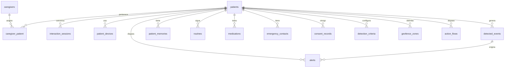
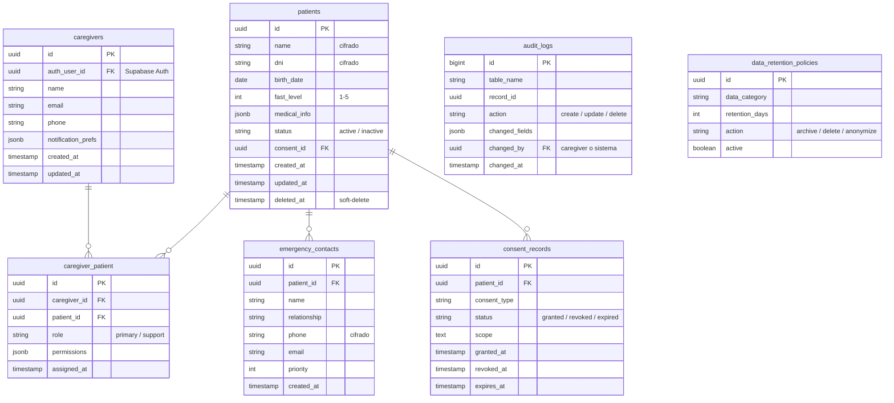
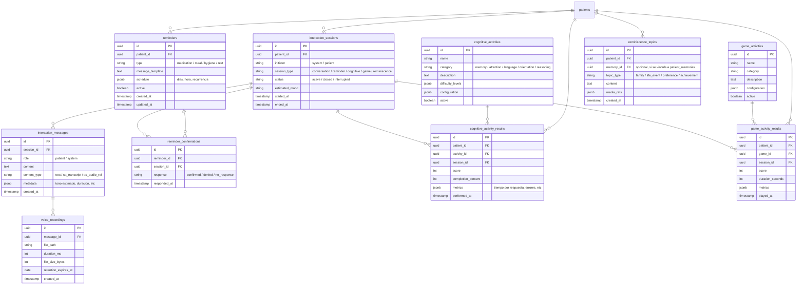
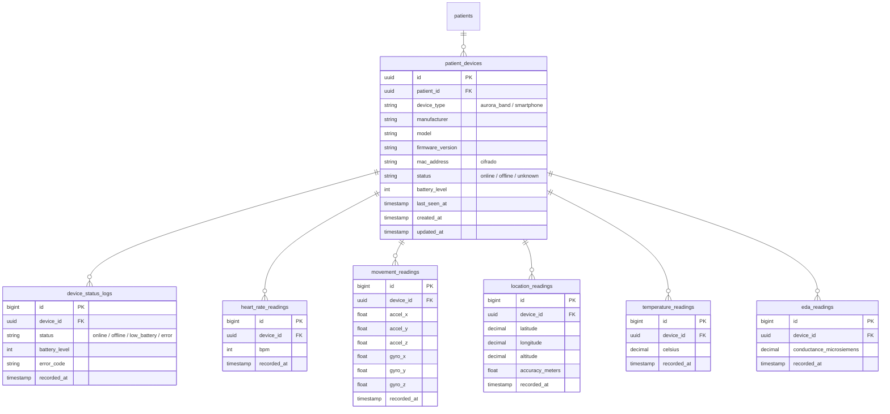
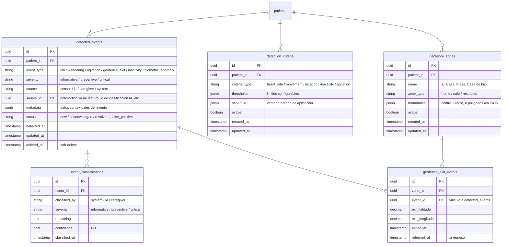
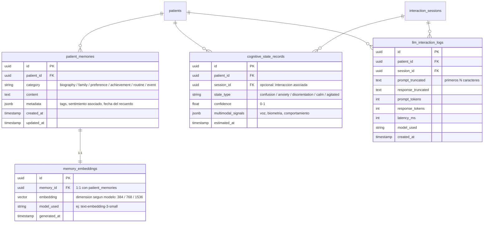
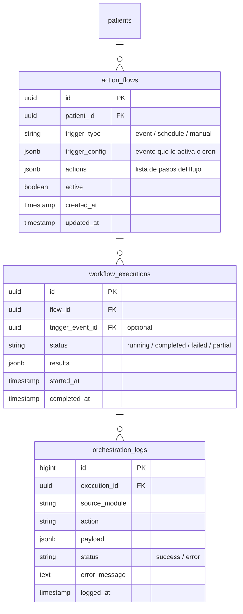
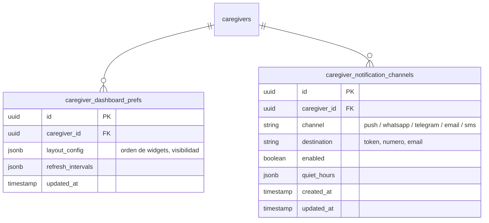
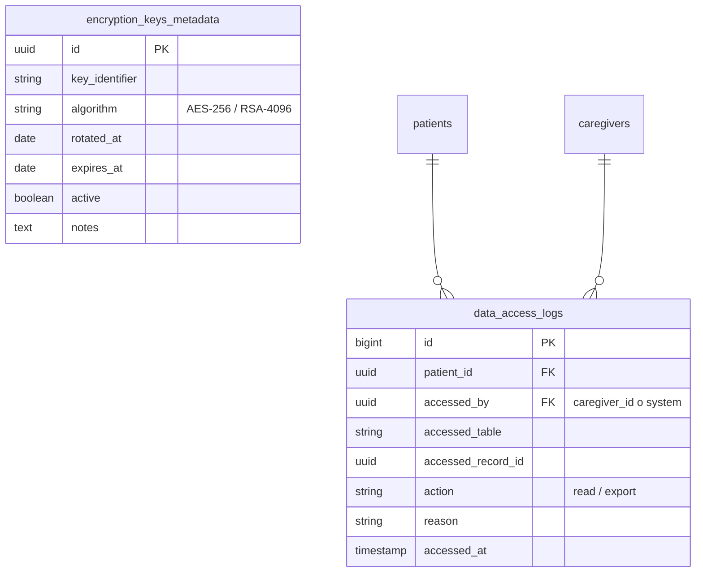

# DER Conceptual — Aurora

Diagrama entidad-relación de alto nivel. Dividido por módulo funcional para legibilidad.
Notación: Mermaid `erDiagram`. Entidades sombreadas con `[vision]` corresponden al Módulo 6 (scope pöst-MVP).

---

## Vista General — Relaciones entre módulos



---

## Módulo 0 — Transversal / Base del Sistema



---

## Módulo 1 — Interacción con el Paciente (AURA-14)



---

## Módulo 2 — Monitoreo Biométrico — Aurora Band (AURA-19)



> Las tablas time-series (`*_readings`, `device_status_logs`) se particionarán por mes.

---

## Módulo 3 — Detección de Eventos y Riesgos (AURA-22)



---

## Módulo 4 — Alertas y Comunicación con el Cuidador (AURA-16)

```mermaid
erDiagram
    alerts {
        uuid id PK
        uuid patient_id FK
        uuid source_event_id FK "opcional: evento que origino la alerta"
        string level "low / medium / high / critical"
        string status "generated / sent / attended / closed / escalated"
        text message
        jsonb context "datos contextuales para el cuidador"
        timestamp generated_at
        timestamp resolved_at
    }

    alert_rules {
        uuid id PK
        uuid patient_id FK
        string event_type
        string min_severity
        jsonb channels "[""push"", ""whatsapp"", ""telegram"", ""call""]"
        jsonb escalation_config
        boolean active
        timestamp created_at
        timestamp updated_at
    }

    alert_escalation_steps {
        uuid id PK
        uuid rule_id FK
        int step_order
        int wait_minutes
        string action "notify / call / escalate"
        string target "caregiver / emergency_contact / emergency_service"
        jsonb params "configuracion adicional"
    }

    notification_logs {
        uuid id PK
        uuid alert_id FK
        string channel "push / whatsapp / telegram / email / call"
        string destination
        string status "sent / delivered / failed / read"
        string external_id "id del mensaje en el servicio externo"
        text error_message
        timestamp sent_at
        timestamp delivered_at
    }

    alert_acknowledgments {
        uuid id PK
        uuid alert_id FK
        uuid caregiver_id FK
        string response "acknowledged / investigating / resolved / false_alarm"
        text note
        timestamp acknowledged_at
    }

    patients ||--o{ alerts : ""
    detected_events ||--o{ alerts : ""
    patients ||--o{ alert_rules : ""
    alert_rules ||--o{ alert_escalation_steps : ""
    alerts ||--o{ notification_logs : ""
    alerts ||--o{ alert_acknowledgments : ""
    caregivers ||--o{ alert_acknowledgments : ""
```

---

## Módulo 5 — Motor de IA y Memoria del Paciente (AURA-15)



> `memory_embeddings.embedding` usa el tipo `vector(N)` de pgvector. Se creará un índice HNSW.

---

## Módulo 6 — Orquestación y Automatización (AURA-21) [vision]



---

## Módulo 7 — Panel del Cuidador / Aurora Care (AURA-18)



---

## Módulo 8 — Seguridad, Privacidad y Cumplimiento (AURA-20)



> Las claves en sí no se almacenan en la BD. `encryption_keys_metadata` solo guarda metadata de rotación.

---

## Módulo 9 — Administración de Rutinas y Medicación (AURA-17)

```mermaid
erDiagram
    routines {
        uuid id PK
        uuid patient_id FK
        string name
        string category "hygiene / meal / rest / exercise / therapy"
        text description
        boolean active
        timestamp created_at
        timestamp updated_at
        timestamp deleted_at "soft-delete"
    }

    routine_schedules {
        uuid id PK
        uuid routine_id FK
        jsonb days_of_week "[1, 3, 5] o [""monday"", ""wednesday""]"
        time time_of_day
        jsonb recurrence "daily / weekly / custom"
        boolean enabled
    }

    routine_compliance {
        uuid id PK
        uuid routine_id FK
        uuid schedule_id FK
        date scheduled_date
        string status "completed / skipped / missed"
        timestamp completed_at "cuando se confirmo"
    }

    medications {
        uuid id PK
        uuid patient_id FK
        string name
        string active_ingredient
        string dosage
        string unit "mg / ml / pills"
        string route "oral / topical / injection"
        text instructions
        boolean active
        timestamp created_at
        timestamp updated_at
    }

    medication_schedules {
        uuid id PK
        uuid medication_id FK
        jsonb days_of_week
        time time_of_day
        float quantity
        string unit
        boolean requires_confirmation
        boolean enabled
    }

    medication_compliance {
        uuid id PK
        uuid schedule_id FK
        uuid medication_id FK
        date scheduled_date
        string status "taken / missed / skipped / no_response"
        timestamp confirmed_at
        text note
    }

    patients ||--o{ routines : ""
    routines ||--o{ routine_schedules : ""
    routine_schedules ||--o{ routine_compliance : ""
    patients ||--o{ medications : ""
    medications ||--o{ medication_schedules : ""
    medication_schedules ||--o{ medication_compliance : ""
```

---

## Convenciones generales del schema

| Elemento | Convención |
|----------|------------|
| **Nombres de tablas** | `snake_case` plural (`patients`, `heart_rate_readings`) |
| **Primary Keys** | `UUID v4` — necesario para sync offline |
| **Foreign Keys** | `snake_case` con nombre de tabla (`patient_id`, `device_id`) |
| **Timestamps** | `timestamptz` siempre en UTC |
| **Soft-delete** | `deleted_at timestamp NULL` — no se destruyen registros clínicos |
| **Metadata flexible** | `jsonb` para datos extensibles (contexto de eventos, preferencias) |
| **Auditoría** | `audit_logs` captura todo cambio via trigger o middleware |
| **RLS** | Toda tabla con `patient_id` tiene policy Row Level Security |

---

## Resumen cuantitativo

| Módulo | Entidades | Tablas time-series | Atributos totales (aprox) |
|--------|-----------|-------------------|--------------------------|
| M0 | 7 | 0 | ~50 |
| M1 | 10 | 0 | ~65 |
| M2 | 7 | 6 | ~40 |
| M3 | 5 | 0 | ~35 |
| M4 | 5 | 0 | ~35 |
| M5 | 4 | 1 (cognitive_state) | ~25 |
| M6 [vision] | 3 | 1 (orchestration_logs) | ~15 |
| M7 | 2 | 0 | ~10 |
| M8 | 2 | 1 (data_access_logs) | ~10 |
| M9 | 6 | 2 | ~40 |
| **Total** | **51** | **11** | **~325** |
