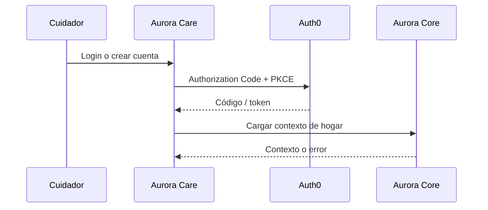

# Artefacto de trazabilidad — AURA-54 Login · Aurora Care

## Carátula

| Campo | Valor |
| --- | --- |
| Universidad / Regional | Universidad Tecnológica Nacional — Facultad Regional Córdoba |
| Carrera / asignatura | Ingeniería en Sistemas de Información — Proyecto Final |
| Curso / año | 2026 |
| Organización | Aurora |
| Tema | Acceso, sesión y onboarding de Aurora Care |
| Docentes / integrantes | Pendiente: no hay evidencia consolidada de docentes, integrantes y legajos. |
| Sprint | Sprint 3 documental. Jira no posee sprint asignado. |
| Issue | [AURA-54 — Login · Aurora Care](https://project-aurora-alz.atlassian.net/browse/AURA-54) |

## Historial de revisión

| Versión | Fecha | Autor | Descripción |
| --- | --- | --- | --- |
| 0.1 | 2026-08-03 | Codex (asistencia documental) | Normalización retrospectiva con Jira y código versionado. |

## Índice

<!-- Generar automáticamente desde los encabezados al exportar; no editar manualmente. -->

## Introducción

Este documento registra la trazabilidad de AURA-54 entre Jira, requisitos, decisiones, código y pruebas. No modifica el estado histórico del issue ni declara aprobada una prueba que no tenga ejecución registrada.

## Audiencia

Equipo Aurora y cátedra de Proyecto Final; presupone conocimiento básico de Jira, Scrum y la arquitectura del proyecto.

## 1. Historia o tarea

| Campo | Valor |
| --- | --- |
| Tipo y estado final | Tarea — Finalizada. |
| Fecha de cierre | 2026-07-31 19:29:28 -03:00. |
| Épica / issue padre | [AURA-18 — Panel del Cuidador](https://project-aurora-alz.atlassian.net/browse/AURA-18). |
| Fuente | Jira, consulta 2026-08-03. |
| Discrepancia a validar | Carpeta documental Sprint 3; Jira no informa sprint para el issue. |

### Descripción

Implementar el acceso de Aurora Care para el cuidador: inicio de sesión, creación de cuenta, onboarding inicial y restauración/protección de sesión. La descripción fue reconstruida retrospectivamente en Jira el 2026-08-03 a partir de evidencia versionada.

### Criterios de aceptación

- CA-01: login local de desarrollo o mediante Auth0.
- CA-02: Authorization Code con PKCE, intercambio de código, refresh token y logout.
- CA-03: control visual de consentimiento antes de continuar con Auth0.
- CA-04: onboarding de cinco pasos.
- CA-05: restauración de sesión y redirección a login sin sesión.
- CA-06: errores de autenticación y de contexto de hogar visibles.
- CA-07: validación integral contra tenant Auth0 productivo pendiente.

### Comentarios relevantes de Jira

El comentario de diseño del 2026-07-18 indicaba implementación React/Next pendiente. El comentario retrospectivo del 2026-08-03 corrige la plataforma con evidencia: Aurora Care usa React Native + Expo, commits `c6f9ac4` y `27e13e5`; `npm.cmd run lint` finalizó con exit 0.

## 2. Requerimientos relacionados

| RF / RNF | Relación | Fuente |
| --- | --- | --- |
| RF-60 a RF-75 | Vínculo por la épica padre AURA-18 según la matriz. El issue no declara qué RF individual cubre. | [[Trazabilidad RF-Épicas]] |
| RF-76 / RF-81 | Pendiente de enlace explícito: el alcance trata autenticación y consentimiento, pero Jira no lo vincula con AURA-20. | Jira y [[Trazabilidad RF-Épicas]] |

## 3. Decisiones de diseño (ADR)

| ADR | Relación | Evidencia |
| --- | --- | --- |
| ADR-002 — React Native + Expo | Framework y navegación de Aurora Care. | `app/` y `package.json`. |
| ADR-005 — Auth0 | Flujo Auth0, PKCE, refresh y logout. | `src/features/auth/`. |
| Nuevo ADR | No aplica: no se evidenció una decisión nueva distinta de ADR-002/005. | Revisión de Jira y código. |

## 4. Modelo de datos (DER)

| DER / entidad | Cambio o relación | Evidencia |
| --- | --- | --- |
| [[DER - Base de Datos Aurora]] | No aplica cambio de DER: no hay migración ni commit de modelo vinculado a AURA-54. | Árbol y commits de AuroraCareFront. |

## 5. Diagramas de modelado

### Secuencia de autenticación

Derivado de `useAuth` y `AuthenticatedStackLayout`; validar contra una ejecución Auth0 real.

## 6. Código y cambios relacionados

| Componente | Repositorio | Ruta exacta / símbolo | Commit | Evidencia |
| --- | --- | --- | --- | --- |
| Login / alta / onboarding | AuroraCareFront | `app/login.tsx`, `app/create-account.tsx`, `app/onboarding.tsx` | `c6f9ac4`, `27e13e5` | Pantallas y navegación. |
| Auth0 | AuroraCareFront | `src/features/auth/hooks/useAuth.ts`, `api/authApi.ts`, `config.ts` | `27e13e5` | PKCE, token, refresh y logout. |
| Protección de rutas | AuroraCareFront | `app/(authenticated)/_layout.tsx` | `27e13e5` | Restauración, redirección y contexto. |
| PR | AuroraCareFront | Pendiente | Pendiente | No se verificó PR remoto asociado. |

## 7. Casos de prueba y ejecución

| ID | Criterio | Precondición | Pasos | Resultado esperado | Resultado de ejecución |
| --- | --- | --- | --- | --- | --- |
| CP-A54-01 | CA-01 | Modo local configurado | Abrir login e ingresar | Sesión local y acceso autenticado | Pendiente. |
| CP-A54-02 | CA-02 | Tenant Auth0 configurado | Iniciar, completar redirección y renovar sesión | Sesión Auth0 válida | Pendiente. |
| CP-A54-03 | CA-03 | Pantalla alta disponible | Aceptar consentimiento y continuar | Control habilita continuación; persistencia no afirmada | Pendiente. |
| CP-A54-04 | CA-04 | Sesión disponible | Recorrer cinco pasos | Navegación completa a área autenticada | Pendiente. |
| CP-A54-05 | CA-05 | Sin sesión | Abrir ruta autenticada | Redirección a `/login` | Pendiente. |
| CP-A54-06 | CA-06 | Error Auth0 o contexto | Provocar error controlado | Mensaje visible | Pendiente. |
| CP-A54-07 | CA-07 | Tenant productivo | Ejecutar flujo end-to-end | Validación integral registrada | Pendiente. |
| VC-A54-01 | Calidad transversal | Dependencias instaladas | `npm.cmd run lint` | Lint sin errores | **Pasó — 2026-08-03, exit 0.** |

## 8. Matriz de trazabilidad

| Tarea | RF / RNF | ADR | DER | Diagramas | Código | Casos |
| --- | --- | --- | --- | --- | --- | --- |
| AURA-54 | RF-60–75 vía AURA-18; RF-76/81 pendientes de vínculo | ADR-002, ADR-005 | Sin cambio | Secuencia | Rutas y commits citados | CP-A54-01 a 07; VC-01 |

## 9. Checklist de completitud UTN

- [x] Tarea, estado, fecha y criterios con fuente Jira.
- [x] RF vinculados sólo por épica o marcados pendientes.
- [x] ADR y DER justificados.
- [x] Diagrama, código y commits con evidencia.
- [x] Casos con precondición, pasos, esperado y ejecución.
- [ ] Ejecución integral Auth0 registrada.

## 10. Pendientes y validaciones requeridas

1. Vincular formalmente AURA-54 con RF-76/RF-81 si el equipo confirma ese alcance.
2. Ejecutar flujo end-to-end con tenant Auth0 y conservar salida/responsable.
3. Confirmar si el consentimiento debe persistirse/auditarse y qué ticket lo cubre.
