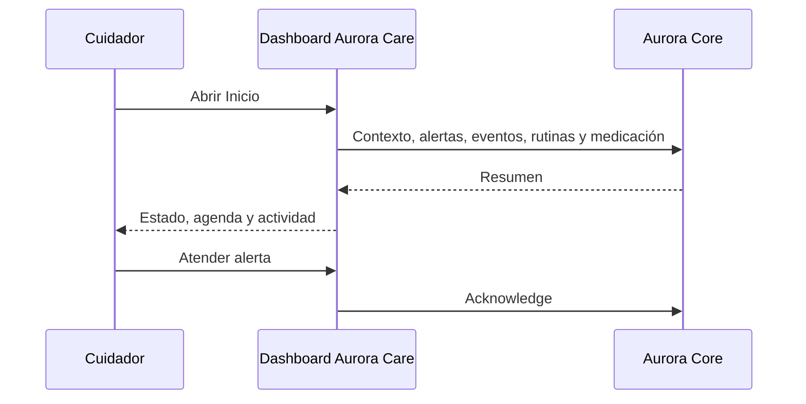

# Artefacto de trazabilidad — AURA-55 Módulo Paciente · Aurora Care

## Carátula

| Campo | Valor |
| --- | --- |
| Universidad / Regional | Universidad Tecnológica Nacional — Facultad Regional Córdoba |
| Carrera / asignatura | Ingeniería en Sistemas de Información — Proyecto Final |
| Curso / año / organización | 2026 — Aurora |
| Tema | Dashboard del cuidador y acceso a datos de paciente |
| Docentes / integrantes | Pendiente: sin evidencia consolidada. |
| Sprint | Sprint 3 documental; Jira no informa sprint. |
| Issue | [AURA-55 — Módulo Paciente](https://project-aurora-alz.atlassian.net/browse/AURA-55) |

## Historial de revisión

| Versión | Fecha | Autor | Descripción |
| --- | --- | --- | --- |
| 0.1 | 2026-08-03 | Codex (asistencia documental) | Normalización retrospectiva con evidencia disponible. |

## Índice

<!-- Generar automáticamente desde los encabezados al exportar; no editar manualmente. -->

## Introducción

Traza la implementación evidenciada del dashboard y separa explícitamente las funciones aún ausentes de la ruta Pacientes.

## Audiencia

Equipo Aurora y cátedra de Proyecto Final.

## 1. Historia o tarea

| Campo | Valor |
| --- | --- |
| Tipo y estado final | Tarea — Finalizada. |
| Fecha de cierre | 2026-07-31 19:29:16 -03:00. |
| Épica / issue padre | [AURA-18 — Panel del Cuidador](https://project-aurora-alz.atlassian.net/browse/AURA-18). |
| Fuente | Jira, consulta 2026-08-03. |
| Discrepancia | Sprint 3 documental; Jira no informa sprint para el issue. |

### Descripción

Implementar el dashboard del cuidador: estado actual, agenda, alertas, dispositivos y resumen de actividad; dejar base de acceso a datos de pacientes. Alcance reconstruido retrospectivamente el 2026-08-03.

### Criterios de aceptación

- CA-01: inicio con estado, agenda, dispositivos y resumen.
- CA-02: alertas activas, apertura y atención.
- CA-03: datos desde contexto, alertas, eventos, rutinas y medicación.
- CA-04: cliente y hooks tipados para pacientes.
- CA-05: UI de perfil/edición en `(tabs)/patients` pendiente.
- CA-06: biometría y ubicación sin evidencia en UI actual.

### Comentarios relevantes de Jira

El comentario de diseño del 2026-07-18 refería AURA-59 y marcaba la implementación pendiente. El comentario retrospectivo del 2026-08-03 identifica el dashboard y registra que `patients.tsx` sigue siendo placeholder; lint exit 0.

## 2. Requerimientos relacionados

| RF / RNF | Relación | Fuente |
| --- | --- | --- |
| RF-60 a RF-75 | Vínculo por la épica padre AURA-18. No se declara cobertura individual sin enlace explícito. | [[Trazabilidad RF-Épicas]] |

## 3. Decisiones de diseño (ADR)

| ADR | Relación | Evidencia |
| --- | --- | --- |
| ADR-002 — React Native + Expo | Dashboard implementado con Expo Router y React Native. | `app/(authenticated)/(tabs)/index.tsx`. |
| Nuevo ADR | No aplica: no hay decisión nueva evidenciada. | Jira y código. |

## 4. Modelo de datos (DER)

| DER / entidad | Cambio o relación | Evidencia |
| --- | --- | --- |
| [[DER - Base de Datos Aurora]] | No aplica cambio: no hay migración ni commit de modelo vinculado a AURA-55. | Árbol de AuroraCareFront. |

## 5. Diagramas de modelado

### Secuencia del dashboard

Derivado de `useHomeSummary` y `homeApi`; validar endpoints en ejecución integrada.

## 6. Código y cambios relacionados

| Componente | Repositorio | Ruta exacta / símbolo | Commit | Evidencia |
| --- | --- | --- | --- | --- |
| Dashboard | AuroraCareFront | `app/(authenticated)/(tabs)/index.tsx` | `0f8abca`, `3644df9` | Estado, agenda, alertas y actividad. |
| Consulta del resumen | AuroraCareFront | `src/features/home/hooks/useHomeSummary.ts`, `api/homeApi.ts` | `27e13e5` | Contexto y consultas a Core. |
| Base de pacientes | AuroraCareFront | `src/features/patients/api/patientsApi.ts`, hooks | `42ec51d`, `3644df9` | Cliente/hook tipado. |
| Brecha | AuroraCareFront | `app/(authenticated)/(tabs)/patients.tsx` | HEAD `27e13e5` | Pantalla placeholder. |

## 7. Casos de prueba y ejecución

| ID | Criterio | Precondición | Pasos | Resultado esperado | Resultado de ejecución |
| --- | --- | --- | --- | --- | --- |
| CP-A55-01 | CA-01 | Sesión y contexto válidos | Abrir Inicio | Estado, agenda, dispositivos y resumen | Pendiente. |
| CP-A55-02 | CA-02 | Alerta activa | Abrir y atender alerta | Acción enviada y vista actualizada | Pendiente. |
| CP-A55-03 | CA-03 | Datos Core disponibles | Abrir Inicio | Resumen armado desde fuentes consultadas | Pendiente. |
| CP-A55-04 | CA-04 | API disponible | Consultar/mutar paciente desde hook | Cliente tipado responde según Core | Pendiente. |
| CP-A55-05 | CA-05 | Ruta Pacientes | Abrir ruta | Brecha visible: no hay perfil editable | Pendiente / brecha confirmada. |
| CP-A55-06 | CA-06 | Ruta actual | Buscar biometría y ubicación | Sin evidencia; pendiente funcional | Pendiente. |
| VC-A55-01 | Calidad transversal | Dependencias instaladas | `npm.cmd run lint` | Lint sin errores | **Pasó — 2026-08-03, exit 0.** |

## 8. Matriz de trazabilidad

| Tarea | RF / RNF | ADR | DER | Diagramas | Código | Casos |
| --- | --- | --- | --- | --- | --- | --- |
| AURA-55 | RF-60–75 vía AURA-18 | ADR-002 | Sin cambio | Secuencia | Rutas y commits citados | CP-A55-01 a 06; VC-01 |

## 9. Checklist de completitud UTN

- [x] Tarea, estado, fecha y criterios con fuente Jira.
- [x] RF vinculados por épica sin inferir cobertura individual.
- [x] ADR/DER justificados y código con rutas exactas.
- [x] Casos trazados a cada criterio y resultado honesto.
- [ ] Validación integrada contra Core y cierre de brechas de UI.

## 10. Pendientes y validaciones requeridas

1. Definir si AURA-55 debe dividirse en dashboard y perfil editable.
2. Ejecutar casos con Core y registrar resultados.
3. Crear evidencia explícita para biometría/ubicación si entra en alcance.
