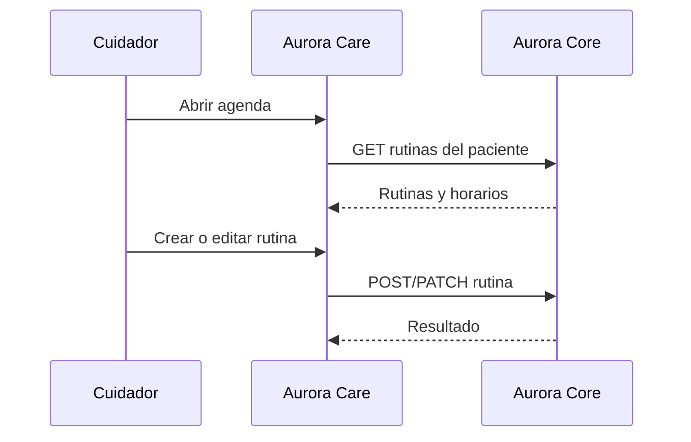

# Artefacto de trazabilidad — AURA-57 Módulo Recordatorios / Rutinas

## Carátula

| Campo | Valor |
| --- | --- |
| Universidad / Regional | Universidad Tecnológica Nacional — Facultad Regional Córdoba |
| Carrera / asignatura | Ingeniería en Sistemas de Información — Proyecto Final |
| Curso / año / organización | 2026 — Aurora |
| Tema | Agenda y editor de rutinas del cuidador |
| Docentes / integrantes | Pendiente: sin evidencia consolidada. |
| Sprint | Sprint 3 documental; Jira no informa sprint. |
| Issue | [AURA-57 — Módulo Recordatorios](https://project-aurora-alz.atlassian.net/browse/AURA-57) |

## Historial de revisión

| Versión | Fecha | Autor | Descripción |
| --- | --- | --- | --- |
| 0.1 | 2026-08-03 | Codex (asistencia documental) | Normalización retrospectiva con Jira y repositorio. |

## Índice

<!-- Generar automáticamente desde los encabezados al exportar; no editar manualmente. -->

## Introducción

Registra la evidencia de la agenda y el editor de rutinas, sin afirmar ejecución integrada que no esté registrada.

## Audiencia

Equipo Aurora y cátedra de Proyecto Final.

## 1. Historia o tarea

| Campo | Valor |
| --- | --- |
| Tipo y estado final | Tarea — Finalizada. |
| Fecha de cierre | 2026-07-31 19:29:01 -03:00. |
| Épica / issue padre | [AURA-18 — Panel del Cuidador](https://project-aurora-alz.atlassian.net/browse/AURA-18). |
| Fuente | Jira, consulta 2026-08-03. |
| Discrepancia | Sprint 3 documental; Jira no informa sprint. |

### Descripción

Implementar agenda de rutinas y editor con contexto de paciente e integración con Aurora Core. Alcance y criterios fueron documentados retrospectivamente en Jira el 2026-08-03.

### Criterios de aceptación

- CA-01: agenda de rutinas del paciente autenticado.
- CA-02: alta/edición con nombre, horario, prioridad, margen y mensaje.
- CA-03: carga y guardado mediante endpoints de rutinas.
- CA-04: estados de carga y error.
- CA-05: eliminación desde UI pendiente.
- CA-06: prueba funcional contra Core pendiente.

### Comentarios relevantes de Jira

El comentario de diseño del 2026-07-18 relaciona AURA-61 y aclara que la lógica de dominio vive en AURA-17. El comentario retrospectivo identifica `d388a86` y `27e13e5`, más lint exit 0.

## 2. Requerimientos relacionados

| RF / RNF | Relación | Fuente |
| --- | --- | --- |
| RF-60 a RF-75 | Vínculo por AURA-18, padre formal del issue. | [[Trazabilidad RF-Épicas]] |
| RF-82 a RF-91 | Relación de dominio citada explícitamente en comentario Jira mediante AURA-17; no es padre formal de la tarea. No se afirma cobertura individual. | Comentario Jira de 2026-07-18 y [[Trazabilidad RF-Épicas]] |

## 3. Decisiones de diseño (ADR)

| ADR | Relación | Evidencia |
| --- | --- | --- |
| ADR-002 — React Native + Expo | UI móvil, navegación y editor. | Rutas Expo Router. |
| Nuevo ADR | No aplica: no hay decisión arquitectónica nueva evidenciada. | Jira y código. |

## 4. Modelo de datos (DER)

| DER / entidad | Cambio o relación | Evidencia |
| --- | --- | --- |
| [[DER - Base de Datos Aurora]] | No aplica cambio: se consumen endpoints de rutinas, sin migración/DDL vinculada. | `careRoutinesApi.ts`; historial Git. |

## 5. Diagramas de modelado

### Secuencia de rutina

Derivado de `useRoutinesModule`, `careRoutinesApi` y `routine-editor`; validación integrada pendiente.

## 6. Código y cambios relacionados

| Componente | Repositorio | Ruta exacta / símbolo | Commit | Evidencia |
| --- | --- | --- | --- | --- |
| Agenda | AuroraCareFront | `app/(authenticated)/(tabs)/routines.tsx` | `d388a86` | Lista y navegación del módulo. |
| Editor | AuroraCareFront | `app/(authenticated)/routine-editor.tsx` | `d388a86` | Crear/editar y validaciones de UI. |
| Integración | AuroraCareFront | `src/features/routines/hooks/useRoutinesModule.ts`, `api/careRoutinesApi.ts`, `api/routinesApi.ts` | `d388a86`, `27e13e5` | Consulta y persistencia. |
| PR | AuroraCareFront | Pendiente | Pendiente | No se verificó PR remoto. |

## 7. Casos de prueba y ejecución

| ID | Criterio | Precondición | Pasos | Resultado esperado | Resultado de ejecución |
| --- | --- | --- | --- | --- | --- |
| CP-A57-01 | CA-01 | Sesión y paciente válidos | Abrir Rutinas | Agenda o error recuperable | Pendiente. |
| CP-A57-02 | CA-02 | Sesión válida | Crear y editar rutina | Campos se validan y guardan | Pendiente. |
| CP-A57-03 | CA-03 | Core disponible | Guardar creación y edición | POST/PATCH correcto | Pendiente. |
| CP-A57-04 | CA-04 | Core inaccesible | Abrir módulo | Estado de error y reintento | Pendiente. |
| CP-A57-05 | CA-05 | Rutina existente | Buscar eliminación | Brecha visible, sin acción UI | Pendiente / brecha confirmada. |
| CP-A57-06 | CA-06 | Entorno integrado | Ejecutar flujo completo | Evidencia de resultado | Pendiente. |
| VC-A57-01 | Calidad transversal | Dependencias instaladas | `npm.cmd run lint` | Lint sin errores | **Pasó — 2026-08-03, exit 0.** |

## 8. Matriz de trazabilidad

| Tarea | RF / RNF | ADR | DER | Diagramas | Código | Casos |
| --- | --- | --- | --- | --- | --- | --- |
| AURA-57 | RF-60–75 vía AURA-18; RF-82–91 por comentario a AURA-17 | ADR-002 | Sin cambio | Secuencia | Rutas y commits citados | CP-A57-01 a 06; VC-01 |

## 9. Checklist de completitud UTN

- [x] Tarea, estado, fecha, criterios y comentarios con fuente Jira.
- [x] Relaciones RF justificadas por padre o comentario explícito.
- [x] ADR, DER, diagrama, código y commits referenciados.
- [x] Un caso por criterio y ejecución no inventada.
- [ ] Prueba contra Core y eliminación visual de rutina.

## 10. Pendientes y validaciones requeridas

1. Definir si RF-82–91 deben vincularse formalmente a la tarea en Jira.
2. Ejecutar los casos contra Core con fecha/salida/responsable.
3. Registrar la decisión de alcance para eliminar rutinas.
