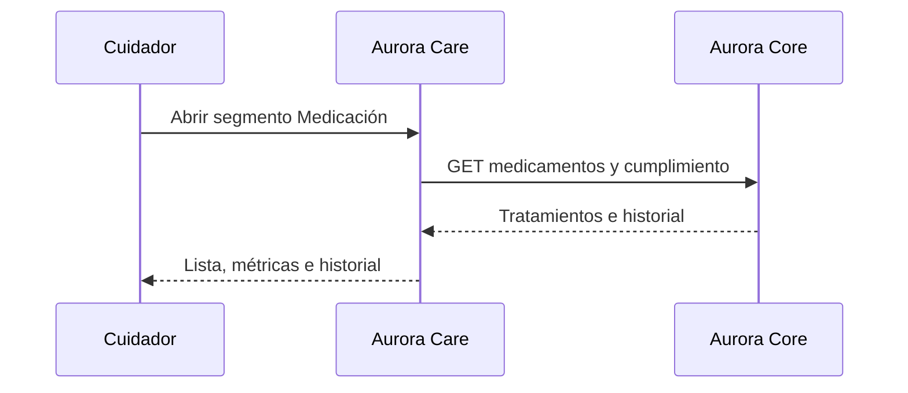

# Artefacto de trazabilidad — AURA-58 Módulo Recetario / Medicación

## Carátula

| Campo | Valor |
| --- | --- |
| Universidad / Regional | Universidad Tecnológica Nacional — Facultad Regional Córdoba |
| Carrera / asignatura | Ingeniería en Sistemas de Información — Proyecto Final |
| Curso / año / organización | 2026 — Aurora |
| Tema | Tratamientos e historial de cumplimiento de medicación |
| Docentes / integrantes | Pendiente: sin evidencia consolidada. |
| Sprint | Sprint 3 documental; Jira no informa sprint. |
| Issue | [AURA-58 — Módulo Recetario](https://project-aurora-alz.atlassian.net/browse/AURA-58) |

## Historial de revisión

| Versión | Fecha | Autor | Descripción |
| --- | --- | --- | --- |
| 0.1 | 2026-08-03 | Codex (asistencia documental) | Normalización retrospectiva con Jira y repositorio. |

## Índice

<!-- Generar automáticamente desde los encabezados al exportar; no editar manualmente. -->

## Introducción

Traza tratamientos e historial existentes en el módulo de Rutinas y documenta que la pestaña independiente y el ABMC visual permanecen pendientes.

## Audiencia

Equipo Aurora y cátedra de Proyecto Final.

## 1. Historia o tarea

| Campo | Valor |
| --- | --- |
| Tipo y estado final | Tarea — Finalizada. |
| Fecha de cierre | 2026-07-31 19:29:24 -03:00. |
| Épica / issue padre | [AURA-18 — Panel del Cuidador](https://project-aurora-alz.atlassian.net/browse/AURA-18). |
| Fuente | Jira, consulta 2026-08-03. |
| Discrepancia | Sprint 3 documental; Jira no informa sprint. |

### Descripción

Implementar visualización de tratamientos e historial de cumplimiento, reutilizando Rutinas e integrando Aurora Core. Alcance y criterios reconstruidos retrospectivamente el 2026-08-03.

### Criterios de aceptación

- CA-01: segmento Medicación con tratamientos y métricas.
- CA-02: historial abrible desde el tratamiento.
- CA-03: consulta de medicamentos y cumplimiento a backend.
- CA-04: cliente tipado CRUD de medicamentos.
- CA-05: pestaña independiente `(tabs)/medications` pendiente.
- CA-06: ABMC visual completo y ejecución contra Core pendientes.

### Comentarios relevantes de Jira

El comentario de diseño del 2026-07-18 relaciona AURA-62 y AURA-17. El comentario retrospectivo del 2026-08-03 establece que la funcionalidad reside en Rutinas, registra brecha de pestaña/ABMC y lint exit 0.

## 2. Requerimientos relacionados

| RF / RNF | Relación | Fuente |
| --- | --- | --- |
| RF-60 a RF-75 | Vínculo por AURA-18, padre formal del issue. | [[Trazabilidad RF-Épicas]] |
| RF-82 a RF-91 | Relación de dominio citada en comentario Jira mediante AURA-17; no es padre formal. No se afirma cobertura individual. | Comentario Jira de 2026-07-18 y [[Trazabilidad RF-Épicas]] |

## 3. Decisiones de diseño (ADR)

| ADR | Relación | Evidencia |
| --- | --- | --- |
| ADR-002 — React Native + Expo | Implementación móvil dentro de rutas Expo. | `routines.tsx`, `medication-history.tsx`. |
| Nuevo ADR | No aplica: no se identificó una decisión nueva. | Jira y código. |

## 4. Modelo de datos (DER)

| DER / entidad | Cambio o relación | Evidencia |
| --- | --- | --- |
| [[DER - Base de Datos Aurora]] | No aplica cambio: la tarea consume endpoints; no se localizó migración o DDL vinculados. | Historial AuroraCareFront. |

## 5. Diagramas de modelado

### Secuencia de medicación

Derivado de `careRoutinesApi` y `medication-history`; validación integrada pendiente.

## 6. Código y cambios relacionados

| Componente | Repositorio | Ruta exacta / símbolo | Commit | Evidencia |
| --- | --- | --- | --- | --- |
| Tratamientos | AuroraCareFront | `app/(authenticated)/(tabs)/routines.tsx` | `d388a86` | Segmento Medicación, métricas y lista. |
| Historial | AuroraCareFront | `app/(authenticated)/medication-history.tsx` | `d388a86` | Visualización de cumplimiento. |
| Integración | AuroraCareFront | `src/features/routines/api/careRoutinesApi.ts` | `d388a86`, `27e13e5` | Medicamentos y compliance. |
| Cliente CRUD | AuroraCareFront | `src/features/medications/api/medicationsApi.ts` | `d388a86` | API tipada; no prueba de UI ABMC. |
| Brecha | AuroraCareFront | `app/(authenticated)/(tabs)/medications.tsx` | HEAD `27e13e5` | Pantalla placeholder. |

## 7. Casos de prueba y ejecución

| ID | Criterio | Precondición | Pasos | Resultado esperado | Resultado de ejecución |
| --- | --- | --- | --- | --- | --- |
| CP-A58-01 | CA-01 | Sesión y paciente válidos | Abrir Medicación desde Rutinas | Tratamientos y métricas cargados | Pendiente. |
| CP-A58-02 | CA-02 | Tratamiento con cumplimiento | Abrir tratamiento | Historial visible | Pendiente. |
| CP-A58-03 | CA-03 | Core disponible | Consultar módulo | GET de medicamentos/compliance correcto | Pendiente. |
| CP-A58-04 | CA-04 | API disponible | Invocar cliente CRUD | Respuesta conforme contrato Core | Pendiente. |
| CP-A58-05 | CA-05 | Ruta Medicamentos | Abrir pestaña | Brecha visible: placeholder | Pendiente / brecha confirmada. |
| CP-A58-06 | CA-06 | Entorno integrado | Ejecutar ABMC completo | Evidencia de resultado o brecha confirmada | Pendiente. |
| VC-A58-01 | Calidad transversal | Dependencias instaladas | `npm.cmd run lint` | Lint sin errores | **Pasó — 2026-08-03, exit 0.** |

## 8. Matriz de trazabilidad

| Tarea | RF / RNF | ADR | DER | Diagramas | Código | Casos |
| --- | --- | --- | --- | --- | --- | --- |
| AURA-58 | RF-60–75 vía AURA-18; RF-82–91 por comentario a AURA-17 | ADR-002 | Sin cambio | Secuencia | Rutas y commits citados | CP-A58-01 a 06; VC-01 |

## 9. Checklist de completitud UTN

- [x] Tarea, estado, fecha, criterios y comentarios con fuente Jira.
- [x] RF justificados por padre o comentario explícito.
- [x] ADR, DER, diagrama y código documentados sin inventar cambios.
- [x] Casos de prueba completos y resultados honestos.
- [ ] Validación integrada, pestaña independiente y ABMC visual completos.

## 10. Pendientes y validaciones requeridas

1. Definir si RF-82–91 deben vincularse formalmente a AURA-58 en Jira.
2. Ejecutar casos integrados contra Core con evidencia guardada.
3. Crear ticket específico para pestaña/ABMC si continúa fuera de alcance.
