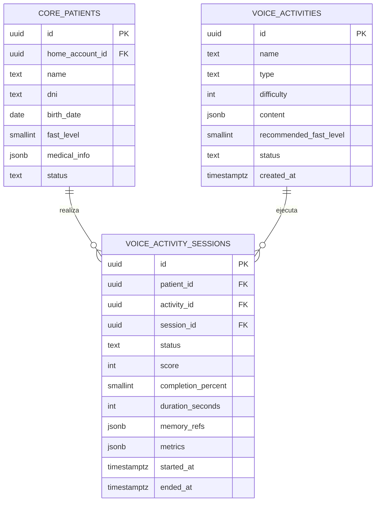
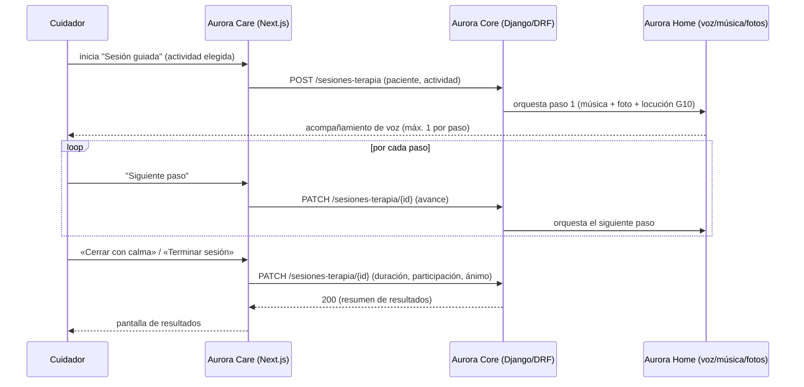
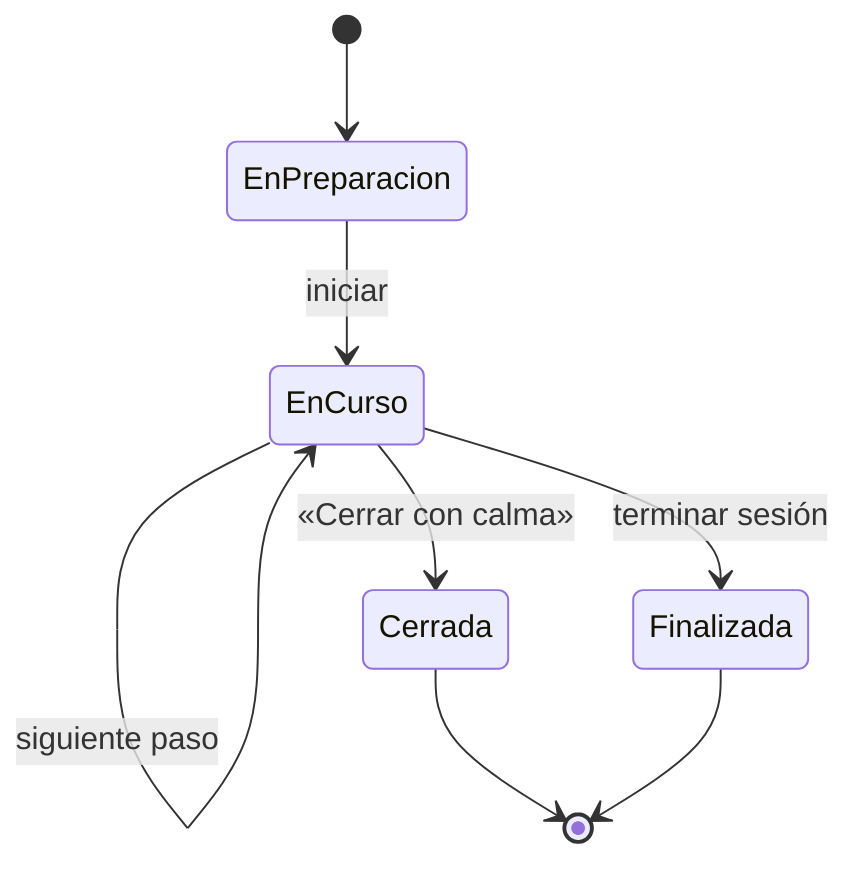

# Artefacto de Trazabilidad — AURA-74 US-D1 Sesión guiada de terapia

> [!draft] **Borrador de propuesta** generado emulando `/artefacto-trazabilidad` (modo task-first, derivado de la tarea de diseño AURA-60). Pensado para **refinar en equipo**. Las secciones con evidencia real de diseño están completas; código y ejecución de pruebas quedan como scaffolding porque `Backend/` y `Frontend/` aún están vacíos. **No inventar** resultados.

> **Para qué:** conectar esta historia con sus decisiones de diseño, modelo de datos, código y pruebas.
> **Para quién:** equipo (durante el desarrollo) y docente (evaluación de calidad técnica).

| Campo | Valor |
| --- | --- |
| Historia | **AURA-74** — US-D1 Sesión guiada de terapia |
| Épica | AURA-18 — Panel del Cuidador (Aurora Care) |
| Requerimientos | ⚠️ Sin RF propio aún (alcance introducido por diseño, ver [[Diseño UX-UI/Handoff y Backlog de Diseño|Handoff]] §3). Relacionados: RF-52 (dificultad adaptativa → AURA-77/US-D4) · módulo Rutinas RF-82–91 (programación de la actividad) |
| Estado en Jira | Tareas por hacer |
| Tareas relacionadas | AURA-60 (Vistas Terapias UI, diseño) · AURA-56 (Módulo Terapias, impl) — enlazar con "Relates" |
| Enlace | https://project-aurora-alz.atlassian.net/browse/AURA-74 |

## 1. Historia de usuario
**Como** cuidador sin formación terapéutica **quiero** que la app me guíe paso a paso durante una sesión de reminiscencia con mi familiar, mientras Aurora Home acompaña con música y fotos, **para** poder estimularlo sin miedo a hacerle mal.

### Criterios de aceptación
- [ ] Cada paso muestra "qué decir / qué evitar" y qué hace Aurora en ese paso.
- [ ] El botón «Cerrar con calma» está siempre visible durante la sesión.
- [ ] Máximo **1 intervención de voz** de Aurora por paso (guion G10, ver [[Diseño UX-UI/VUI — Diseño Conversacional|VUI]]).
- [ ] Al terminar se registra duración, participación y ánimo de la sesión.
- [ ] Las plantillas de pasos están validadas por un especialista (mitigación R1).

## 2. Decisiones de diseño (ADR)
Decisiones técnicas que esta historia usa o de las que depende (ver [[Arquitectura y Stack Tecnológico]]):
- **ADR-002** — Frontend Aurora Care (React + Next.js): el player de sesión guiada vive acá.
- **ADR de voz en el borde (Whisper.cpp / TTS local en Aurora Home)** — acompañamiento por voz y locución de los pasos. ⚠️ Confirmar el número de ADR en el doc de Arquitectura.
- **ADR-003** — Supabase (PostgreSQL): persistencia del registro de la sesión.

> [!todo] **Posible ADR nuevo** — *Guardarraíles de la sesión guiada*: máx. 1 intervención de voz por paso, botón «Cerrar con calma» siempre disponible, y no exponer errores/puntajes al paciente. Es una decisión de diseño de interacción con impacto técnico (control del orquestador de voz). Evaluar si amerita `ADR-0XX` propio o queda documentado en VUI + esta historia. **No inventar el número**; definir en equipo.

## 3. Modelo de datos (DER)
La historia agrega el registro de sesiones de estimulación (terapia guiada). El modelo se implementa en el DER oficial de AURA-53.

### Tablas relevantes (AURA-53 — DER oficial)

**Referencia:** `Document Hub/INSTANCIA 3 — Sprints 1 a N/Sprint 1/AURA-53/DER - Base de Datos Aurora.md`

> [!todo] **Modelo de pasos guiados ("qué decir / qué evitar"):** El DER oficial modela la **sesión** (`VOICE_ACTIVITY_SESSIONS`) y la **actividad** (`VOICE_ACTIVITIES`), pero no incluye una tabla explícita para los pasos secuenciales ni el guión palabra-a-palabra por paso (texto "guion_decir", "guion_evitar"). Esto quedaría como `jsonb content` dentro de `VOICE_ACTIVITIES`. El detalle de cómo estructurar este contenido (pasos, texto, acciones de Aurora) es responsabilidad de la implementación (AURA-56). **No inventar tabla; definir en equipo durante el sprint.**

## 4. Diagramas de modelado

### 4.1 Diagrama de secuencia

### 4.2 Diagrama de estados (DTE)

> Diagrama de clases: opcional para esta historia; el DER + secuencia ya cubren el modelado. Agregar si la cátedra lo pide.

## 5. Código relacionado
| Tipo | Ubicación / referencia |
| --- | --- |
| Diseño (fuente de verdad visual) | `Design/previews/screens-08-terapias.html` · prototipo `Design/prototype/aurora-care.html` (WIRING #21–28) |
| Frontend (Next.js) | _pendiente — `Frontend/` aún vacío_ |
| Backend (Django/DRF) | _pendiente — `Backend/` aún vacío_ |
| Commit / PR | _pendiente_ |

> [!todo] Completar con paths reales cuando se implemente (tarea AURA-56).

## 6. Casos de prueba
| ID | Precondición | Pasos | Resultado esperado | Resultado de ejecución |
| --- | --- | --- | --- | --- |
| CP-AURA74-01 | Cuidador autenticado, actividad seleccionada | 1. Iniciar sesión guiada · 2. Avanzar por los pasos | Cada paso muestra "qué decir/qué evitar" y la acción de Aurora | Pendiente |
| CP-AURA74-02 | Sesión en curso | 1. Observar la UI durante toda la sesión | El botón «Cerrar con calma» está siempre visible | Pendiente |
| CP-AURA74-03 | Sesión en curso | 1. Avanzar un paso · 2. Contar intervenciones de voz | Aurora interviene por voz **máx. 1 vez** por paso (G10) | Pendiente |
| CP-AURA74-04 | Sesión iniciada | 1. Terminar la sesión | Se registran duración, participación y ánimo | Pendiente |

> [!todo] No marcar "Pasó/Falló" sin ejecución real. Cada CA tiene su caso (01↔guía por paso, 02↔cerrar con calma, 03↔1 voz/paso, 04↔registro).

## 7. Matriz de trazabilidad de la historia
| Historia | RF | ADR | DER | Diagramas | Código | Casos de prueba |
| --- | --- | --- | --- | --- | --- | --- |
| AURA-74 | ⚠️ sin RF propio (rel. RF-52) | ADR-002, ADR-003 (+ posible ADR de guardarraíles) | Propuesto (sin DER oficial) | secuencia, estados | diseño listo; código pendiente | CP-AURA74-01/02/03/04 |

## Checklist de completitud (cátedra)
- [x] Historia y criterios de aceptación
- [ ] ADR correspondiente — *ADR-002 (Frontend), ADR-003 (Datos); posible ADR nuevo de guardarraíles de UX (pendiente definición en equipo)*
- [x] DER actualizado — *DER oficial AURA-53 vinculado; gap en modelo de pasos/guiones (quedan como jsonb)*
- [x] Diagramas de modelado relevantes (secuencia, estados)
- [x] Casos de prueba con precondición, pasos y resultado esperado
- [ ] Resultados de ejecución de las pruebas — *pendiente de implementación (AURA-56)*
- [ ] Referencias a código (paths/commits/PRs) — *pendiente de implementación*
- [ ] Asignar/confirmar RF de "Terapias" en [[Requerimientos]] y [[Trazabilidad RF-Épicas]] — *alcance nuevo; AURA-74 es historia derivada de diseño (Handoff §3)*
