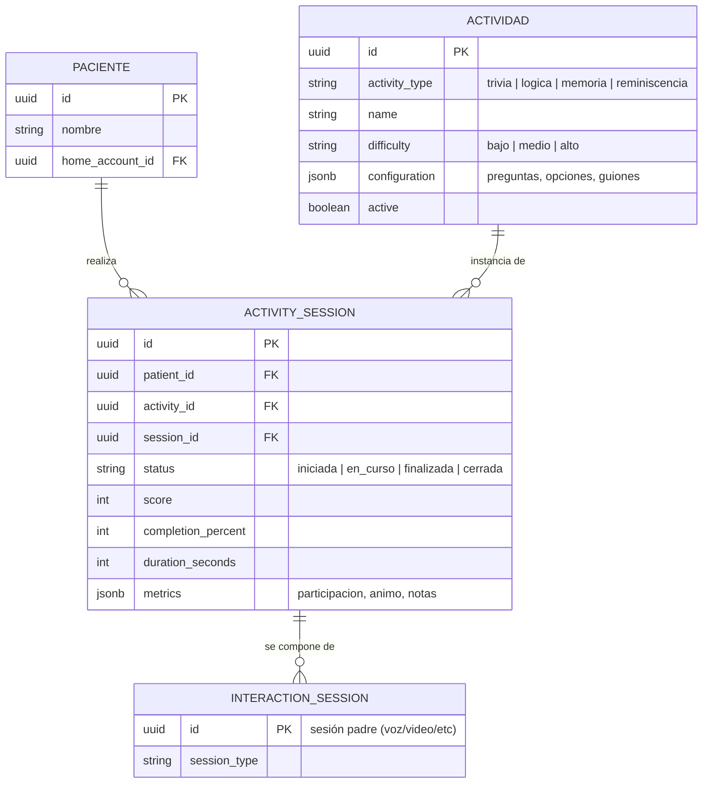

# Artefacto de Trazabilidad — AURA-75 US-D2 Biblioteca de actividades terapéuticas

> [!draft] **Borrador de propuesta** generado automáticamente con `/artefacto-trazabilidad` (modo derivado de tareas de diseño AURA-60 e implementación AURA-56). Pensado para **refinar en equipo**. Las secciones con evidencia real de diseño están completas; código y ejecución de pruebas quedan como scaffolding porque la carpeta `src/features/therapies/` aún no existe. **No inventar** resultados.

> **Para qué:** conectar esta historia con sus decisiones de diseño, modelo de datos, código y pruebas.
> **Para quién:** equipo (durante el desarrollo) y docente (evaluación de calidad técnica).

| Campo | Valor |
| --- | --- |
| Historia | **AURA-75** — US-D2 Biblioteca de actividades terapéuticas |
| Épica | AURA-18 — Panel del Cuidador (Aurora Care) |
| Requerimientos | ⚠️ Sin RF propio aún (alcance introducido por diseño, ver [[Diseño UX-UI/Handoff y Backlog de Diseño\|Handoff]] §3). Relacionados: RF-10–13 (proponer/iniciar actividades de estimulación cognitiva según perfil, para el paciente) · RF-52 (adaptar actividades según desempeño previo → sugerencia del día) · RF-82–91 (rutinas y medicación → programable como rutina) |
| Estado en Jira | Tareas por hacer |
| Tareas relacionadas | AURA-60 (Vistas Terapias UI, diseño ✅ completado) · AURA-56 (Módulo Terapias, implementación frontend pendiente) |
| Enlace | https://project-aurora-alz.atlassian.net/browse/AURA-75 |

## 1. Historia de usuario

**Como** cuidador sin formación terapéutica **quiero** ver un catálogo de actividades (trivia, lógica simple, juego de memoria, reminiscencia) con su modalidad («la hace Aurora» / «guiada por vos»), **para** elegir o programar la estimulación diaria.

### Criterios de aceptación
- [ ] Filtros por tipo de actividad (trivia, lógica, memoria, reminiscencia).
- [ ] Sugerencia del día según la respuesta previa del paciente (impulsada por RF-52).
- [ ] Programable como rutina (integración con RF-82–91).
- [ ] Métricas semanales de participación (resumen visual, sin gráficos complejos).
- [ ] Las plantillas de actividades están validadas por un especialista (mitigación R1).

## 2. Decisiones de diseño (ADR)

Decisiones técnicas que esta historia usa o de las que depende (ver [[Arquitectura y Stack Tecnológico]]):

- **ADR-002** — Frontend Aurora Care (React + Next.js): la biblioteca de actividades y sugerencia del día viven acá como componente reutilizable.
- **ADR-003** — Supabase (PostgreSQL): persistencia del catálogo de actividades (`voice.activities`) y sesiones de actividades (`voice.activity_sessions`); integración con vector embeddings para sugerencia adaptativa (RF-52).
- **ADR-004** — Microservicios: Aurora Care (Next.js) consume la API REST de Aurora Core (Django/DRF) para listar, filtrar, crear sesiones y registrar métricas de actividades.

> [!todo] **Posible ADR nuevo** — *Catálogo de actividades y sugerencia adaptativa*: criterios para seleccionar una actividad sugerida (historial de participación, dificultad, tipo preferido) y cómo se expresa en la UI (card destacada, badge "Sugerida para vos"). Pendiente de definición en equipo (tarea de diseño UX/especialista).

## 3. Modelo de datos (DER)

El DER oficial de Aurora (AURA-53, vista `04_Voz_e_Interaccion.dbml`) define las entidades para esta historia. Resumen del relevante:

```dbml
Table voice.activities {
  id uuid [pk]
  activity_type text          -- "trivia" | "logica" | "memoria" | "reminiscencia"
  name text
  category text               -- Categorizacion adicional (ej. "animales", "objetos")
  difficulty text             -- "bajo" | "medio" | "alto"
  description text            -- Instrucciones para el cuidador
  configuration jsonb         -- Preguntas, opciones, guiones (formato abierto)
  active boolean
  created_at timestamptz
  updated_at timestamptz
}

Table voice.activity_sessions {
  id uuid [pk]
  patient_id uuid [fk]        -- Referencia al paciente
  activity_id uuid [fk]       -- Referencia a la actividad (catálogo)
  session_id uuid [fk]        -- FK a voice.interaction_sessions (sesión padre)
  status text                 -- "iniciada" | "en_curso" | "finalizada" | "cerrada"
  score int                   -- Puntaje del paciente en la actividad
  completion_percent smallint -- 0–100, nivel de completitud
  duration_seconds int        -- Duración total de la sesión
  memory_refs jsonb           -- Referencias a la memoria del paciente (para IA)
  metrics jsonb               -- Participación (baja/media/alta), animo, notas libres
  started_at timestamptz
  ended_at timestamptz
}
```

**Relación con otras entidades:**
- `voice.activities` ← se instancia en → `voice.activity_sessions` (catálogo → ejecución)
- `voice.activity_sessions.patient_id` → `core.patients.id` (participante)
- `voice.activity_sessions.session_id` → `voice.interaction_sessions.id` (sesión padre, puede ser raíz o subsesión)

> [!note] El DER oficial ya existe y está formalizado. No hay "sin DER oficial" aquí — consultar [[Requerimientos]] y el completo `DER_Aurora_8_Vistas_DBML/DER_Aurora.dbml` para referencias a políticas de retención, cifrado, auditoría (módulos 8 y 9 del DER).

## 4. Diagramas de modelado

### 4.1 Diagrama de relaciones (entidad-relación)



### 4.2 Diagrama de secuencia — Flujo de biblioteca y sugerencia del día

```mermaid
sequenceDiagram
    participant Cui as Cuidador
    participant Care as Aurora Care (Next.js)
    participant Core as Aurora Core (API)
    participant DB as Supabase (BD)
    
    Cui->>Care: abre "Biblioteca de Actividades"
    Care->>Core: GET /actividades (sin filtros; o ya filtra lado cliente)
    Core->>DB: SELECT * FROM voice.activities WHERE active = true
    DB-->>Core: catálogo completo (trivia, lógica, memoria, reminiscencia)
    Core-->>Care: [{ id, name, type, difficulty, description }, ...]
    Care-->>Cui: lista de actividades (cards)
    
    Cui->>Care: aplica filtro "tipo = trivia"
    Care-->>Cui: muestra solo trivia
    
    Cui->>Care: solapa "Sugerencia del día" / abre una actividad recomendada
    Care->>Core: GET /actividades/sugerencia/{paciente_id}
    Core->>DB: historial reciente de participación (últimos 7 días)
    Core->>Core: lógica: dificultad adaptativa + tipo preferido
    Core-->>Care: { actividad_id, razon: "por tu desempeño" }
    Care-->>Cui: destaca una actividad con badge
    
    Cui->>Care: inicia la actividad (click "Comenzar")
    Care->>Core: POST /sesiones-actividad { paciente_id, actividad_id }
    Core->>DB: INSERT INTO voice.activity_sessions
    Core-->>Care: { session_id, ... }
    Care-->>Cui: redirige a player/detalle de la actividad
    
    Cui->>Care: programa actividad como rutina
    Care->>Core: POST /rutinas { ... activity_id ... } (RFC-82–91)
    Core-->>Care: rutina creada
    Care-->>Cui: "Programada para mañana a las 10:00"
    
    loop después de la sesión
        Core->>DB: actualizar activity_sessions (score, duration, metrics)
    end
```

### 4.3 Diagrama de clases (dominio)

> No aplica — esta historia es fundamentalmente un catálogo de lectura + creación de sesiones. Las clases de dominio (Activity, ActivitySession) viven en el backend (Django models) y el frontend consume la API REST. Un class diagram ampliaría sin valor; el DER + secuencia ya modela la estructura.

### 4.4 Diagrama de estados

> No aplica — el catálogo no tiene un ciclo de vida nombrado. Las *sesiones* (activity_sessions) tienen estados (iniciada→en_curso→finalizada), pero ese es el dominio de AURA-74 (sesión guiada). La biblioteca AURA-75 es un catálogo estático + mecanismo de sugerencia; no hay máquina de estados en la Historia. Si la historia evoluciona a incluir un "estado de los filtros" o "estados del cuidador navegando," revisar entonces.

## 5. Código relacionado

| Tipo | Ubicación / referencia |
| --- | --- |
| **Diseño (fuente de verdad visual)** | `Design/previews/screens-08-terapias.html` · prototipo `Design/prototype/aurora-care.html` (WIRING #21–28) — aprobado 09/07/2026 |
| **Frontend (Next.js)** | _pendiente — `src/features/therapies/` aún no existe. Esperado: componentes `LibraryView.tsx`, `ActivityCard.tsx`, `SuggestionOfDay.tsx`, hooks `useActivities.ts`, tipos `Activity.ts`_ |
| **Backend (Django/DRF)** | _pendiente — endpoints `/api/actividades/`, `/api/actividades/{id}/`, `/api/sesiones-actividad/`, `/api/actividades/sugerencia/{paciente_id}/`; servicios de IA para RF-52 (sugerencia adaptativa)_ |
| **Commit / PR** | _pendiente_ |

> [!todo] Completar con paths reales cuando se implemente (tarea AURA-56).

## 6. Casos de prueba

| ID | Precondición | Pasos | Resultado esperado | Resultado de ejecución |
| --- | --- | --- | --- | --- |
| CP-AURA75-01 | Cuidador autenticado | 1. Abre "Biblioteca de Actividades" | Se carga la lista de actividades (trivia, lógica, memoria, reminiscencia) | Pendiente |
| CP-AURA75-02 | Biblioteca cargada | 1. Aplica filtro "tipo = trivia" | Solo se muestran actividades de tipo trivia | Pendiente |
| CP-AURA75-03 | Biblioteca cargada | 1. Abre la solapa "Sugerencia del día" | Aparece una actividad recomendada según el historial | Pendiente |
| CP-AURA75-04 | Actividad seleccionada | 1. Click en "Iniciar" | Se abre el player (diseño AURA-60) con la primera pregunta/actividad | Pendiente |
| CP-AURA75-05 | Actividad en curso | 1. Registra puntuación, tiempo, participación | Se guardan las métricas en BD y se muestran en historial semanal | Pendiente |
| CP-AURA75-06 | Actividad seleccionada | 1. Click en "Programar como rutina" | Se abre formulario de rutina; la actividad queda ligada a un horario (RF-82–91) | Pendiente |

> [!todo] No marcar "Pasó/Falló" sin ejecución real. Cada CA verifica un aspecto de los criterios de aceptación.

## 7. Matriz de trazabilidad de la historia

| Historia | RF relacionados | ADR | DER | Diagramas | Código | Casos de prueba |
| --- | --- | --- | --- | --- | --- | --- |
| AURA-75 | RF-10–13 (iniciación), RF-52 (sugerencia), RF-82–91 (rutinas) — sin RF propio | ADR-002, ADR-003, ADR-004 | `voice.activities`, `voice.activity_sessions` (DER oficial AURA-53) | E-R, secuencia | diseño listo; código pendiente | CP-AURA75-01–06 |

## Checklist de completitud (cátedra)

- [x] Historia y criterios de aceptación
- [x] ADR correspondiente — ADR-002 (frontend), ADR-003 (datos), ADR-004 (microservicios)
- [x] DER actualizado — consultar `DER_Aurora_8_Vistas_DBML/04_Voz_e_Interaccion.dbml` (oficial en AURA-53)
- [x] Diagramas de modelado relevantes (entidad-relación, secuencia)
- [x] Casos de prueba con precondición, pasos y resultado esperado
- [ ] Resultados de ejecución de las pruebas — *pendiente de implementación (AURA-56)*
- [ ] Referencias a código (paths/commits/PRs) — *pendiente de implementación*
- [ ] Confirmar RF de "Terapias" en [[Requerimientos]] y [[Trazabilidad RF-Épicas]] — *alcance nuevo (Handoff §3); asignar RF cuando se refine la historia en equipo*
