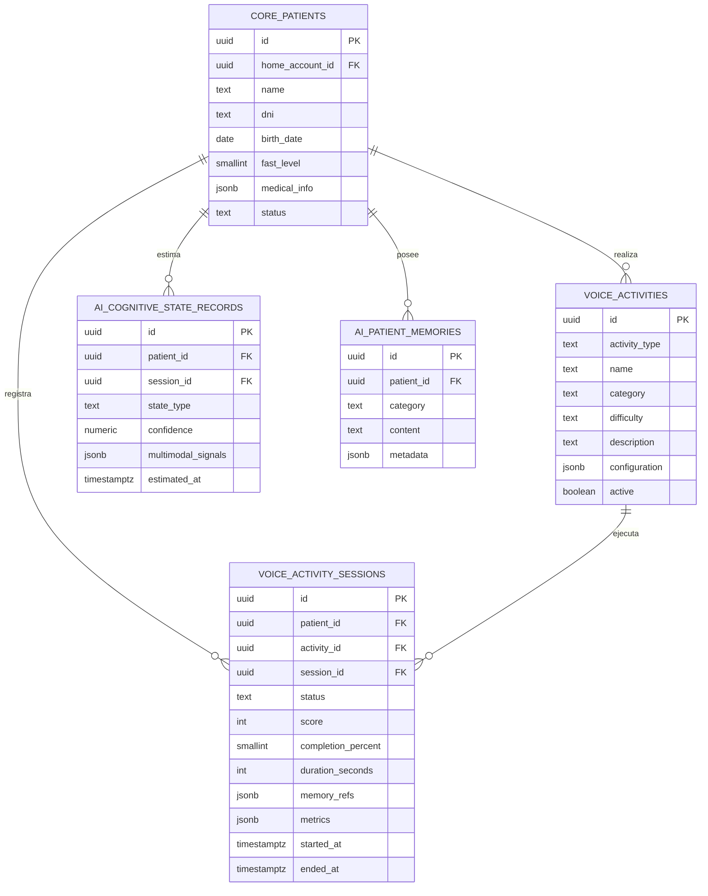
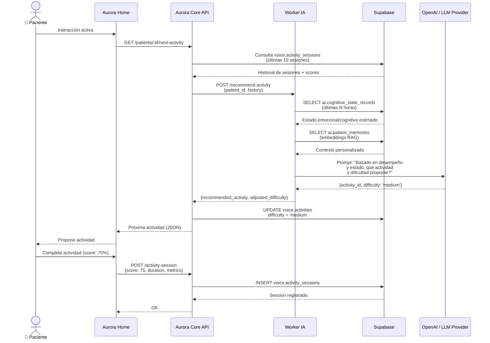
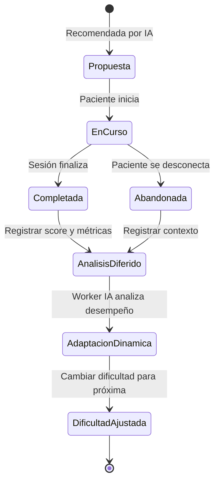

# Artefacto de Trazabilidad — AURA-77: Dificultad Adaptativa

## 1. Información de la Historia

| Campo | Valor |
|---|---|
| **Issue Key** | AURA-77 |
| **Tipo** | Historia de Usuario |
| **Título** | US-D4 — Dificultad adaptativa |
| **Épica** | [AURA-15] Motor de IA y Memoria del Paciente |
| **Estado** | Tareas por hacer |
| **Scope** | MVP |
| **Labels** | `aurora-core`, `derivada-de-diseno`, `mvp` |

## 2. Mapeo a Requerimientos Funcionales

| RF | Descripción | Módulo | Status |
|---|---|---|---|
| **RF-52** | Adaptar actividades cognitivas según desempeño previo del paciente. | Motor de Inteligencia Artificial | ✓ Relevante |
| **RF-53** | Adaptar respuestas según estado emocional o cognitivo estimado. | Motor de Inteligencia Artificial | ⚪ Relacionado |
| **RF-54** | Asistir en la clasificación de eventos cuando se requiera contexto adicional. | Motor de Inteligencia Artificial | ⚪ Relacionado |

### Justificación

La historia AURA-77 implementa el componente de dificultad adaptativa del sistema de actividades cognitivas. Esto significa que el Motor de IA (AURA-15) debe analizar el **desempeño previo** del paciente en actividades cognitivas y **ajustar dinámicamente** la dificultad de nuevas actividades propuestas. Esto satisface principalmente **RF-52**, que es el requerimiento central de la épica para adaptación cognitiva.

Las RFs 53 y 54 son complementarias: la adaptación de dificultad se nutre del estado emocional/cognitivo estimado y puede informar la clasificación de eventos de riesgo.

## 3. Decisiones de Arquitectura (ADRs Relevantes)

### ADR-003: Base de Datos (Relacional y Vectorial)

**Decisión adoptada:** Supabase (PostgreSQL 16 + pgvector)

**Aplicación en AURA-77:**
- El campo `difficulty` de la tabla `voice.activities` almacena el nivel actual de dificultad de una actividad (ej: `easy`, `medium`, `hard`).
- Las ejecuciones históricas (`voice.activity_sessions`) registran el score y métricas de desempeño.
- Los embeddings vectoriales (`ai.memory_embeddings`) capturan el contexto de desempeño anterior para búsqueda RAG.
- El algoritmo de adaptación consulta `voice.activity_sessions` (desempeño histórico) y `ai.cognitive_state_records` (estado emocional/cognitivo estimado).

**Trade-offs considerados:**
- ✓ PostgreSQL + pgvector permite búsqueda vectorial nativa sin servicios externos.
- ⚠️ Free Tier de Supabase limitado a 500 MB; requiere monitoreo si el histórico de sesiones crece mucho.

---

### ADR-004: Patrón Arquitectónico

**Decisión adoptada:** Microservicios — Worker IA separado para inferencia LLM + RAG.

**Aplicación en AURA-77:**
- El **Worker IA** (FastAPI) es el responsable de implementar el algoritmo de adaptación de dificultad.
- Consulta `voice.activity_sessions` del paciente (desempeño histórico).
- Invoca LLM para evaluar qué actividad y dificultad proponer a continuación.
- Mantiene independencia: una caída del Worker IA no impide recordatorios o monitoreo biométrico.

**Flujo:**
1. Aurora Home solicita próxima actividad cognitiva.
2. Aurora Core API valida y reenvía a Worker IA.
3. Worker IA → RAG sobre memoria del paciente + consulta desempeño histórico.
4. Worker IA → LLM → calcula dificultad recomendada + actividad.
5. Resultado se propone al paciente; ejecución se registra en `voice.activity_sessions`.

---

### ADR-001 & ADR-002: Backend Python/Django + Frontend React/Next.js

**Aplicación en AURA-77:**
- **Backend:** Django ORM para acceso a `voice.activities` y `voice.activity_sessions`; serialización DRF.
- **Frontend (Aurora Care):** Componentes React para visualizar histórico de actividades y desempeño del paciente; dashboard del cuidador puede ver gráficas de progresión de dificultad.

---

## 4. Modelo de Datos (DER Relevante)

### Entidades Implicadas



### Decisiones de Tablas Implicadas

Según el documento `Definicion y decisiones de tablas BD.md` (AURA-53):

- **`voice.activities`** — Catálogo único de actividades cognitivas, juegos y reminiscencia. El campo `difficulty` es configurado por el sistema y actualizado dinámicamente por el algoritmo de adaptación.
- **`voice.activity_sessions`** — Ejecuciones de actividades. Cada sesión registra `score` (0-100), `completion_percent`, `duration_seconds` y `metrics` (JSON) para analizar desempeño.
- **`ai.cognitive_state_records`** — Estimaciones de estado emocional/cognitivo (confusión, angustia, etc.) derivadas de biometría, voz e historial.
- **`ai.patient_memories`** — Recuerdos, preferencias y rutinas que alimentan el contexto del LLM para proponer actividades personalizadas.

---

## 5. Diagramas de Comportamiento

### Diagrama de Secuencia — Flujo de Adaptación de Dificultad



### Diagrama de Estados — Ciclo de Vida de una Actividad



---

## 6. Componentes de Código (Evidencia Actual)

### Estado del Frontend

> [!todo] **Pendiente — No existe carpeta therapies/ en AuroraCareFront/src/features/**

**Búsqueda realizada:**
```
find /home/jeremaldonado/Escritorio/Tesis-Obsidian/AuroraCareFront/src/features \
  -type d -name "therapies"
# Resultado: no encontrado
```

**Carpetas existentes en features/:**
- `alerts/` — módulo de alertas
- `auth/` — autenticación
- `devices/` — dispositivos
- `medications/` — medicamentos
- `patients/` — información de pacientes

**Scaffolding recomendado:**
```
src/features/activities/
├── api/
│   ├── useActivities.ts          # Hook para GET /activities
│   ├── useActivitySessions.ts    # Hook para registrar sesiones
│   └── useAdaptivity.ts          # Hook para obtener recomendación de dificultad
├── components/
│   ├── ActivitySelector.tsx      # Componente para elegir/proponer actividad
│   ├── ActivityDifficultyLevel.tsx  # Indicador visual de dificultad
│   └── PerformanceChart.tsx      # Gráfica de desempeño vs. dificultad
├── hooks/
│   └── useActivityPerformance.ts # Lógica de análisis de desempeño
├── types.ts
│   ├── Activity
│   ├── ActivitySession
│   ├── DifficultyLevel enum: { EASY, MEDIUM, HARD, ADAPTIVE }
└── store/
    └── activityStore.ts          # Zustand para estado local
```

---

### Estado del Backend

> [!todo] **Pendiente — Revisar implementación del Worker IA**

**Estructura esperada:**

```
backend/aurora_core/
├── activities/
│   ├── models.py           # Activity, ActivitySession models
│   ├── views.py            # REST endpoints
│   ├── serializers.py      # DRF serializers
│   └── migrations/          # Migraciones del modelo
└── worker_ia/
    ├── services/
    │   ├── adaptivity_engine.py   # Lógica de cálculo de dificultad
    │   ├── rag_retriever.py       # RAG sobre memoria del paciente
    │   └── llm_client.py          # Cliente LLM + prompts
    └── endpoints/
        ├── recommend_activity.py  # POST /recommend-activity
        └── analyze_performance.py # Análisis asíncrono
```

**Dependencias clave:**
- `langchain` o `llama-index` — para RAG + LLM
- `supabase-py` — cliente oficial de Supabase
- `fastapi` — framework del Worker IA

---

## 7. Casos de Prueba

### CT-1: Recomendación de Dificultad Basada en Desempeño Previo

| Entrada | Proceso | Salida Esperada |
|---|---|---|
| Paciente con 5 sesiones previas: scores [80, 82, 78, 85, 79] en dificultad MEDIUM | Worker IA calcula promedio (80.8%) y consulta estado emocional (normal) | Recomendación: siguiente actividad en dificultad HARD (score mínimo: 85% para HARD, paciente en rango seguro) |
| Paciente con 3 sesiones con scores [40, 35, 45] en dificultad HARD | Promedio bajo (40%) y estado emocional: angustia detectada | Recomendación: bajar a EASY, actividad con reminiscencia positiva |

### CT-2: Escalada y Desescalada Automática

| Escenario | Trigger | Acción |
|---|---|---|
| Paciente completa 3 sesiones consecutivas MEDIUM con score > 85% | Algoritmo detecta patrón de dominio | Proponer HARD en próxima sesión |
| Paciente completa sesión HARD con score < 40% y abandona 2 consecutivas | Detección de frustración | Revertir a MEDIUM; registrar evento de ansiedad |

### CT-3: Integración con Memoria del Paciente

| Caso | Entrada | Esperado |
|---|---|---|
| Paciente con memoria de "prefiere juegos con animales" | Recomendación de actividad | Priorizar actividades de categoría "animal-games" en dificultad adaptada |

---

## 8. Dependencias y Bloqueos

| Dependencia | Estado | Nota |
|---|---|---|
| **AURA-53** (DER) | ✓ Completado | Tablas `voice.activities`, `voice.activity_sessions` definidas |
| **AURA-56** (Módulo Terapias Cognitivas) | ⚠️ En curso | Tareas por hacer; scaffolding esperado en AuroraCareFront/src/features |
| **Worker IA** (ADR-004) | ⚠️ Planificado | Servicios de LLM + RAG deben estar disponibles |
| **Supabase setup** | ✓ Completado | pgvector + Realtime listos |

---

## 9. Observaciones y Notas

1. **Activación de dificultad:** El campo `difficulty` de `voice.activities` debe ser actualizado tanto **estáticamente** (por el cuidador en Aurora Care) como **dinámicamente** (por el Worker IA tras analizar sesiones). Requiere un endpoint PATCH protegido.

2. **Ventana de análisis:** ¿Cuántas sesiones históricas analizar? Propuesta: últimas 10-20 sesiones (últimos 7-14 días para pacientes activos). Requiere experimentación.

3. **Umbrales de desempeño:** Los umbrales (ej: 85% para escalar, 40% para descender) son **configurable por paciente** en `ai.cognitive_state_records` o mediante una tabla `adaptation_thresholds`.

4. **Ausencia de código:** La historia AURA-77 no tiene evidencia de código implementado aún. Esta es una **historia de diseño derivada** (label `derivada-de-diseno`), sin tareas de desarrollo asignadas todavía.

5. **Testing de IA:** El componente de adaptación requiere test de comportamiento (assertion sobre recomendaciones) + mock de LLM para testing unitario.

---

## 10. Checklist de Completitud

- [x] Mapeo a RF
- [x] ADRs relevantes identificados
- [x] DER validado
- [x] Diagramas de flujo/secuencia trazados
- [ ] Código frontend scaffolded
- [ ] Código backend implementado
- [ ] Casos de prueba ejecutados
- [ ] Integración con AURA-56 validada
- [ ] Documentación de API completada

---

## Historial de Cambios

| Fecha | Versión | Autor | Cambio |
|---|---|---|---|
| 2026-07-28 | 1.0 | Claude Code (agent) | Artefacto inicial: recopilación de evidencia, diagramas, scaffolding |

