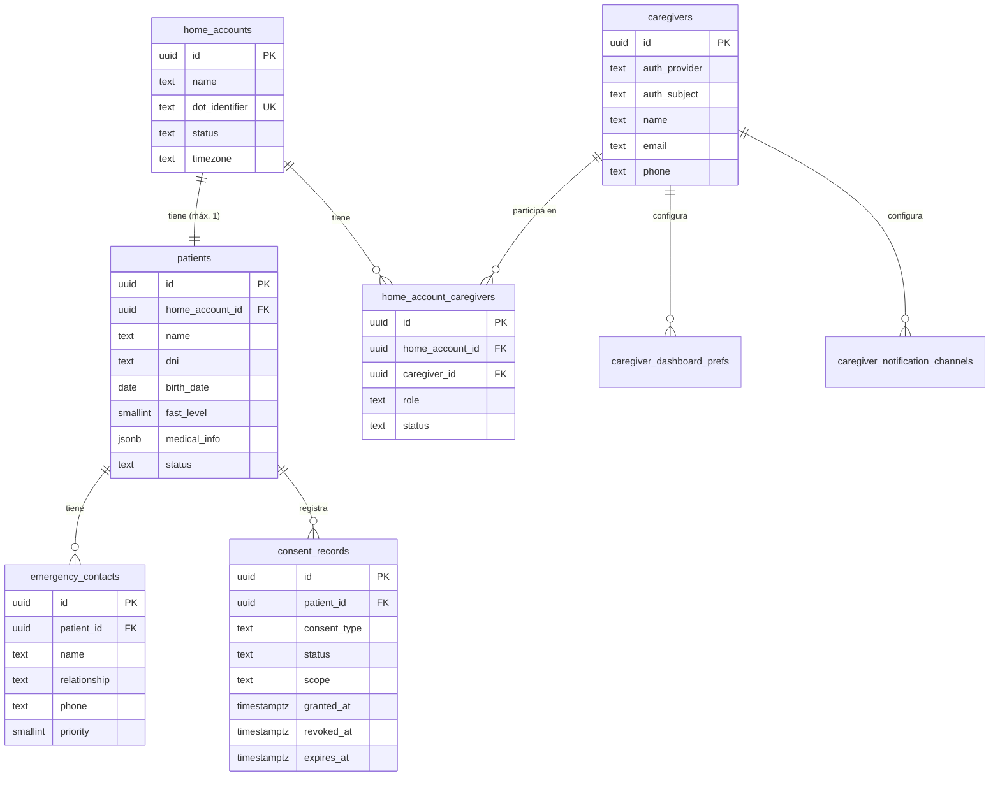
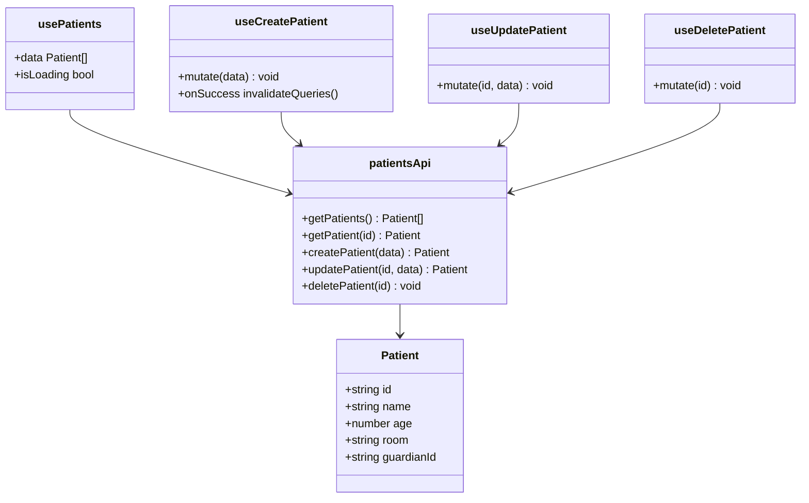
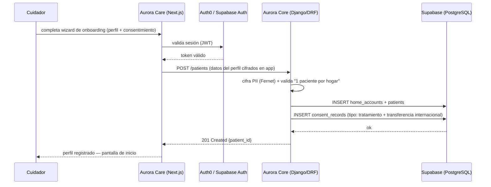

# Artefacto de Trazabilidad — AURA-78 Registro y perfil del paciente

> **Para qué:** conectar esta historia con sus decisiones de diseño, modelo de datos, código y pruebas.
> **Para quién:** equipo (durante el desarrollo) y docente (evaluación de calidad técnica).

| Campo | Valor |
| --- | --- |
| Historia | **AURA-78** — Registro y perfil del paciente |
| Épica | AURA-18 — Panel del Cuidador (Aurora Care) |
| Requerimientos | RF-68, RF-69, RF-74 (módulo Cuidador) · transversales RF-76, RF-79, RF-81 (Seguridad / [[AURA-20]]) |
| Estado en Jira | Tareas por hacer |
| Tareas relacionadas | AURA-59 (Vistas Paciente UI, diseño ✅) · AURA-55 (Módulo Paciente, impl. pendiente) |
| Enlace | https://project-aurora-alz.atlassian.net/browse/AURA-78 |

## 1. Historia de usuario
**Como** cuidador principal **quiero** registrar los datos del paciente (un único perfil por hogar), vincular a otros cuidadores familiares y obtener el consentimiento informado **para** centralizar la red de apoyo y cumplir la obligación legal de tratamiento de datos sensibles (Ley 25.326).

### Criterios de aceptación
- [ ] El sistema permite **un solo perfil de paciente por instancia/hogar** (`home_accounts` 1:1 `patients`).
- [ ] Los datos personales identificatorios (nombre, DNI) se almacenan cifrados en reposo a nivel de aplicación (Ley 25.326, RF-79) — ver §2 nota de cifrado.
- [ ] Se pueden registrar y gestionar **contactos de emergencia** vinculados al paciente (RF-69).
- [ ] El wizard de onboarding incluye la pantalla de **consentimiento informado explícito** para el tratamiento de datos sensibles y la transferencia internacional, generando un registro en `consent_records` (RF-81, Decreto 1558/2001).
- [ ] Solo el cuidador autenticado y vinculado al hogar puede acceder o modificar el perfil del paciente (RF-76, RF-77 — RLS de Supabase + Auth0/Supabase Auth).

## 2. Decisiones de diseño (ADR)
Decisiones técnicas que esta historia usa (ver [[Arquitectura y Stack Tecnológico]]):

- **ADR-002** — Frontend Aurora Care (React + Next.js 14 PWA): la UI de registro/onboarding y el wizard de perfil viven en `AuroraCareFront`.
- **ADR-003** — Supabase (PostgreSQL + pgvector): persistencia de `core.patients`, `core.caregivers`, `core.home_account_caregivers`, `core.emergency_contacts` y `core.consent_records`; Row Level Security (RLS) para aislamiento por `home_account_id`.
- **ADR-005** — Auth0 (o Supabase Auth): autenticación del cuidador. El `auth_subject` almacenado en `core.caregivers` es el ID externo del proveedor; Organizations de Auth0 con criterio "una organización = un hogar" respalda la regla de perfil único por hogar.

> [!todo] **ADR-0XX pendiente — Estrategia de cifrado de PII:** El DER oficial (AURA-53) almacena `patients.name` y `patients.dni` como `text` (sin bytea). La [[Investigación — Almacenamiento de Datos y Ley 25.326]] §5.1 recomienda **cifrado en la capa de aplicación (Django, Fernet)** antes de escribir, en lugar de `pgcrypto` (que expone la clave en los logs de SQL). Crear ADR-0XX que formalice: qué campos se cifran, qué biblioteca, gestión de claves y rotación. Hasta que exista, RF-79 queda parcialmente sin ADR.

## 3. Modelo de datos (DER)
DER oficial de esta historia, extraído de [[AURA-53]] (Vista 02 — Core y Cuidadores, mergeado 2026-07-28):

> **Nota cifrado:** `patients.name` y `patients.dni` son `text` en el esquema — el cifrado ocurre en la capa Django (Fernet) antes de la escritura. Ver ADR-0XX pendiente.

## 4. Diagramas de modelado

### 4.1 Diagrama de clases (frontend — AuroraCareFront)

> [!todo] **Gap detectado:** el tipo `Patient` en `AuroraCareFront/src/features/patients/types.ts` es mínimo (`id, name, age, room, guardianId?`) y no refleja el DER (`home_account_id, dni, birth_date, fast_level, medical_info, status`). Pendiente: extender la interfaz para alinear con el backend (AURA-55).

### 4.2 Diagrama de secuencia (flujo de registro en onboarding)

> Diagrama de estados (DTE): **no aplica** — el registro de perfil no tiene ciclo de vida con estados múltiples. El estado del paciente (`patients.status`) se gestiona en el módulo de monitoreo.

## 5. Código relacionado

| Tipo | Ubicación / referencia |
| --- | --- |
| Diseño (fuente de verdad visual) | `Design/previews/screens-01-auth-onboarding.html` (wizard perfil+consentimiento) · `screens-02-core.html` (dashboard inicio) |
| Frontend — API client | `AuroraCareFront/src/features/patients/api/patientsApi.ts` |
| Frontend — hooks | `AuroraCareFront/src/features/patients/hooks/usePatients.ts` · `usePatientMutations.ts` |
| Frontend — tipos | `AuroraCareFront/src/features/patients/types.ts` ⚠️ tipo incompleto vs. DER |
| DER (esquema oficial) | `Document Hub/INSTANCIA 3 — Sprints 1 a N/Sprint 1/AURA-53/DER_Aurora_8_Vistas_DBML/02_Core_y_Cuidadores.dbml` |
| Backend (Django/DRF) | _pendiente — implementación AURA-55_ |
| Commit / PR de implementación | _pendiente — revisar AuroraCareFront con `git log --grep AURA-55`_ |

## 6. Casos de prueba

| ID | Precondición | Pasos | Resultado esperado | Resultado de ejecución |
| --- | --- | --- | --- | --- |
| CP-AURA78-01 | Cuidador autenticado, sin paciente registrado | 1. Abrir wizard de onboarding · 2. Cargar nombre, DNI, fecha de nacimiento, nivel FAST · 3. Completar pantalla de consentimiento · 4. Guardar | Perfil creado; `consent_records` con `status=active`; nombre y DNI cifrados en BD | Pendiente |
| CP-AURA78-02 | Cuidador autenticado, hogar ya tiene un paciente registrado | 1. Intentar crear un segundo paciente | El sistema rechaza la operación (1 perfil por hogar) | Pendiente |
| CP-AURA78-03 | Paciente registrado, cuidador principal autenticado | 1. Ir a "Cuidadores" · 2. Invitar a un cuidador familiar por email | El cuidador queda en `home_account_caregivers` con rol `familiar`; recibe notificación | Pendiente |
| CP-AURA78-04 | Paciente registrado | 1. Ir a "Contactos de emergencia" · 2. Agregar contacto con nombre, relación, teléfono y prioridad | Contacto guardado en `emergency_contacts` vinculado al paciente | Pendiente |
| CP-AURA78-05 | Cuidador NO vinculado al hogar, autenticado | 1. Intentar GET /patients/{id} del paciente | La respuesta es 403 Forbidden (RLS de Supabase + validación en Core) | Pendiente |

> [!todo] No marcar "Pasó/Falló" sin ejecución real. Mapeo CA ↔ caso: registro completo (CP-01), unicidad (CP-02), otros cuidadores (CP-03), contactos emergencia (CP-04), acceso no autorizado (CP-05).

## 7. Matriz de trazabilidad de la historia

| Historia | RF | ADR | DER | Diagramas | Código | Casos de prueba |
| --- | --- | --- | --- | --- | --- | --- |
| AURA-78 | RF-68, RF-69, RF-74, RF-76, RF-79, RF-81 | ADR-002, ADR-003, ADR-005 + ADR-0XX (pendiente cifrado) | ✅ AURA-53 (Vista 02) | clases (frontend), secuencia (onboarding) | AuroraCareFront/src/features/patients/ · diseño screens-01/02 | CP-AURA78-01..05 |

## Checklist de completitud (cátedra)

- [x] Historia y criterios de aceptación
- [ ] ADR correspondiente — *ADR-0XX de cifrado de PII pendiente*
- [x] DER actualizado — *AURA-53 mergeado 2026-07-28*
- [x] Diagramas de modelado (clases frontend · secuencia onboarding)
- [x] Casos de prueba con precondición, pasos y resultado esperado
- [ ] Resultados de ejecución — *pendiente de implementación (AURA-55)*
- [x] Referencias a código — *AuroraCareFront/src/features/patients/ (parcial — tipo Patient incompleto)*

> **Cambios respecto a la versión 2026-07-19:** DER actualizado con esquema real de AURA-53 (antes "propuesto sin oficial"); código real de AuroraCareFront agregado en §5; gap de tipo `Patient` vs. DER documentado; RF-81 + `consent_records` incorporados en criterios y DER; secuencia de onboarding extendida con consentimiento; CP-04 y CP-05 nuevos; nota de cifrado Fernet vs. pgcrypto con referencia a [[Investigación — Almacenamiento de Datos y Ley 25.326]] §5.1.
