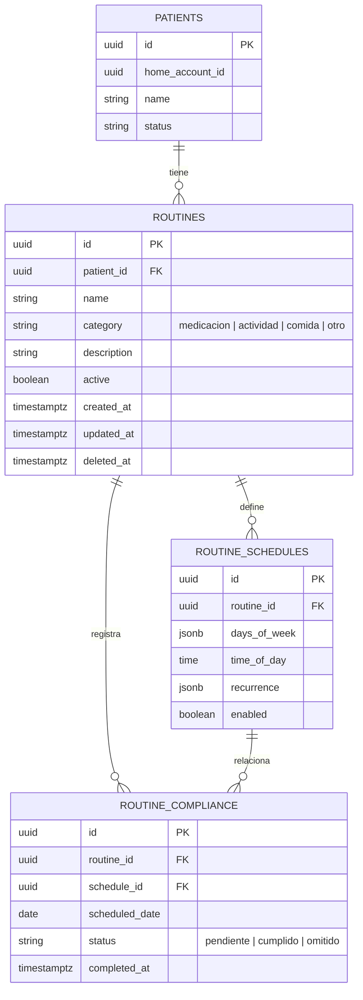
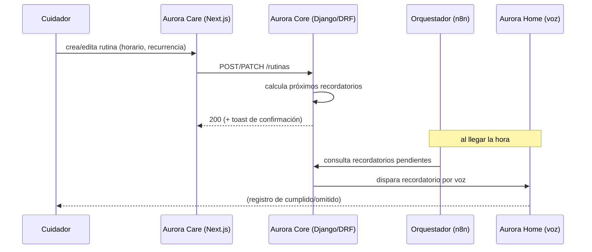
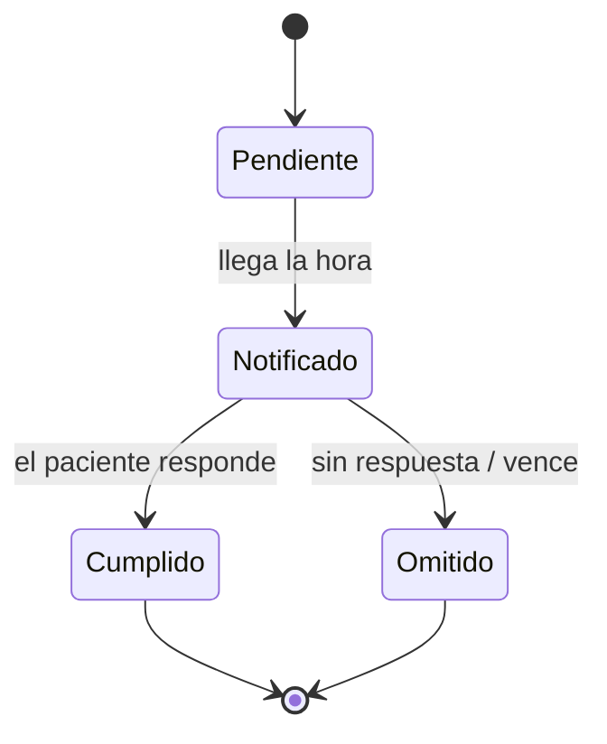

# Artefacto de Trazabilidad — AURA-79 Gestión de rutinas y recordatorios

> [!draft] Artefacto derivado (task-first) de la tarea de diseño AURA-61. Diseño completo; código y ejecución de pruebas como scaffolding. **No inventar** resultados.

> **Para qué:** conectar esta historia con sus decisiones de diseño, modelo de datos, código y pruebas.
> **Para quién:** equipo (durante el desarrollo) y docente (evaluación de calidad técnica).

| Campo | Valor |
| --- | --- |
| Historia | **AURA-79** — Gestión de rutinas y recordatorios (interfaz del cuidador) |
| Épica | AURA-18 — Panel del Cuidador (Aurora Care) · dominio en AURA-17 |
| Requerimientos | Interfaz del cuidador (RF-60–75) sobre dominio de Rutinas **RF-82–91** (AURA-17). ⚠️ Confirmar RF puntuales en [[Requerimientos]] |
| Estado en Jira | Tareas por hacer |
| Tareas relacionadas | AURA-61 (Vistas Recordatorio UI, diseño) · AURA-57 (Módulo Recordatorios, impl) — enlazar con "Relates" |
| Enlace | https://project-aurora-alz.atlassian.net/browse/AURA-79 |

## 1. Historia de usuario
**Como** cuidador **quiero** crear y editar las rutinas y recordatorios del paciente (agenda del día, horarios, repeticiones) **para** organizar su día y que Aurora se los recuerde.

### Criterios de aceptación
- [ ] ABM de rutinas con agenda del día ("hoy le toca").
- [ ] Editor de rutina con guardar + confirmación (toast).
- [ ] Las rutinas programadas alimentan los recordatorios de Aurora Home.

## 2. Decisiones de diseño (ADR)
- **ADR-002** — Frontend Aurora Care (React + Next.js): editor y agenda de rutinas.
- **ADR-003** — Supabase (PostgreSQL): persistencia de `rutinas` / `recordatorios`.
- **Orquestación (n8n) / Aurora Home** — el disparo del recordatorio por voz se coordina desde Core hacia Home. ⚠️ Confirmar el ADR de orquestación en [[Arquitectura y Stack Tecnológico]].

> [!todo] La lógica de dominio de rutinas/medicación vive en **AURA-17**; esta historia cubre la **interfaz de configuración**. Alinear el modelo con esa épica.

## 3. Modelo de datos (DER)
**Schema oficial** de AURA-53 (`Document Hub/INSTANCIA 3 — Sprints 1 a N/Sprint 1/AURA-53/DER_Aurora_8_Vistas_DBML/03_Rutinas_y_Medicacion.dbml`):

**Diferencia con el propuesto:** El schema oficial separa horarios (`routine_schedules`) y cumplimiento (`routine_compliance`) de rutinas, permitiendo múltiples horarios por rutina y registro granular de cumplimiento. El estado es más fino (`status` text) que el original.

## 4. Diagramas de modelado

### 4.1 Diagrama de secuencia

### 4.2 Diagrama de estados (DTE) — recordatorio

## 5. Código relacionado
| Tipo | Ubicación / referencia |
| --- | --- |
| Diseño (fuente de verdad visual) | ✅ `Design/previews/screens-02-core.html` (Rutinas 10, Editor 11) · prototipo `Design/prototype/aurora-care.html` (`WIRING.md` #9, #12, #13) |
| Sistema de diseño | ✅ `Design/tokens/tokens.css` · `Design/previews/components.html` |
| Documentación | ✅ _Manual de UX-UI Aurora_, _User Flows_, _Arquitectura de Información — Aurora Care_ |
| Backend (Django/DRF) | > [!todo] **Pendiente** — `Backend/` vacío; esperar definición de endpoints AURA-79 |
| Frontend (Next.js) | > [!todo] **Pendiente** — Scaffold `app/(authenticated)/routines.tsx` (solo título); `/src/features/routines/` no existe aún (AURA-57) |
| Commit / PR | > [!todo] **Pendiente** (bloqueado por AURA-57) |

## 6. Casos de prueba
| ID | Precondición | Pasos | Resultado esperado | Resultado de ejecución |
| --- | --- | --- | --- | --- |
| CP-AURA79-01 | Cuidador autenticado, paciente registrado | 1. Crear rutina con horario · 2. Guardar | La rutina aparece en la agenda del día; toast de confirmación | Pendiente |
| CP-AURA79-02 | Rutina existente | 1. Editar hora/recurrencia · 2. Guardar | Los cambios se reflejan y recalculan los recordatorios | Pendiente |
| CP-AURA79-03 | Rutina activa con recordatorio próximo | 1. Esperar la hora programada | Aurora Home dispara el recordatorio por voz | Pendiente |

## 7. Matriz de trazabilidad de la historia
| Historia | RF | ADR | DER | Diagramas | Código | Casos de prueba |
| --- | --- | --- | --- | --- | --- | --- |
| AURA-79 | RF-82–91 (rel. RF-60–75) | ADR-002, ADR-003, ADR-005 | ✅ AURA-53 oficial | secuencia, estados | diseño ✅ listo; código pendiente | CP-AURA79-01/02/03 |

## Checklist de completitud (cátedra)
- [x] Historia y criterios de aceptación
- [x] ADR correspondiente — ADR-002 (Frontend), ADR-003 (BD), ADR-005 (Auth)
- [x] DER actualizado — ✅ DER oficial de AURA-53 integrado; reconciliados estados
- [x] Diagramas de modelado relevantes (secuencia, estados)
- [x] Casos de prueba con precondición, pasos y resultado esperado
- [ ] Resultados de ejecución — *pendiente de implementación (AURA-57)*
- [ ] Referencias a código — *frontend scaffolding listo, implementación pendiente*
- [x] Confirmar RF puntuales de Rutinas — ✅ RF-82–91 (AURA-17) + RF-60–75 (AURA-18) confirmados en Trazabilidad RF-Épicas
