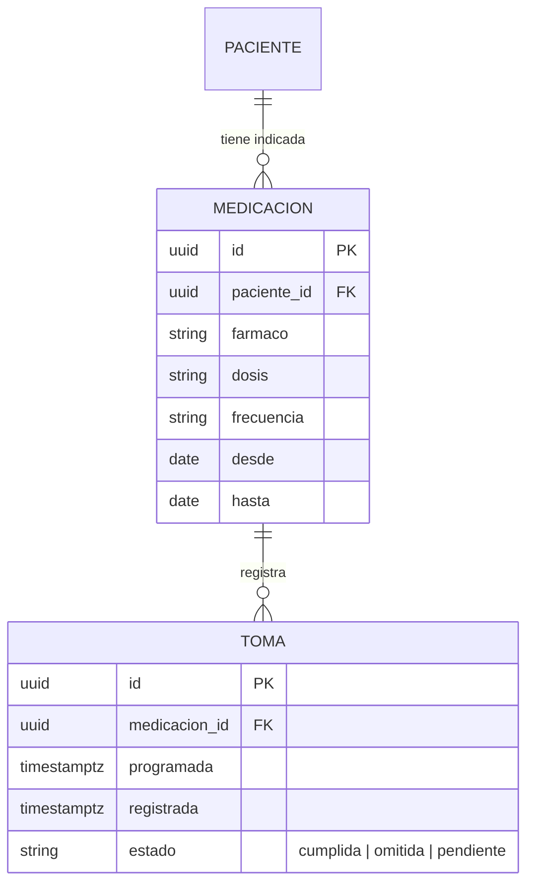
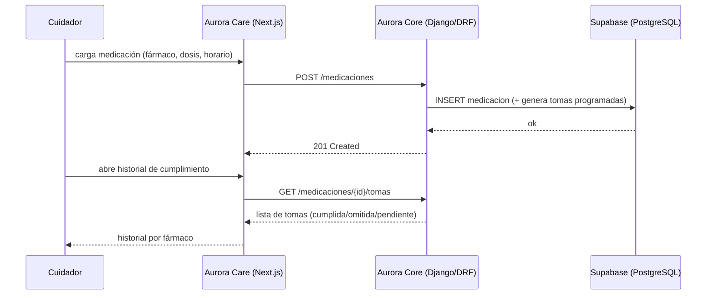
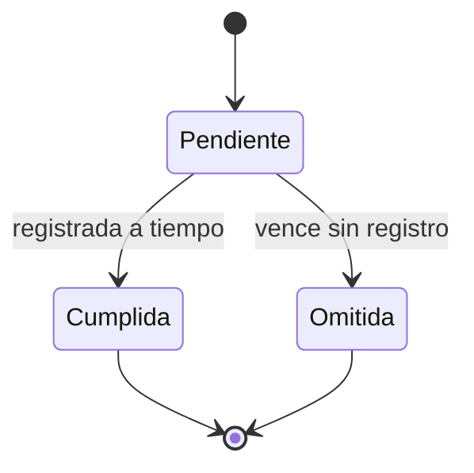

# Artefacto de Trazabilidad — AURA-80 Gestión de medicación y recetario

> [!draft] Artefacto derivado (task-first) de la tarea de diseño AURA-62. Diseño completo; código y ejecución de pruebas como scaffolding. **No inventar** resultados.

> **Para qué:** conectar esta historia con sus decisiones de diseño, modelo de datos, código y pruebas.
> **Para quién:** equipo (durante el desarrollo) y docente (evaluación de calidad técnica).

| Campo | Valor |
| --- | --- |
| Historia | **AURA-80** — Gestión de medicación y recetario (interfaz del cuidador) |
| Épica | AURA-18 — Panel del Cuidador (Aurora Care) · dominio en AURA-17 |
| Requerimientos | Interfaz del cuidador (RF-60–75) sobre dominio de Medicación **RF-82–91** (AURA-17). ⚠️ Confirmar RF puntuales en [[Requerimientos]] |
| Estado en Jira | Tareas por hacer |
| Tareas relacionadas | AURA-62 (Vistas Recetario UI, diseño) · AURA-58 (Módulo Recetario, impl) — enlazar con "Relates" |
| Enlace | https://project-aurora-alz.atlassian.net/browse/AURA-80 |

## 1. Historia de usuario
**Como** cuidador **quiero** cargar y consultar la medicación del paciente y su historial de cumplimiento **para** asegurar que tome lo indicado y detectar faltas.

### Criterios de aceptación
- [ ] ABM de medicación (fármaco, dosis, horario).
- [ ] Vista de historial de cumplimiento por fármaco.
- [ ] Integración con los recordatorios/rutinas de medicación.

## 2. Decisiones de diseño (ADR)
- **ADR-002** — Frontend Aurora Care (React + Next.js): recetario e historial.
- **ADR-003** — Supabase (PostgreSQL): persistencia de `medicaciones` y `tomas`.
- **Privacidad (Ley 25.326)** — datos de salud sensibles; aplica cifrado/retención (coordinar con AURA-20).

> [!todo] Compartida con **AURA-79** (rutinas): la toma de medicación es un tipo de rutina/recordatorio. Definir si `MEDICACION` reusa `RUTINA` o es entidad propia enlazada. Decisión de modelo a cerrar con AURA-17/AURA-53.

## 3. Modelo de datos (DER)
Propuesto (sin DER oficial):

## 4. Diagramas de modelado

### 4.1 Diagrama de secuencia

### 4.2 Diagrama de estados (DTE) — toma

## 5. Código relacionado
| Tipo | Ubicación / referencia |
| --- | --- |
| Diseño (fuente de verdad visual) | `Design/previews/screens-02-core.html` (Medicación 12, Historial 13) · `WIRING.md` #14, #15 |
| Backend (Django/DRF) | _pendiente — `Backend/` vacío_ |
| Frontend (Next.js) | **ABM Medicación:** `AuroraCareFront/src/features/medications/` — types.ts (interface Medication), api/medicationsApi.ts (CRUD GET/POST/PATCH/DELETE), hooks/useMedications.ts (useQuery), hooks/useMedicationMutations.ts (create/update/delete) |
| Commit / PR | _pendiente (AURA-58)_ |
| Estado de implementación | ✅ **Criterio #1 (ABM):** tipos + CRUD API + hooks React Query implementados. ❌ **Criterio #2 (historial cumplimiento / TOMA):** No hay entidad `TOMA` ni historial en el código. ❌ **Criterio #3 (integración recordatorios):** pendiente integración con AURA-79. |

## 6. Casos de prueba
| ID | Precondición | Pasos | Resultado esperado | Resultado de ejecución |
| --- | --- | --- | --- | --- |
| CP-AURA80-01 | Cuidador autenticado, paciente registrado | 1. Cargar fármaco con dosis y horario · 2. Guardar | La medicación queda registrada y genera tomas programadas | Pendiente |
| CP-AURA80-02 | Medicación con tomas registradas | 1. Abrir historial de cumplimiento | Se ven las tomas cumplidas/omitidas por fármaco | Pendiente |
| CP-AURA80-03 | Medicación con horario | 1. Esperar la hora de la toma | Se dispara el recordatorio (integración con AURA-79) | Pendiente |

## 7. Matriz de trazabilidad de la historia
| Historia | RF | ADR | DER | Diagramas | Código | Casos de prueba |
| --- | --- | --- | --- | --- | --- | --- |
| AURA-80 | RF-66, RF-85–91 (parcial: ABM implementado; historial pendiente) | ADR-002, ADR-003 (+ privacidad) | Propuesto | secuencia, estados | ✅ ABM (types, API, hooks); ❌ TOMA/historial | CP-AURA80-01 parcial; CP-02/03 pendientes |

## Checklist de completitud (cátedra)
- [x] Historia y criterios de aceptación
- [ ] ADR correspondiente — *decisión de modelo medicación↔rutina pendiente*
- [ ] DER actualizado — *propuesto; falta DER oficial (AURA-53)*
- [x] Diagramas de modelado relevantes (secuencia, estados)
- [x] Casos de prueba con precondición, pasos y resultado esperado
- [x] Referencias a código — *ABM implementado (types, API, hooks)*
- [ ] Resultados de ejecución — *pendiente: CP-AURA80-01 (ABM) parcial; CP-02/03 (historial, recordatorio) no ejecutables sin TOMA*
- [x] Confirmar RF puntuales de Medicación en [[Requerimientos]] — RF-66 (ABMC), RF-85–91 (medicación + cumplimiento)
