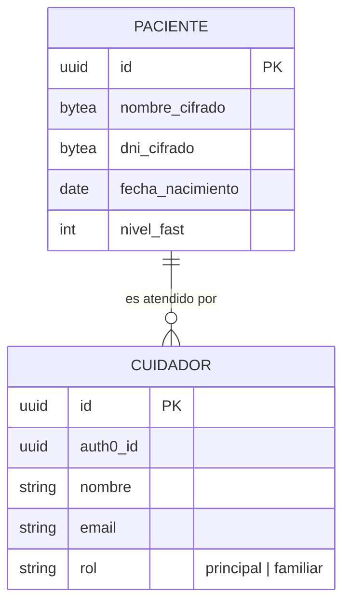
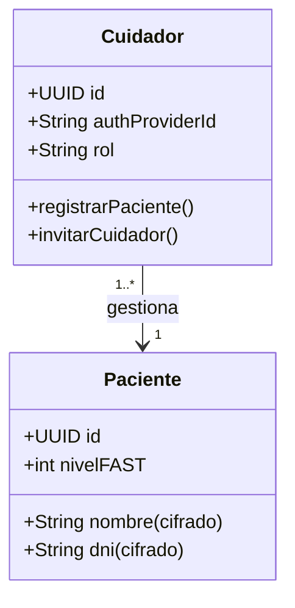
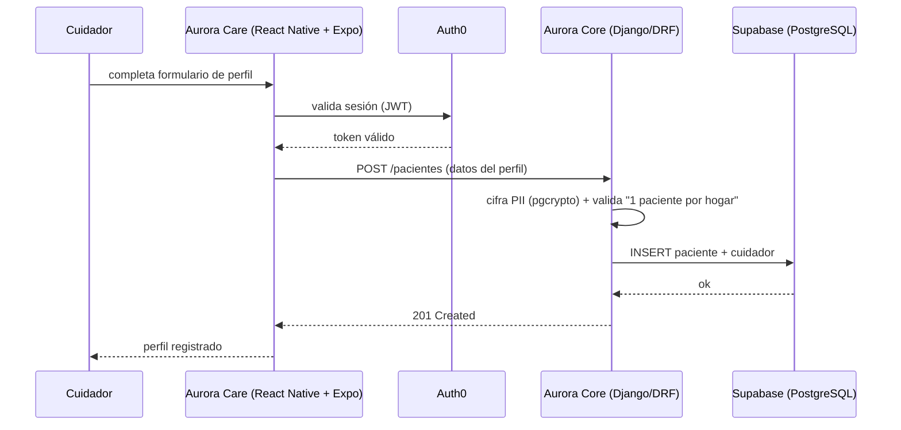

# Artefacto de Trazabilidad — US 1.1 Registro de Perfil del Paciente

> [!example] Documento de **EJEMPLO / prueba en seco** generado con `/artefacto-trazabilidad` (modo manual). Aún no hay historia en Jira ni código/tests; las secciones sin evidencia quedan como scaffolding.

> **Para qué:** conectar esta historia con sus decisiones de diseño, modelo de datos, código y pruebas.
> **Para quién:** equipo (durante el desarrollo) y docente (evaluación de calidad técnica).

| Campo | Valor |
| --- | --- |
| Historia | **US-1.1** — Registro de Perfil del Paciente |
| Épica | AURA-18 — Panel del Cuidador (Aurora Care) |
| Requerimientos | RF-68, RF-69, RF-74 (módulo Cuidador) · transversales: RF-76, RF-79 (Seguridad / AURA-20) |
| Estado en Jira | — (no creada; demo) |
| Tareas relacionadas | — (no aplica en la demo) |
| Enlace | — |

## 1. Historia de usuario
**Como** cuidador principal **quiero** registrar los datos del paciente (un único perfil) y los datos de contacto de otros cuidadores familiares **para** centralizar la red de apoyo.

### Criterios de aceptación
- [ ] El sistema permite **un solo perfil de paciente por instancia/hogar**.
- [ ] Los datos personales (nombre, DNI) se almacenan **cifrados** (Ley 25.326).
- [ ] Se pueden registrar **otros cuidadores** vinculados al paciente.

## 2. Decisiones de diseño (ADR)
Decisiones técnicas que esta historia usa (ver [[Arquitectura y Stack Tecnológico]]):
- **ADR-002** — Frontend Aurora Care (React Native + Expo): la UI de registro vive acá.
- **ADR-003** — Supabase (PostgreSQL + pgvector): persistencia de `pacientes` y `cuidadores`.
- **ADR-005** — Auth0: autenticación del cuidador; *Organizations* de Auth0 con el criterio "una organización = un paciente", que respalda la regla de **un perfil por hogar**.
- **Privacidad (sección 6)** — Ley 25.326: cifrado de PII a nivel de columna con **pgcrypto** y derechos ARCO.

> [!todo] Decisión menor a registrar (posible ADR-010): **qué campos de PII se cifran y la gestión de claves** (pgcrypto a nivel columna). Confirmar si amerita ADR propio o queda cubierto por la sección 6. No se inventa: marcar pendiente hasta decidirlo en equipo.

## 3. Modelo de datos (DER)
La historia crea las entidades base de personas. Modelo afectado (a validar contra el DER oficial, aún no formalizado):

> [!todo] No existe aún un DER oficial del proyecto. Este diagrama es la propuesta derivada de la historia; formalizarlo y enlazarlo cuando se cree el modelo de datos definitivo.

## 4. Diagramas de modelado

### 4.1 Diagrama de clases

### 4.2 Diagrama de secuencia

> Diagrama de estados (DTE): **no aplica** — el registro de perfil no tiene ciclo de vida con estados.

## 5. Código relacionado
| Tipo | Ubicación / referencia |
| --- | --- |
| Backend (Django/DRF) | _pendiente — aún sin código en `Backend/`_ |
| Frontend (React Native + Expo) | _pendiente — aún sin código en `Frontend/`_ |
| Commit / PR | _pendiente_ |

> [!todo] Completar con paths reales cuando se implemente la historia.

## 6. Casos de prueba
| ID | Precondición | Pasos | Resultado esperado | Resultado de ejecución |
| --- | --- | --- | --- | --- |
| CP-US1.1-01 | Cuidador autenticado, sin paciente registrado | 1. Abrir "Nuevo paciente" · 2. Cargar nombre y DNI · 3. Guardar | Perfil creado; nombre y DNI quedan cifrados en BD | Pendiente |
| CP-US1.1-02 | Ya existe un paciente en el hogar | 1. Intentar crear un segundo paciente | El sistema lo rechaza (1 perfil por hogar) | Pendiente |
| CP-US1.1-03 | Paciente registrado | 1. Invitar a un cuidador familiar por email | El cuidador queda vinculado al paciente | Pendiente |

> [!todo] No marcar "Pasó/Falló" sin ejecución real. Cada criterio de aceptación tiene su caso (01↔cifrado, 02↔perfil único, 03↔otros cuidadores).

## 7. Matriz de trazabilidad de la historia
| Historia | RF | ADR | DER | Diagramas | Código | Casos de prueba |
| --- | --- | --- | --- | --- | --- | --- |
| US-1.1 | RF-68, RF-69, RF-74, RF-76, RF-79 | ADR-002, ADR-003, ADR-005 (+ posible ADR-010) | Propuesto (sin DER oficial) | clases, secuencia | pendiente | CP-US1.1-01/02/03 |

## Checklist de completitud (cátedra)
- [x] Historia y criterios de aceptación
- [ ] ADR correspondiente (si hubo decisión técnica nueva) — *posible ADR-010 de cifrado pendiente*
- [ ] DER actualizado — *propuesto; falta DER oficial*
- [x] Diagramas de modelado relevantes (clases, secuencia)
- [x] Casos de prueba con precondición, pasos y resultado esperado
- [ ] Resultados de ejecución de las pruebas — *pendiente de implementación*
- [ ] Referencias a código (paths/commits/PRs) — *pendiente de implementación*
